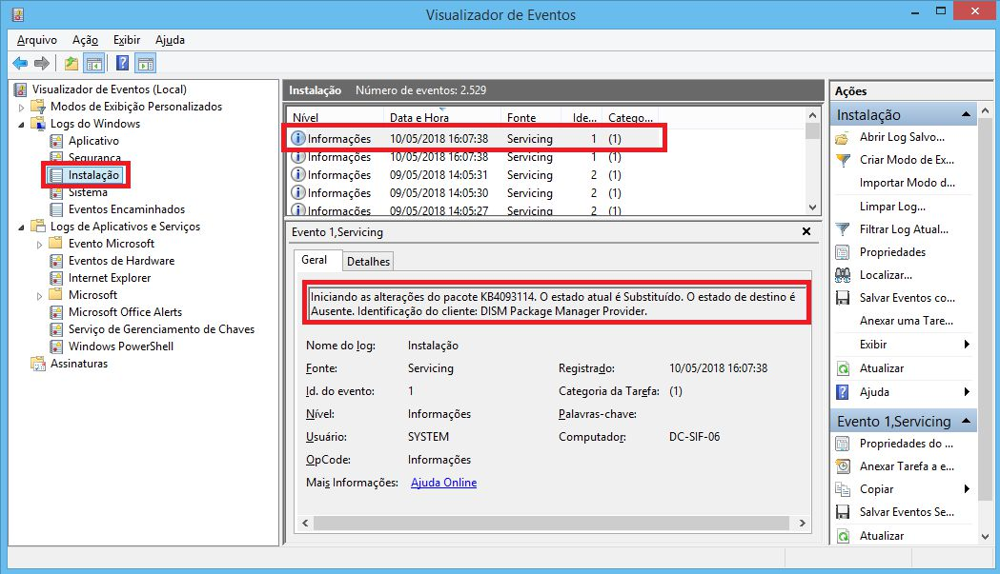
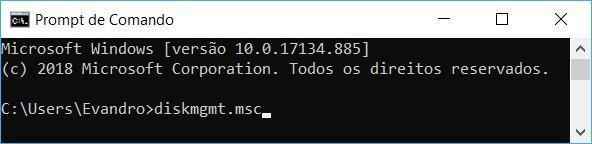

# Capítulo 7 – Windows Desktop

Ao longo de décadas, a família de sistemas operacionais Microsoft Windows consolidou-se como a plataforma dominante no mercado de computadores pessoais (desktops e notebooks). Sua popularidade deve-se, em grande parte, à sua interface gráfica intuitiva, vasta compatibilidade de hardware e a um gigantesco ecossistema de software desenvolvido para ela. Para qualquer profissional ou entusiasta da tecnologia, compreender os processos de instalação, configuração e os componentes fundamentais do Windows é um conhecimento essencial. Embora existam diversas versões — como o Windows XP, 7, 8, 10 e 11, cada uma com suas particularidades —, os princípios básicos de sua implementação e gerenciamento compartilham uma base comum.

Neste capítulo, exploraremos o processo de instalação e configuração de uma das versões mais icônicas, o Windows 7, que serve como um excelente modelo para entendermos os passos lógicos que se aplicam, com pequenas variações, às demais edições. Vamos detalhar cada etapa, desde a inicialização do computador a partir da mídia de instalação até as configurações finais que preparam o sistema para o primeiro uso, desvendando o que acontece "por baixo dos panos" em cada decisão tomada pelo usuário.

## Instalação e Configuração Inicial

A instalação de um sistema operacional como o Windows é um procedimento que transforma um conjunto de hardware em um ambiente computacional funcional. O método mais tradicional para iniciar esse processo é através de uma **mídia de inicialização (boot)**, que pode ser um DVD, um pen drive ou até mesmo uma imagem disponibilizada através de uma rede local. Para que isso funcione, o computador precisa ser instruído a tentar carregar um sistema a partir dessas mídias antes de tentar inicializar pelo disco rígido (HD) ou SSD interno. Essa ordem de prioridade de inicialização é configurada no **SETUP** do computador, uma interface de baixo nível, também conhecida como BIOS ou, em sistemas mais modernos, UEFI.

O processo de instalação das diferentes versões do Windows é notavelmente semelhante em sua estrutura. Utilizaremos como exemplo um passo a passo detalhado da instalação do Windows 7, que ilustra de forma clara todas as etapas cruciais.

**1. Inicialização a partir da Mídia:**

Com o computador ligado e a ordem de boot corretamente configurada, a mídia de instalação do Windows 7 (DVD ou pen drive) é inserida. Ao reiniciar o PC, o SETUP (BIOS/UEFI) detecta a mídia e exibe uma mensagem como "Pressione qualquer tecla para iniciar do CD ou DVD...". Nesse momento, o usuário deve pressionar qualquer tecla para que o programa de instalação, contido na mídia, seja carregado na memória RAM, dando início ao processo. Se nenhuma tecla for pressionada, o sistema prosseguirá para o próximo dispositivo na ordem de boot, que geralmente é o disco rígido.

**2. Configurações de Localização:**

As primeiras telas do instalador são dedicadas à personalização regional. É aqui que o usuário define o idioma que será usado em toda a interface do sistema, o formato de hora e moeda (que influencia como datas, números e valores monetários são exibidos) e o layout do teclado. A escolha correta do layout do teclado é fundamental para garantir que os caracteres especiais e a acentuação correspondam às teclas físicas (por exemplo, ABNT2 para teclados padrão brasileiro com a tecla "Ç").

 

**3. Início da Instalação e Escolha do Tipo:**

Após as configurações de localização, a tela principal do instalador oferece a opção de iniciar a cópia dos arquivos.

Em seguida, uma das decisões mais importantes é apresentada: o tipo de instalação.

- **Atualização (Upgrade):** Esta opção tenta instalar uma nova versão do Windows sobre uma versão anterior já existente, mantendo os arquivos pessoais, configurações e programas do usuário. É uma opção conveniente, mas só está disponível quando o instalador é executado a partir de um sistema Windows já em funcionamento. A desvantagem é que problemas ou instabilidades do sistema antigo podem ser "carregados" para a nova instalação.
- **Personalizada (Avançada) (Clean Install):** Esta é a opção para uma **instalação limpa**. Ela instala uma cópia nova do Windows, sem manter configurações ou programas anteriores. É a escolha que oferece o maior nível de controle, permitindo ao usuário gerenciar os discos e as partições. Embora exija a reinstalação de todos os programas e a restauração de arquivos a partir de um backup, uma instalação limpa geralmente resulta em um sistema mais estável, rápido e livre de resquícios de softwares antigos. Para a instalação em um disco vazio ou para a formatação completa, esta é a única opção.

**4. Gerenciamento de Disco: Particionamento e Formatação:**

Ao escolher a instalação "Personalizada", o instalador exibe os discos de armazenamento disponíveis. É nesta etapa que se define onde o Windows será instalado.

Na imagem, vemos um disco (Disco 0) com uma partição já criada. Ao clicar em "Opções de unidade", ferramentas avançadas são exibidas. A opção **Formatar** é crucial: ela apaga completamente todos os dados de uma partição e cria um novo sistema de arquivos (no caso do Windows 7 e versões posteriores, o NTFS) para organizar o espaço. É um passo destrutivo, mas necessário para preparar a partição para receber os arquivos do sistema operacional. O instalador frequentemente emite um aviso de que todos os dados serão perdidos. Após selecionar a partição e formatá-la, o botão "Avançar" dá continuidade à cópia dos arquivos do Windows para o disco.

É comum que o instalador do Windows crie automaticamente uma pequena partição adicional chamada **"Reservado pelo Sistema"**. Esta partição não recebe uma letra (como C:) e fica oculta para o usuário. Ela é de extrema importância, pois armazena o **Gerenciador de Inicialização (Boot Manager)** e os **Dados de Configuração de Inicialização (BCD)**, que são os componentes responsáveis por carregar o sistema operacional quando o computador é ligado.

**5. Configurações Iniciais da Conta de Usuário:**

Após a cópia dos arquivos e a primeira reinicialização, o Windows inicia a fase de configuração pós-instalação (conhecida como OOBE - Out-of-Box Experience). O primeiro passo é criar a conta do usuário principal.

- **Nome de usuário:** É o nome que identificará a conta do usuário no sistema (ex: "edivaldo").
- **Nome do computador:** É o nome que identificará a máquina em uma rede local (ex: "edivaldo-PC"). É uma boa prática definir um nome descritivo, especialmente em ambientes com múltiplos computadores, como `ESCRITORIO-01` ou `SALA-NOTEBOOK`.

**6. Definição da Senha da Conta:**

A segurança começa com uma senha forte. Nesta etapa, o usuário define uma senha para sua conta. É altamente recomendado criar uma senha que combine letras maiúsculas, minúsculas, números e símbolos. O Windows também exige a criação de uma dica de senha. É importante que a dica seja algo que apenas o usuário entenda e que o ajude a lembrar da senha, sem revelá-la diretamente. Por exemplo, se a senha for MeuCachorroNasceuEm2015!, uma dica ruim seria "cachorro 2015", mas uma dica boa poderia ser "Aniversário do meu primeiro pet".

**7. Chave do Produto e Ativação:**

A chave do produto (Product Key) é um código alfanumérico que serve como licença de uso do software. Inseri-la nesta etapa e marcar a opção "Ativar automaticamente o Windows quando eu estiver online" inicia o processo de ativação. A ativação é um mecanismo anti-pirataria que valida a chave junto aos servidores da Microsoft, vinculando-a àquele hardware específico. É possível pular esta etapa e inserir a chave posteriormente; o Windows funcionará normalmente por um período de carência, mas solicitará a ativação após esse tempo.

**8. Configuração das Atualizações Automáticas:**

Manter o sistema operacional atualizado é uma das práticas de segurança mais importantes. O Windows Update é o serviço responsável por baixar e instalar correções de segurança (patches), correções de bugs e melhorias de recursos. As opções oferecidas são:

- **Usar configurações recomendadas:** Instala automaticamente todas as atualizações importantes e recomendadas, oferecendo o maior nível de proteção.
- **Instalar somente atualizações importantes:** Foca apenas nas atualizações críticas, principalmente as de segurança.
- **Perguntar depois:** Desativa temporariamente as atualizações automáticas, deixando a decisão para o usuário. Esta opção não é recomendada, pois pode deixar o computador vulnerável a ameaças recém-descobertas.

**9. Configuração de Data e Hora:**

A precisão do relógio do sistema é vital não apenas para o usuário, mas também para o funcionamento correto de diversas aplicações, registros de eventos (logs) e protocolos de rede seguros. Nesta tela, o usuário configura o fuso horário (ex: UTC-03:00 Brasília), a data e a hora.

**10. Seleção do Local da Rede:**

Se o computador estiver conectado a uma rede, o Windows solicita que o usuário classifique o tipo de rede. Esta escolha não é apenas informativa; ela define um conjunto de regras de firewall e compartilhamento para proteger o computador.

- **Rede Doméstica:** Para redes residenciais seguras, onde todos os dispositivos são conhecidos e confiáveis. Ativa a descoberta de rede, permitindo que computadores se enxerguem para compartilhar arquivos e impressoras.
- **Rede de Trabalho:** Semelhante à rede doméstica, mas otimizada para um ambiente de escritório. A descoberta de rede também é ativada.
- **Rede Pública:** A opção mais segura, destinada a redes não confiáveis como Wi-Fi de aeroportos, hotéis ou cafeterias. Desativa a descoberta de rede, tornando o computador "invisível" para outros dispositivos na mesma rede e aplicando regras de firewall mais restritivas para bloquear conexões indesejadas.

Após esta última configuração, o instalador finaliza os preparativos e, em poucos instantes, apresenta a Área de Trabalho, marcando o fim do processo de instalação. O sistema está agora pronto para ser utilizado, receber a instalação de programas e ser personalizado pelo usuário.

## Edições do Windows Moderno

A Microsoft tradicionalmente lança suas versões do sistema operacional Windows em diferentes **edições** (às vezes chamadas de SKUs - Stock Keeping Units). Essa estratégia visa atender a diversos segmentos de mercado, desde o usuário doméstico com necessidades básicas até grandes corporações com requisitos complexos de segurança e gerenciamento. Cada edição oferece um conjunto específico de funcionalidades, com preços correspondentes, permitindo que os consumidores escolham a versão que melhor se adapta ao seu perfil de uso. Analisaremos as edições mais conhecidas das versões mais influentes do Windows.

### Windows 7

O Windows 7 foi amplamente elogiado por sua estabilidade e interface amigável, e sua estrutura de edições serviu de base para as versões futuras.

- **Windows 7 Starter:** A edição mais básica, projetada para hardware de baixo custo, como os netbooks populares na época de seu lançamento. Suas limitações eram significativas: era exclusivamente distribuído em versão de 32 bits, não possuía os efeitos visuais da interface Aero Glass e, a mais notória, impedia que o usuário executasse mais de três aplicativos simultaneamente.
- **Windows 7 Home Basic:** Uma versão intermediária, voltada para mercados emergentes. Eliminava a restrição de três aplicativos da edição Starter e estava disponível em versões de 32 e 64 bits, mas ainda carecia dos recursos multimídia e estéticos mais avançados.
- **Windows 7 Home Premium:** Considerada a edição padrão para usuários domésticos, acumulava as funcionalidades das versões anteriores e adicionava recursos importantes para entretenimento e usabilidade. Os destaques incluíam o suporte completo à interface **Aero Glass**, com suas transparências e animações, o **Aero Background**, que permitia a troca automática de papéis de parede, e o suporte a tecnologias de tela sensível ao toque (Windows Touch).
- **Windows 7 Professional:** Voltada para pequenas e médias empresas e usuários avançados. Além de todos os recursos da Home Premium, esta edição introduzia ferramentas focadas em produtividade e segurança de rede. Um recurso crucial era a capacidade de ingressar em um **Domínio do Windows Server**, permitindo o gerenciamento centralizado de usuários e políticas. Também incluía o **Encrypting File System (EFS)**, uma tecnologia de criptografia no nível do sistema de arquivos que permite proteger arquivos e pastas individuais contra acesso não autorizado.
- **Windows 7 Enterprise:** Destinada a grandes corporações e disponível apenas através de licenciamento por volume. Construída sobre a base da edição Professional, adicionava recursos de segurança e gerenciamento em larga escala, como o **BitLocker**, uma solução de criptografia que protege volumes de disco inteiros (a partição do sistema ou discos de dados), e o **AppLocker**, que permite aos administradores de TI criar regras para impedir a execução de softwares não autorizados.
- **Windows 7 Ultimate:** A edição mais completa, que combinava absolutamente todos os recursos das edições Enterprise e Home Premium. Era voltada para entusiastas de tecnologia e profissionais que desejavam ter acesso a todas as funcionalidades disponíveis, sem as restrições de licenciamento por volume da edição Enterprise.

Uma inovação notável no Windows 7 foi o **Windows Anytime Upgrade**. Esse recurso permitia que os usuários fizessem o upgrade de uma edição inferior para uma superior (por exemplo, de Home Premium para Professional) de forma simples e rápida, diretamente pelo sistema, comprando uma nova chave de licença online. O processo mantinha todos os arquivos, programas e configurações do usuário, apenas desbloqueando as funcionalidades da nova edição.

### Windows 10

Com o Windows 10, a Microsoft simplificou um pouco a estrutura de edições, focando em um modelo de "Windows como Serviço", com atualizações contínuas de recursos.

- **Windows 10 Home:** A edição padrão para a maioria dos computadores vendidos no varejo. Inclui o núcleo de funcionalidades do sistema, como o menu Iniciar redesenhado, o navegador Microsoft Edge, a assistente virtual Cortana e o sistema de autenticação biométrica **Windows Hello**.
- **Windows 10 Pro:** Direcionada a profissionais e pequenas empresas. Adiciona à edição Home recursos de gerenciamento e segurança essenciais para o ambiente corporativo, como o **BitLocker**, a Área de Trabalho Remota, o gerenciamento de políticas de grupo e o **Windows Update for Business**, que oferece mais controle sobre como e quando as atualizações são aplicadas.
- **Windows 10 Enterprise:** A solução para grandes organizações, disponível via licenciamento por volume. Inclui todos os recursos da edição Pro e adiciona ferramentas avançadas para implantação em massa, virtualização e segurança aprimorada, como o **DirectAccess** e o **Credential Guard**.
- **Windows 10 Education:** Funcionalmente muito semelhante à edição Enterprise, mas licenciada para instituições acadêmicas (escolas e universidades) com preços especiais.
- **Windows 10 Pro for Workstations:** Uma edição de nicho, projetada para hardware de altíssimo desempenho. Oferece suporte a um número maior de processadores e a mais memória RAM, além de incluir o **ReFS (Resilient File System)**, um sistema de arquivos mais moderno e robusto contra a corrupção de dados, ideal para grandes volumes de armazenamento.
- **Windows 10 Mobile:** Uma versão descontinuada, projetada para smartphones e pequenos tablets, com uma interface otimizada para toque (Continuum). Não obteve sucesso no mercado e foi encerrada.
- **Windows 10 IoT (Internet of Things):** Uma família de edições projetada para dispositivos embarcados e de finalidade específica, como caixas eletrônicos, terminais de ponto de venda, equipamentos industriais e outros dispositivos da "Internet das Coisas".

### Windows 11

O Windows 11 manteve uma estrutura de edições muito parecida com a do seu predecessor, o Windows 10, focando as mudanças na interface do usuário, segurança e produtividade.

- **Windows 11 Home:** A edição base para o consumidor geral, apresentando a nova interface com o Menu Iniciar centralizado, os Widgets, uma Microsoft Store renovada e a integração nativa com o Microsoft Teams. Uma mudança importante é que esta edição **exige uma conta Microsoft e conexão com a internet** para a configuração inicial.
- **Windows 11 Pro:** Para usuários avançados e ambientes de negócios. Inclui todos os recursos da Home e adiciona as mesmas ferramentas de gerenciamento e segurança da versão Pro do Windows 10, como BitLocker, Políticas de Grupo e a capacidade de configurar o sistema sem uma conta Microsoft.
- **Windows 11 Enterprise:** A edição para grandes corporações, com o conjunto mais completo de ferramentas de segurança, implantação e gerenciamento, distribuída por licenciamento por volume.
- **Windows 11 Education:** Equivalente à edição Enterprise, mas licenciada para o setor educacional.
- **Windows 11 Pro for Workstations:** Assim como sua contraparte no Windows 10, esta edição é otimizada para hardware de ponta, suportando configurações com múltiplos processadores, grandes quantidades de memória e o sistema de arquivos ReFS.
- **Windows 11 SE:** Uma nova edição introduzida especificamente para o mercado educacional de baixo custo, competindo com os Chromebooks. É uma versão simplificada do Windows 11, otimizada para dispositivos mais modestos, com uma interface que minimiza distrações e um sistema que limita a instalação de aplicativos àqueles aprovados pelos administradores de TI da escola, garantindo um ambiente de aprendizado mais focado e seguro.

## Gerenciamento de Hardware e Drivers

Um sistema operacional, por si só, é um software genérico. Para que ele possa se comunicar e controlar a vasta gama de componentes de hardware que podem ser conectados a um computador — desde placas de vídeo e de rede até impressoras e webcams —, ele precisa de um componente de software especializado: o **driver**. Como abordado em capítulos anteriores, um driver atua como um tradutor ou uma ponte de comunicação. Ele contém um conjunto de instruções e rotinas que "ensina" ao sistema operacional a linguagem específica de um determinado periférico, permitindo que o S.O. envie comandos, receba dados e utilize todas as funcionalidades do dispositivo. Ninguém conhece melhor o funcionamento de um hardware do que seu próprio fabricante, e, por isso, é ele o principal responsável por desenvolver e distribuir os drivers adequados.

Sistemas operacionais modernos como o Windows simplificaram enormemente esse processo com a tecnologia **PnP (Plug and Play)**. O Windows mantém uma imensa base de dados interna com drivers para milhares de dispositivos comuns. Quando um periférico PnP é conectado ao computador (geralmente via USB ou outro barramento moderno), ele se identifica para o sistema operacional, informando seus identificadores únicos de hardware. O Windows então consulta sua base de dados e, se encontrar um driver compatível, realiza a instalação de forma automática e transparente para o usuário, que em poucos segundos já pode utilizar o novo dispositivo.

Contudo, haverá situações em que essa automação não é suficiente. Se um dispositivo for muito recente, de um fabricante pouco conhecido, ou se for um hardware especializado, o Windows pode não ter um driver compatível em sua base. Nesses casos, a intervenção manual se faz necessária, seja para instalar o driver a partir de uma mídia fornecida pelo fabricante (como o CD que acompanha o produto) ou para baixá-lo diretamente do site do fabricante.

A ferramenta central para monitorar e gerenciar todos os componentes de hardware e seus respectivos drivers no Windows é o **Gerenciador de Dispositivos**. Acessível através do Painel de Controle ou clicando com o botão direito no menu Iniciar, ele apresenta uma visão hierárquica de todo o hardware instalado no computador.

O Gerenciador de Dispositivos é uma ferramenta de diagnóstico e administração fundamental. Nele, é possível:

- **Verificar o Status:** Dispositivos que estão funcionando corretamente são listados normalmente. Se um dispositivo apresentar um problema — como a falta de um driver, um conflito de recursos ou um mau funcionamento — ele será marcado com um ícone de alerta, geralmente um **ponto de exclamação amarelo**. Um dispositivo marcado com um **'X' vermelho** está desabilitado.
- **Atualizar Driver:** Permite buscar e instalar uma versão mais nova do driver para um dispositivo. Mesmo que um dispositivo esteja funcionando, a atualização do driver pode corrigir bugs, melhorar o desempenho (especialmente para placas de vídeo) ou adicionar novas funcionalidades.
- **Desabilitar Dispositivo:** Desativa temporariamente um dispositivo sem desinstalar seu driver. É útil para solucionar conflitos ou para economizar recursos.
- **Desinstalar Dispositivo:** Remove o dispositivo da configuração do sistema e, opcionalmente, apaga seus arquivos de driver do computador. Na próxima vez que o hardware for detectado, o Windows tentará reinstalá-lo do zero.
- **Verificar se há alterações de hardware:** Força o sistema a fazer uma nova varredura em busca de dispositivos PnP que possam ter sido conectados ou desconectados desde a última verificação.
- **Propriedades:** Abre uma janela com informações detalhadas sobre o dispositivo, incluindo o status, a versão do driver, os recursos de hardware alocados e códigos de erro específicos, que são vitais para a solução de problemas avançados.

Ao selecionar a opção para atualizar um driver, o Windows oferece duas abordagens:

1. **Pesquisar automaticamente software de driver atualizado:** Esta é a opção mais simples. O Windows primeiro verifica sua própria base de drivers local e, em seguida, se conecta ao serviço **Windows Update** para buscar online por um driver mais recente validado pela Microsoft.
2. **Procurar software de driver no computador:** Esta opção é usada quando o usuário já possui os arquivos do driver, seja por tê-los baixado do site do fabricante ou por possuir o CD de instalação. O usuário deve então indicar a pasta onde os arquivos do driver (geralmente incluindo um arquivo `.inf`) estão localizados para que o sistema possa instalá-los.

Ao optar pela busca automática, o sistema inicia uma varredura online.

Após a busca, o sistema informa o resultado. É comum que o Windows reporte que "Os melhores drivers para seus dispositivo já estão instalados". Isso significa que, de acordo com o catálogo do Windows Update, não há uma versão mais nova ou mais compatível disponível. No entanto, isso não significa que não exista um driver mais recente. Fabricantes, especialmente de placas de vídeo como AMD e NVIDIA, frequentemente lançam drivers otimizados em seus sites antes de disponibilizá-los no Windows Update. Portanto, para obter o máximo de desempenho ou acesso a recursos mais novos, verificar diretamente o site do fabricante ainda é uma prática recomendada.

## Gerenciamento de Aplicativos: Instalação, Reparo e Desinstalação

A principal finalidade de um sistema operacional de desktop é servir como plataforma para a execução de softwares ou aplicativos. O processo de adicionar, remover ou manter esses programas é uma das interações mais comuns que um usuário tem com o S.O. Compreender como esse ciclo de vida do software é gerenciado no Windows é crucial para garantir a estabilidade e o bom desempenho do sistema.

A instalação de um novo programa geralmente começa com a execução de um arquivo instalador, que pode ter diversos nomes, como `Setup.exe`, `Install.exe`, ou ser um pacote `.msi` (Microsoft Installer). Este executável é muito mais do que um simples descompactador de arquivos. Ele orquestra uma série de operações complexas para integrar profundamente o software ao sistema operacional:

- **Criação de Estruturas de Arquivos:** O instalador cria as pastas necessárias para o programa, geralmente dentro de diretórios padrão como `C:\Program Files` (para aplicativos de 64 bits) ou `C:\Program Files (x86)` (para aplicativos de 32 bits em um sistema de 64 bits). Além disso, pode criar pastas em locais de dados do usuário (como `AppData`) para armazenar configurações e arquivos temporários.
- **Cópia de Bibliotecas (DLLs):** Muitos programas dependem de bibliotecas de vínculo dinâmico (arquivos `.dll`), que contêm código reutilizável. O instalador copia essas DLLs para a pasta do programa ou, em alguns casos, para pastas do sistema (como `C:\Windows\System32`) para que possam ser compartilhadas por outros aplicativos.
- **Modificações no Registro do Windows:** Esta é uma das etapas mais críticas. O instalador realiza alterações no **Registro do Windows**, um banco de dados hierárquico que armazena configurações de baixo nível para o sistema operacional e para os aplicativos instalados. As modificações podem incluir:
    - **Associações de Arquivos:** Registrar que tipos de arquivo o programa pode abrir (ex: associar a extensão `.pdf` ao Adobe Reader).
    - **Entradas de Menu de Contexto:** Adicionar opções ao menu que aparece quando se clica com o botão direito em um arquivo.
    - **Informações de Desinstalação:** Gravar os dados sobre o programa, como nome, versão, publicador e, o mais importante, o comando exato para executar seu próprio desinstalador.

Devido a essa profunda integração, a remoção de um programa nunca deve ser feita simplesmente apagando sua pasta. Tal ação deixaria para trás inúmeros "resíduos digitais", como entradas órfãs no Registro, arquivos DLL desnecessários em pastas do sistema e associações de arquivo quebradas. Com o tempo, esse acúmulo pode levar à lentidão, instabilidade e erros no sistema.

O método correto e seguro para gerenciar os softwares instalados é através do utilitário **Programas e Recursos**, localizado no **Painel de Controle**, o tradicional centro de configurações do Windows.

Ao abrir "Programas e Recursos", o sistema exibe uma lista de todos os softwares de desktop que foram devidamente instalados. A partir desta interface, o usuário pode selecionar um programa e escolher uma das ações disponíveis, geralmente através do menu de contexto (clique com o botão direito do mouse):

As opções mais comuns são:

- **Desinstalar:** Esta é a ação para remover completamente um programa. Ao ser acionada, ela não apaga os arquivos diretamente. Em vez disso, ela executa o programa **desinstalador** específico daquele software. Esse desinstalador é projetado para reverter de forma limpa todas as ações realizadas durante a instalação: apagar os arquivos e pastas criados, remover as entradas do Registro e anular as associações de arquivos.
- **Alterar:** Esta opção geralmente executa o instalador original em um "modo de manutenção". Ela permite ao usuário modificar os componentes do programa que estão instalados. Por exemplo, em uma suíte de escritório, seria possível usar a opção "Alterar" para adicionar um componente que não foi incluído na instalação inicial, como um corretor ortográfico para um novo idioma.
- **Reparar:** Uma função de diagnóstico e correção. A reparação verifica a integridade dos arquivos principais do programa e suas configurações no Registro. Se encontrar arquivos corrompidos, ausentes ou configurações inválidas, ela tentará restaurá-los a partir dos arquivos de instalação originais. É uma excelente primeira medida para tentar consertar um programa que parou de funcionar corretamente.

Ao selecionar "Desinstalar", o Windows invoca o desinstalador correspondente, que então assume o controle do processo de remoção.

É importante notar que, a partir do Windows 10, a Microsoft introduziu uma nova interface para o gerenciamento de aplicativos na janela principal de **Configurações**, na seção **"Aplicativos e recursos"**. Essa nova interface unifica a gestão tanto de programas de desktop tradicionais quanto dos aplicativos modernos baixados da Microsoft Store, oferecendo as mesmas funcionalidades de desinstalação e modificação de forma mais integrada ao novo design do sistema.

## Personalização do Ambiente: Idioma, Região e Dispositivos de Entrada

Após a instalação inicial, o próximo passo natural é ajustar o sistema operacional para que ele se adeque perfeitamente às preferências e necessidades do usuário. O Windows oferece um painel de controle centralizado e moderno para essas personalizações, conhecido como o aplicativo **Configurações**. Esta interface, que pode ser acessada rapidamente através do atalho de teclado **`WINDOWS + I`**, organiza de forma lógica as diversas opções de customização do sistema, desde a aparência visual até o comportamento de dispositivos de hardware.

Nesta seção, exploraremos como realizar os ajustes finos em componentes essenciais da interação do usuário com o sistema: o idioma, as configurações regionais, o teclado e o mouse.

### Configurações de Idioma e Região

As configurações de idioma e região são fundamentais, pois definem não apenas a língua da interface, mas também como as informações são formatadas e qual conteúdo local é apresentado ao usuário. Essas opções estão concentradas na seção **"Hora e idioma"** > **"Idioma e região"**.

- **Idioma de Exibição do Windows:** Esta é a configuração mais visível, determinando o idioma principal de toda a interface gráfica do sistema operacional. Menus, janelas, mensagens de erro e todos os textos do sistema serão exibidos no idioma selecionado aqui. Para adicionar um novo idioma de exibição, é necessário primeiro adicioná-lo à lista de "Idiomas preferidos" e, em seguida, baixar o respectivo pacote de idiomas.
- **Idiomas Preferidos:** Esta é uma lista ordenada dos idiomas que o usuário entende. Sua principal função é comunicar a outros aplicativos e a sites da web qual idioma deve ser usado, caso o idioma de exibição principal não esteja disponível. Por exemplo, se o idioma de exibição for "Português (Brasil)" e o segundo idioma preferido for "Inglês (Estados Unidos)", um aplicativo que não tenha tradução para o português, mas tenha para o inglês, será exibido em inglês. Esta lista também determina quais dicionários para correção ortográfica e quais layouts de teclado estarão disponíveis para uso.
- **País ou Região:** Esta configuração informa ao sistema e aos aplicativos a localização geográfica do usuário. Isso é usado para fornecer conteúdo localizado e relevante. Por exemplo, ao definir a região como "Brasil", a Microsoft Store irá priorizar aplicativos populares no mercado brasileiro, e os componentes de notícias do sistema (como os Widgets) destacarão eventos locais.
- **Formato Regional:** Uma configuração poderosa que define como datas, horas, números e valores monetários são exibidos, independentemente do idioma de exibição. Isso permite um alto grau de personalização. Um usuário pode, por exemplo, preferir usar a interface do Windows em Inglês, mas configurar o formato regional para "Português (Brasil)" para que as datas apareçam no formato `DD/MM/AAAA` e a moeda seja exibida como `R$`.

### Configuração do Teclado

A configuração do teclado está diretamente ligada aos "Idiomas preferidos". Para cada idioma adicionado a essa lista, é possível instalar um ou mais layouts de teclado correspondentes. Um layout de teclado é o mapa que define qual caractere é gerado por cada tecla física.

Para adicionar um novo layout, o caminho é:

1. Na seção "Idioma e região", localizar o idioma desejado na lista de "Idiomas preferidos" e clicar nas opções (ícone de três pontos).
2. Selecionar "Opções de idioma".
3. Na seção "Teclados", clicar em "Adicionar um teclado" e escolher o layout desejado na lista (por exemplo, "Estados Unidos (Internacional)" ou "Português (Brasil ABNT2)").

Uma vez que mais de um layout de teclado esteja instalado, um indicador de idioma aparecerá na Barra de Tarefas (próximo ao relógio), permitindo que o usuário alterne rapidamente entre os layouts disponíveis, seja com o mouse ou com o atalho de teclado **`WINDOWS + Barra de espaço`**.

### Configuração do Mouse

O mouse é um dos principais dispositivos de entrada, e ajustar seu comportamento pode melhorar significativamente a produtividade e o conforto. As configurações do mouse podem ser encontradas em **"Bluetooth e dispositivos"** > **"Mouse"**.

Nesta seção, é possível ajustar diversas configurações essenciais:

- **Botão principal do mouse:** Permite inverter a função dos botões esquerdo e direito. Este é um recurso de acessibilidade crucial para usuários canhotos, que podem preferir usar o botão direito para o clique principal (seleção) e o esquerdo para o clique secundário (menu de contexto).
- **Velocidade do cursor:** Controla a sensibilidade do ponteiro, ou seja, a distância que o cursor percorre na tela em relação ao movimento físico do mouse. Uma velocidade maior é útil para navegar rapidamente em telas grandes ou de alta resolução, enquanto uma velocidade menor oferece mais precisão para tarefas detalhadas.
- **Rolagem:** Define o comportamento da roda de rolagem do mouse, como o número de linhas que a página avança a cada "clique" da roda.

Para configurações mais avançadas, como a alteração da aparência do ponteiro, a ativação de rastros ou o ajuste da velocidade do clique duplo, o Windows ainda oferece um painel de "Propriedades do Mouse" mais detalhado, geralmente acessível através de um link de "Configurações adicionais do mouse" na mesma tela.

## Manutenção e Evolução do Sistema: Windows Update e Upgrades de Edição

Um sistema operacional não é um software estático. Após a sua instalação, ele entra em um ciclo contínuo de manutenção e evolução, essencial para garantir sua segurança, estabilidade e funcionalidade ao longo do tempo. No ecossistema Windows, esse ciclo é gerenciado principalmente através de duas frentes: as atualizações de rotina, controladas pelo serviço Windows Update, e as atualizações de versão ou edição, que representam um salto para um produto mais avançado.

### Windows Update: A Manutenção Contínua

O **Windows Update** é o serviço central da Microsoft para a distribuição de atualizações para o sistema operacional. Sua função é verificar, baixar e instalar pacotes de software que corrigem falhas, aprimoram recursos e, o mais importante, fecham brechas de segurança. Se o recurso de Atualizações Automáticas estiver habilitado, como é o padrão na maioria das instalações, todo esse processo pode ocorrer em segundo plano, sem a necessidade de intervenção do usuário.

O Windows Update distribui diferentes tipos de atualizações:

- **Atualizações de Segurança:** Conhecidas como _patches_, são as mais críticas. Elas corrigem vulnerabilidades no código do sistema que poderiam ser exploradas por malwares, vírus ou invasores para comprometer o computador.
- **Atualizações de Qualidade:** Pacotes que corrigem bugs não relacionados à segurança, melhorando a estabilidade e o desempenho geral do sistema.
- **Atualizações de Drivers:** Conforme vimos, o Windows Update também serve como um repositório para drivers de hardware, facilitando a manutenção da compatibilidade dos periféricos.
- **Atualizações de Recursos (Feature Updates):** Específicas do modelo "Windows como Serviço" (adotado a partir do Windows 10), são grandes pacotes semestrais ou anuais que instalam novas funcionalidades e podem alterar significativamente a interface e o comportamento do sistema, funcionando como uma mini-atualização de versão.

### O Conceito de Service Pack (SP)

Em versões mais antigas do Windows (como XP, Vista e 7), o modelo de atualização era menos fragmentado. Quando o número de correções e atualizações individuais se tornava muito grande, a Microsoft as compilava em um único pacote cumulativo chamado **Service Pack (SP)**. A instalação de um único Service Pack era uma forma prática e eficiente de aplicar centenas de correções de uma só vez, garantindo que o sistema ficasse totalmente atualizado.

Um Service Pack não se limitava a corrigir problemas. Em muitos casos, ele também introduzia novas funcionalidades e melhorias significativas. O exemplo mais emblemático é o **Service Pack 2 (SP2) do Windows XP**, lançado em 2004. Ele não foi apenas um pacote de correções; foi uma grande reformulação da segurança do sistema, introduzindo a "Central de Segurança do Windows", um firewall mais robusto e nativamente ativado, e melhorias de segurança no Internet Explorer. Os Service Packs eram sempre gratuitos e, embora pudessem ser baixados manualmente, a Microsoft sempre recomendou sua instalação através do próprio Windows Update.

### Upgrade de Edição: Windows Anytime Upgrade e o Modelo Moderno

É crucial diferenciar um _update_ (atualização) de um _upgrade_ (melhora de versão/edição). Enquanto um update corrige e aprimora a versão atual, um **upgrade** eleva o sistema a um patamar superior, com mais recursos.

No Windows 7, a Microsoft introduziu o **Windows Anytime Upgrade**, um método simplificado que permitia ao usuário migrar de uma edição mais básica para uma mais completa (por exemplo, da _Home Premium_ para a _Professional_) sem a necessidade de formatar o computador ou usar discos de instalação. O processo era feito online, adquirindo uma nova chave de licença, e mantinha todos os arquivos, programas e configurações do usuário intactos, apenas "desbloqueando" os recursos da edição superior.

Esse conceito evoluiu e foi integrado de forma mais direta no Windows 10 e 11. O upgrade de edição agora é realizado através da tela de **Ativação**, dentro do aplicativo Configurações. Para realizar o upgrade, por exemplo, do Windows 10 Home para o Windows 10 Pro, o usuário precisa de uma chave de produto (Product Key) válida da edição Pro ou de uma licença digital vinculada à sua conta Microsoft.

Ao inserir a nova chave na opção "Alterar chave do produto", o sistema valida a licença e inicia um processo que baixa e habilita os recursos exclusivos da edição Pro, como o BitLocker, a Área de Trabalho Remota e o ingresso em um domínio. Após uma reinicialização, o sistema operacional já estará operando como a nova edição, mantendo todos os dados do usuário preservados.

## Monitoramento e Gerenciamento de Recursos: Gerenciador de Tarefas

Uma das ferramentas de diagnóstico e administração mais poderosas e acessíveis do Windows é o **Gerenciador de Tarefas**. Este utilitário multifuncional oferece uma visão em tempo real do que está acontecendo no sistema, permitindo monitorar o desempenho do hardware, analisar o consumo de recursos por cada aplicativo e serviço, e intervir diretamente para gerenciar processos em execução. Para acessá-lo, pode-se usar um dos vários atalhos, sendo o mais comum **`Ctrl + Shift + Esc`**, ou clicar com o botão direito do mouse na Barra de Tarefas e selecionar "Gerenciador de Tarefas".

### A Guia "Processos": Análise e Controle de Aplicativos

A primeira guia, "Processos", fornece um resumo detalhado de tudo o que está em execução no sistema. Os processos são inteligentemente agrupados para facilitar a identificação:

- **Aplicativos:** Programas que o usuário iniciou e que geralmente possuem uma janela visível na tela.
- **Processos em segundo plano:** Tarefas que rodam nos bastidores, sem uma interface direta. Podem ser processos auxiliares de aplicativos, serviços do sistema ou softwares de terceiros.
- **Processos do Windows:** Processos essenciais para o funcionamento do próprio sistema operacional.

Para cada processo, são exibidas colunas que mostram o consumo de recursos em tempo real: **CPU (processador), Memória, Disco, Rede e GPU (placa de vídeo)**. Essa visão é extremamente útil para diagnosticar problemas de lentidão. Por exemplo, se o sistema está lento e a coluna "Disco" mostra 100% de uso, isso indica que o gargalo de desempenho está no armazenamento, e não necessariamente no processador.

Quando um aplicativo para de responder ("trava") ou começa a consumir uma quantidade excessiva de recursos, o Gerenciador de Tarefas permite uma ação direta. Ao clicar com o botão direito sobre um processo, um menu de contexto é exibido com várias opções.

A opção mais utilizada é a **"Finalizar tarefa"**, que força o encerramento imediato do processo selecionado. É um recurso drástico que deve ser usado com cautela, pois não dá ao programa a chance de salvar qualquer trabalho em andamento, podendo levar à perda de dados. Outras opções úteis no menu de contexto incluem:

- **Modo de eficiência:** Um recurso mais recente que reduz a prioridade de um processo, limitando seu consumo de recursos para melhorar a eficiência energética e a responsividade do sistema.
- **Ir para detalhes:** Leva para a guia "Detalhes", que oferece uma visão mais técnica do processo, com informações como seu PID (Identificador de Processo) e o usuário que o executa.
- **Abrir local do arquivo:** Abre o Explorador de Arquivos diretamente na pasta onde o arquivo executável do processo está localizado.
- **Criar arquivo de despejo de memória:** Uma ferramenta de depuração avançada que salva um "instantâneo" completo da memória utilizada pelo processo em um arquivo, que pode ser analisado por desenvolvedores para diagnosticar a causa de travamentos ou erros.

### A Guia "Desempenho": Diagnóstico do Sistema em Tempo Real

Enquanto a guia "Processos" foca no "quem", a guia **"Desempenho"** foca no "o quê". Ela funciona como um painel de controle geral da "saúde" do hardware do sistema, exibindo gráficos detalhados e em tempo real do uso dos componentes críticos.

Ao selecionar um componente na barra lateral (como CPU, Memória, Disco, etc.), a área principal exibe informações vitais para análise:

- **CPU (Processador):** Mostra o gráfico de utilização percentual ao longo do tempo, a velocidade atual do clock, o número de processos e threads em execução e o **tempo de atividade** (há quanto tempo o sistema está ligado). Além disso, fornece detalhes técnicos do processador, como o número de **núcleos** (unidades de processamento físicas) e **processadores lógicos** (que podem ser o dobro do número de núcleos em CPUs com tecnologia Hyper-Threading), e o tamanho dos caches de memória.
- **Memória:** Exibe o consumo total de RAM, a quantidade em uso e a disponível, além de um gráfico que detalha como a memória está sendo utilizada (por exemplo, em cache ou alocada para processos).
- **Disco:** Mostra a porcentagem de tempo em que o disco está ativo (lendo ou gravando dados), a velocidade de leitura/escrita e o tempo médio de resposta, sendo crucial para identificar gargalos de armazenamento.
- **Rede e GPU:** Fornecem informações semelhantes para a utilização da rede (Wi-Fi, Ethernet) e da unidade de processamento gráfico.

## Programas Acessórios Integrados

Toda instalação do Windows inclui um conjunto de pequenos aplicativos utilitários, conhecidos como **Acessórios do Windows**. São programas que fazem parte do sistema operacional, projetados para realizar tarefas básicas do dia a dia de forma rápida e eficiente. Eles se distinguem dos softwares que o usuário precisa instalar manualmente.

Para acessá-los, basta abrir o Menu Iniciar e procurar pela pasta "Acessórios do Windows" ou digitar o nome do programa desejado na barra de pesquisa.

Dentre os acessórios mais conhecidos e úteis, destacam-se:

- **Bloco de Notas (Notepad):** Um editor de texto puro e simples. Por não suportar formatação (como negrito, itálico ou fontes diferentes), ele é a ferramenta ideal para criar e editar arquivos de texto plano (`.txt`), scripts de programação e arquivos de configuração que não podem conter caracteres de formatação ocultos.
- **WordPad:** Um processador de texto básico, superior ao Bloco de Notas. O WordPad permite formatação de texto (alterar fonte, cor, tamanho), alinhamento de parágrafos, inserção de imagens e salvamento em formatos como RTF (Rich Text Format), sendo uma ótima ferramenta para criar documentos simples sem a necessidade de uma suíte de escritório completa.
- **Paint:** Um editor de imagens e desenhos simples, útil para criar gráficos básicos, fazer anotações em capturas de tela, recortar e redimensionar imagens.
- **Ferramenta de Captura (Snipping Tool):** Um utilitário essencial para capturar imagens da tela do computador. Permite tirar "fotos" da tela inteira, de uma janela específica ou de uma área retangular ou de formato livre selecionada pelo usuário.
- **Conexão de Área de Trabalho Remota:** Uma ferramenta poderosa que permite conectar-se e controlar remotamente outro computador com Windows (versão Pro ou superior) através de uma rede, como se o usuário estivesse fisicamente sentado em frente a ele.
- **Mapa de Caracteres:** Um utilitário que exibe todos os caracteres disponíveis em uma determinada fonte, permitindo ao usuário encontrar e copiar símbolos especiais (como ©, ™, €, α) que não estão presentes no teclado físico.

## Serviços de Rede e Segurança

Um sistema operacional de desktop raramente opera de forma isolada. Sua verdadeira força reside na capacidade de se comunicar com outros dispositivos, consumir serviços e acessar informações através de uma rede. Embora o foco desta apostila seja o Windows Desktop, a interação cliente-servidor é a base da computação moderna. Portanto, é essencial compreender como os serviços de rede são fornecidos, geralmente por um sistema operacional de servidor como o Windows Server, e como o sistema desktop (o cliente) os utiliza.

No Windows Server, o administrador de sistemas pode instalar e configurar uma vasta gama de serviços de rede de forma nativa. Através do **Gerenciador de Servidores**, é possível adicionar **Funções**, que são os papéis principais que um servidor pode desempenhar na infraestrutura de TI, como controlador de domínio (Active Directory), servidor de arquivos, servidor de impressão e, como veremos em detalhe, servidor DHCP e DNS.

### DHCP: A Automação da Configuração de Rede

Em qualquer rede baseada no protocolo TCP/IP, cada dispositivo (computador, smartphone, impressora, etc.) precisa de um endereço IP único para poder se comunicar. A atribuição manual desses endereços, conhecida como endereçamento estático, é uma tarefa viável em redes muito pequenas, mas se torna impraticável, tediosa e suscetível a erros em redes maiores. Para resolver esse problema, foi criado o **DHCP (Dynamic Host Configuration Protocol)**.

O DHCP é um protocolo cliente-servidor cuja principal função é **automatizar e centralizar a distribuição e o gerenciamento das configurações de rede**. Em uma rede com DHCP, um dispositivo servidor é encarregado de atribuir dinamicamente um endereço IP e outras informações de configuração a qualquer cliente que se conecte à rede.

#### O Processo de Obtenção de Endereço (DORA)

O processo de comunicação entre um cliente e um servidor DHCP para a obtenção de um endereço IP é conhecido pelo acrônimo **DORA**, que representa as quatro etapas principais:

1. **Discover (Descoberta):** Um cliente que acaba de se conectar à rede e não possui um endereço IP envia uma mensagem de **descoberta** (`DHCPDISCOVER`) em _broadcast_. Uma mensagem em broadcast é enviada para todos os dispositivos na rede local, pois o cliente ainda não sabe o endereço específico do servidor DHCP.
2. **Offer (Oferta):** Todos os servidores DHCP na rede que recebem a mensagem de descoberta respondem ao cliente com uma mensagem de **oferta** (`DHCPOFFER`). Essa mensagem contém uma proposta de endereço IP que o cliente pode usar, juntamente com outras configurações, como a máscara de sub-rede e o tempo de concessão (lease time).
3. **Request (Requisição):** O cliente geralmente aceita a primeira oferta que recebe. Ele então envia uma mensagem de **requisição** (`DHCPREQUEST`), também em broadcast, informando qual endereço IP (e de qual servidor) ele está solicitando. O envio em broadcast serve para notificar os outros servidores DHCP (caso existam) de que suas ofertas não foram aceitas.
4. **Acknowledge (Confirmação):** O servidor DHCP cuja oferta foi aceita finaliza o processo enviando uma mensagem de **confirmação** (`DHCPACK`). Esta mensagem confirma a concessão (lease) do endereço IP para o cliente por um determinado período.

#### Configuração de um Servidor DHCP

Para que um servidor DHCP possa operar, ele precisa ser configurado com um conjunto de parâmetros que serão distribuídos aos clientes. É crucial notar que **o próprio servidor DHCP deve possuir um endereço IP estático (fixo)**, pois ele precisa ser um ponto de referência constante na rede. As principais configurações incluem:

- **Escopo (Scope):** O intervalo de endereços IP que o servidor está autorizado a distribuir. Por exemplo, de `192.168.1.100` a `192.168.1.150`. Dentro do escopo, o administrador também pode definir **faixas de exclusão**, que são endereços dentro do intervalo que não devem ser distribuídos automaticamente, sendo reservados para dispositivos que necessitam de IP fixo, como outras impressoras ou servidores.
- **Máscara de Sub-rede:** Define os limites da rede local, permitindo que os dispositivos saibam se outro endereço IP está na mesma rede ou em uma rede externa. Para uma rede doméstica ou de pequeno porte (Classe C), a máscara comum é `255.255.255.0`.
- **Gateway Padrão:** É o endereço IP do roteador da rede, o dispositivo que serve como "porta de saída" para a Internet ou outras redes. Todo o tráfego destinado a um endereço fora da rede local é enviado para o gateway.
- **Servidores DNS:** Os endereços IP dos servidores de Nomes de Domínio (DNS) que os clientes devem usar para traduzir nomes de sites (como `www.google.com`) em seus respectivos endereços IP (como `8.8.8.8`).
- **Tempo de Concessão (Lease Time):** O período durante o qual um cliente pode utilizar o endereço IP que lhe foi atribuído antes de precisar renová-lo com o servidor.

#### Configuração do Cliente DHCP no Windows

Do lado do cliente Windows, a configuração para utilizar o serviço DHCP é extremamente simples. O processo envolve acessar as propriedades do adaptador de rede (seja ele Wi-Fi ou Ethernet) e instruir o sistema a obter suas configurações automaticamente.

O caminho típico é: `Painel de Controle` → `Central de Rede e Compartilhamento` → `Alterar as configurações do adaptador`. Em seguida, clica-se com o botão direito no adaptador desejado, seleciona-se "Propriedades", e na lista de itens, dá-se um duplo clique em **"Protocolo IP Versão 4 (TCP/IPv4)"**.

Na janela de propriedades do protocolo, basta selecionar as opções **"Obter um endereço IP automaticamente"** e **"Obter o endereço dos servidores DNS automaticamente"**. Ao fazer isso, sempre que o computador se conectar a uma rede, ele executará o processo DORA para receber sua configuração completa do servidor DHCP local.

### DNS: O Sistema de Nomes de Domínio

Navegar na Internet seria uma tarefa impraticável se precisássemos memorizar sequências numéricas complexas para cada site ou serviço que desejamos acessar. A Internet é construída sobre o conjunto de protocolos TCP/IP, onde cada dispositivo é unicamente identificado por um endereço IP (como `172.217.169.132`). Para preencher a lacuna entre a forma como os humanos se lembram de locais (por nomes, como `www.google.com.br`) e a forma como as máquinas se comunicam (por números), foi criado o **DNS (Domain Name System)**.

De forma simples, o DNS pode ser visto como a "lista telefônica da Internet". Sua função principal é traduzir nomes de domínio, que são fáceis para nós lembrarmos, nos endereços IP correspondentes que os computadores usam para se localizar. Tecnicamente, o DNS é definido como um **esquema hierárquico de atribuição de nomes** combinado com um **sistema de banco de dados distribuído** para implementar essa nomenclatura. "Distribuído" significa que nenhuma máquina no mundo contém todos os mapeamentos de nome para IP; essa informação está espalhada por milhares de servidores DNS, tornando o sistema resiliente e escalável. "Hierárquico" refere-se à sua estrutura em forma de árvore, que organiza os nomes de forma lógica.

O DNS opera na camada de Aplicação do modelo OSI e, curiosamente, utiliza dois protocolos de transporte: o **UDP** na porta **53** para a maioria das consultas rápidas de nome, e o **TCP**, também na porta **53**, para transferências de dados maiores e mais confiáveis, como a replicação de informações entre servidores DNS (transferência de zona). Um computador cliente descobre quais servidores DNS ele deve consultar através de sua configuração de rede, que pode ser fornecida automaticamente via DHCP ou configurada manualmente. O comando `ipconfig /all` no Prompt de Comando do Windows exibe, entre outras informações, os endereços dos servidores DNS que o sistema está utilizando.

#### A Estrutura Hierárquica do DNS

O espaço de nomes do DNS é organizado como uma árvore invertida, cuja estrutura garante que cada nome de domínio no mundo seja único.

Os níveis desta hierarquia são:

1. **Raiz (Root):** O topo da árvore, representado por um ponto (`.`). É gerenciado por um conjunto de servidores raiz globais que conhecem os endereços dos servidores de TLD.
2. **Top-Level Domains (TLDs):** Os domínios de mais alto nível, logo abaixo da raiz. Eles se dividem em:
    - **gTLDs (generic TLDs):** Como `.com`, `.org`, `.net`, `.gov`.
    - **ccTLDs (country-code TLDs):** Sufixos de dois caracteres para países, como `.br` (Brasil), `.pt` (Portugal), `.de` (Alemanha).
3. **Second-Level Domains (SLDs):** É o nome que as organizações e indivíduos registram, como `microsoft` em `microsoft.com` ou `google` em `google.com.br`.
4. **Third-Level Domains (Subdomínios):** São subdivisões criadas dentro de um domínio principal para organizar serviços, como `mail` em `mail.google.com` ou `loja` em `loja.empresa.com.br`.

A administração global dos TLDs é responsabilidade da **ICANN (Internet Corporation for Assigned Names and Numbers)**. A ICANN delega a administração dos ccTLDs a organizações locais. No caso do domínio `.br`, o responsável é o **Comitê Gestor da Internet no Brasil (CGI.br)**, através do `registro.br`.

#### O Processo de Resolução de Nomes

Quando um usuário digita `www.exemplo.com.br` no navegador, um processo complexo de resolução de nomes é iniciado. Esse processo envolve dois tipos de consulta:

- **Consulta Recursiva:** É a comunicação entre o seu computador (o "resolvedor") e o seu servidor DNS local (geralmente fornecido pelo seu provedor de Internet). O cliente faz uma única pergunta ("Qual o IP de `maq.a.b.edu`?") e espera uma única resposta final. O servidor DNS local assume a responsabilidade de encontrar essa resposta, realizando os passos seguintes.
- **Consulta Iterativa:** É a comunicação que o servidor DNS local faz com outros servidores DNS na Internet. O processo ocorre em iterações:
    1. O servidor local pergunta a um **servidor raiz**: "Quem sabe sobre `.edu`?". O servidor raiz responde com o endereço do servidor TLD responsável pelo `.edu`.
    2. O servidor local pergunta ao **servidor TLD .edu**: "Quem sabe sobre `b.edu`?". O servidor `.edu` responde com o endereço do servidor de nomes (NS) autoritativo para o domínio `b.edu`.
    3. Este processo continua iterativamente descendo na hierarquia até que o servidor local encontre o servidor autoritativo que conhece a resposta final.
    4. O servidor DNS local entrega a resposta final ao computador do usuário e armazena (coloca em **cache**) essa informação por um tempo, para que possa responder imediatamente a futuras consultas para o mesmo endereço.

#### Zonas e Registros de Recursos (RRs)

O banco de dados distribuído do DNS é organizado em **zonas**. Uma zona é uma porção do espaço de nomes gerenciada por um servidor específico. Por exemplo, a `microsoft.com` pode ser uma zona, contendo todos os registros para esse domínio e seus subdomínios, a menos que um subdomínio seja delegado para outra zona.

As informações dentro de uma zona são armazenadas como **Registros de Recursos (Resource Records - RRs)**. Cada registro é uma tupla de informação composta por cinco campos: `<Nome do Domínio, Tempo de Vida, Classe, Tipo, Valor>`. O `Tipo` do registro define a natureza da informação. Abaixo estão os tipos mais importantes:

|Tipo|Significado|Valor|
|---|---|---|
|SOA|Início de autoridade (Start of Authority)|Parâmetros para essa zona|
|A|Endereço IPv4|Inteiro de 32 bits|
|AAAA|Endereço IPv6|Inteiro de 128 bits|
|MX|Troca de mensagens de e-mail|Prioridade, domínio disposto a aceitar e-mails|
|NS|Servidor de nomes|Nome de um servidor para este domínio|
|CNAME|Nome canônico (alias = apelido)|Nome de domínio|
|PTR|Ponteiro (usado para o DNS reverso)|Nome alternativo de um end. IP|
|SPF|Estrutura de política do transmissor|Codificação de texto da política de envio de mensagens de e-mail|
|SRV|Serviço|Identifica computadores que hospedam serviços específicos|
|TXT|Texto|Informações sobre um servidor, rede, datacenter etc|

- **SOA (Start of Authority):** É o registro principal de uma zona. Ele define informações administrativas, como qual é o servidor primário para a zona, o e-mail do administrador, o número de série da zona (que controla a replicação) e temporizadores.
- **A e AAAA:** São os registros mais comuns, mapeando um nome de host para um endereço IPv4 (A) ou IPv6 (AAAA).
- **MX (Mail Exchange):** Especifica para quais servidores as mensagens de e-mail de um domínio devem ser entregues. O campo "Prioridade" permite configurar servidores primários e de backup.
- **NS (Name Server):** Indica quais servidores DNS são os responsáveis (autoritativos) por uma determinada zona. São eles que mantêm os registros originais.
- **CNAME (Canonical Name):** Cria um apelido (alias) para um nome de domínio. Por exemplo, `www.empresa.com` pode ser um CNAME que aponta para `servidor01.hospedagem.net`.
- **PTR (Pointer):** Usado no processo de DNS reverso, onde a consulta é feita com um endereço IP para se obter o nome de domínio correspondente. É muito utilizado por sistemas de segurança e servidores de e-mail para verificar a legitimidade de uma conexão.
- **SPF, SRV e TXT:** São registros baseados em texto com finalidades específicas. **SPF (Sender Policy Framework)** ajuda a combater spam, listando os servidores autorizados a enviar e-mails em nome de um domínio. **SRV (Service)** é usado para localizar serviços específicos em uma rede, como servidores de VoIP ou de mensagens instantâneas. **TXT** é um registro genérico usado para armazenar informações textuais diversas, como chaves de verificação de propriedade de domínio para serviços de terceiros.

#### Ferramentas e Conceitos Adicionais

Para consultar esses registros manualmente, sistemas Windows e Linux oferecem a ferramenta de linha de comando **`nslookup`**. Ela permite que um usuário ou administrador consulte diretamente um servidor DNS para obter os registros associados a um domínio.

A saída do `nslookup` frequentemente informa se a resposta é **autoritativa** ou **não autoritativa**. Uma resposta **autoritativa** é aquela fornecida diretamente pelo servidor DNS que é o dono original da informação (o servidor primário ou secundário da zona). Uma resposta **não autoritativa** é aquela fornecida a partir do cache de um servidor intermediário. Embora as respostas de cache sejam geralmente corretas e muito mais rápidas, elas podem, teoricamente, estar desatualizadas.

Para garantir a robustez do serviço, é prática padrão configurar múltiplos servidores DNS para cada zona: um **servidor primário**, que contém a cópia original e editável dos registros, e um ou mais **servidores secundários**, que periodicamente copiam os registros do primário para fornecer redundância e balanceamento de carga.

### Configuração de Conexões de Rede: Cabeada e Sem Fio

A capacidade de se conectar a uma rede local (LAN) e à Internet é uma função primordial de qualquer sistema operacional de desktop. O Windows oferece interfaces gráficas intuitivas para gerenciar as conexões através de seus adaptadores de rede — os componentes de hardware, como a porta Ethernet (para redes cabeadas) e a placa Wi-Fi (para redes sem fio), que permitem a comunicação do computador. Veremos a seguir os passos para configurar ambos os tipos de conexão.

#### Configurando uma Rede Cabeada (Ethernet)

A conexão cabeada, ou Ethernet, é conhecida por sua estabilidade e velocidade, sendo a escolha preferencial para computadores de mesa e situações onde o desempenho máximo da rede é crucial.

**1. Conexão Física e Acesso às Configurações:**

O primeiro passo é físico: conectar uma extremidade de um cabo de rede (Ethernet) na porta correspondente do computador e a outra em um dispositivo de rede, como um roteador, um switch ou uma tomada de rede na parede.

Após a conexão, o Windows geralmente detecta a rede automaticamente. Para visualizar ou alterar as configurações, pode-se clicar com o botão direito do mouse sobre o ícone de rede na bandeja do sistema (próximo ao relógio) e selecionar **"Configurações de rede e da Internet"**.

**2. Navegando até as Propriedades do Adaptador:**

Na janela de Configurações, selecione a opção "Ethernet". Esta tela fornecerá um status geral da conexão.

Para acessar as configurações detalhadas de IP, role a tela de "Ethernet" para baixo até encontrar as opções de atribuição de IP e DNS e clique em **"Editar"**.

Um caminho alternativo, que leva a uma interface mais tradicional (presente em versões mais antigas do Windows), é navegar até "Configurações avançadas de rede" e selecionar "Mais opções do adaptador de rede". Isso abrirá a pasta "Conexões de Rede" do antigo Painel de Controle, onde se pode clicar com o botão direito sobre o adaptador "Ethernet" e ir em "Propriedades".

**3. Configurando o Protocolo TCP/IPv4:**

Ambos os caminhos levarão à configuração do Protocolo IP Versão 4 (TCP/IPv4), que é o protocolo fundamental para a comunicação na maioria das redes atuais.

Nesta janela, existem duas abordagens principais para a configuração:

- **Automática (via DHCP):** É o método padrão e recomendado para a grande maioria dos usuários. Ao selecionar **"Obter um endereço IP automaticamente"** e **"Obter o endereço dos servidores DNS automaticamente"**, o computador é configurado como um cliente DHCP. Ele solicitará e receberá automaticamente todas as informações necessárias para se comunicar na rede (endereço IP, máscara, gateway e DNS) do servidor DHCP (geralmente o roteador).
- **Manual (Endereço IP Estático):** Em cenários específicos, como em redes corporativas para servidores, impressoras de rede ou computadores que precisam ter um endereço fixo, a configuração manual é necessária. Ao selecionar "Usar o seguinte endereço IP", o administrador deve preencher manualmente todos os campos: o Endereço IP, a Máscara de sub-rede, o Gateway padrão e os endereços dos Servidores DNS. Qualquer erro na digitação desses valores resultará em falha de conexão.

#### Configurando uma Rede Sem Fio (Wi-Fi)

A configuração de uma rede sem fio (WLAN) envolve duas etapas: a preparação da infraestrutura (o roteador) e a conexão do cliente (o computador).

**1. Configuração do Roteador Wireless (Infraestrutura):**

Antes que qualquer dispositivo possa se conectar, o roteador sem fio, que atua como o ponto de acesso central, deve ser configurado. Este processo geralmente envolve:

- Conectar o roteador ao modem da Internet através de um cabo Ethernet (na porta WAN/Internet).
- Acessar a interface de administração do roteador através de um navegador web, digitando seu endereço IP padrão (comumente `192.168.0.1` ou `192.168.1.1`).
- Configurar os parâmetros essenciais da rede Wi-Fi:
    - **SSID (Service Set Identifier):** O nome público da sua rede sem fio, que aparecerá na lista de redes disponíveis.
    - **Segurança e Senha:** É vital proteger a rede com uma senha forte. O protocolo de segurança recomendado é, no mínimo, **WPA2 (Wi-Fi Protected Access 2)**. O padrão mais recente e ainda mais seguro é o **WPA3**, que deve ser usado se o roteador e os dispositivos forem compatíveis. Protocolos mais antigos como WEP e WPA são considerados inseguros e devem ser evitados.
- Salvar as configurações e, se necessário, reiniciar o roteador.

**2. Conectando o Computador à Rede Wi-Fi:**

Com o roteador configurado e transmitindo o sinal, conectar um computador com Windows é um processo simples:

- Clicar no ícone de rede na bandeja do sistema. Uma lista de redes Wi-Fi disponíveis ao alcance será exibida.
- Selecionar o nome da rede (SSID) desejada na lista.
- Clicar no botão "Conectar".
- Quando solicitado, digitar a senha da rede que foi configurada no roteador e clicar em "Avançar".

Após a primeira conexão bem-sucedida, o Windows salvará o perfil da rede (incluindo a senha), permitindo que o computador se reconecte automaticamente sempre que a rede estiver ao alcance.

### Acesso Remoto: A Área de Trabalho Remota

O Acesso Remoto é uma tecnologia que permite a um usuário conectar-se e controlar um computador a partir de outro, através de uma rede local ou da Internet. A experiência é como se o usuário estivesse fisicamente sentado em frente à máquina remota, com acesso total à sua área de trabalho, arquivos e aplicativos. A principal ferramenta nativa para esta finalidade no Windows é a **Área de Trabalho Remota**, que utiliza o **Protocolo de Área de Trabalho Remota (RDP - Remote Desktop Protocol)** para realizar a comunicação.

É fundamental destacar uma limitação importante relacionada às edições do Windows: a capacidade de **receber** uma conexão remota (atuar como _host_ ou servidor) está disponível apenas nas edições **Pro, Enterprise e Education**. As edições **Home** do Windows podem atuar como _cliente_ para se conectar a outros computadores, mas não podem ser acessadas remotamente através deste recurso nativo.

O processo de utilização da Área de Trabalho Remota envolve duas etapas principais: configurar o computador que será acessado (o _host_) e, em seguida, usar outro computador (o _cliente_) para iniciar a conexão.

#### Configurando o Computador Host (Acesso Remoto)

Para que um computador possa aceitar conexões remotas, a funcionalidade precisa ser explicitamente ativada e, em alguns casos, o firewall precisa ser configurado.

**1. Ativando o Acesso Remoto:**

O método mais direto para habilitar o recurso é através do aplicativo Configurações.

- Pode-se abrir as Configurações rapidamente com o atalho de teclado **`Win + I`**.
- Dentro das Configurações, navegue até **"Sistema"** e, em seguida, selecione **"Área de Trabalho Remota"**.

- Na tela seguinte, basta ativar o interruptor da "Área de Trabalho Remota". O sistema exibirá uma confirmação de segurança, pois habilitar este recurso expõe o computador a possíveis conexões da rede.

Ao ativar a funcionalidade, o Windows inicia os serviços necessários e começa a "escutar" por tentativas de conexão na porta de rede padrão do RDP, que é a **TCP 3389**. É crucial anotar o **Nome do computador** exibido nesta tela, pois ele (ou o endereço IP do computador) será usado para iniciar a conexão a partir do cliente.

**2. Configuração do Firewall:**

Por padrão, ao ativar a Área de Trabalho Remota, o Windows automaticamente cria uma regra de exceção no Windows Defender Firewall para permitir o tráfego de rede necessário. No entanto, é uma boa prática verificar se essa permissão está corretamente configurada, especialmente em ambientes com políticas de segurança mais rígidas.

- Abra o Painel de Controle, navegue até "Sistema e Segurança" → "Windows Defender Firewall".
- Clique em "Permitir um aplicativo ou recurso através do Windows Defender Firewall".
- Na lista, localize "Área de Trabalho Remota" e certifique-se de que a caixa de seleção esteja marcada para o perfil de rede correto (geralmente "Privada"). Habilitar o acesso remoto para redes "Públicas" não é recomendado, pois representa um risco de segurança significativo.

#### Conectando-se a partir de um Computador Cliente

Uma vez que o computador host está configurado, conectar-se a ele a partir de outro computador da rede é um processo simples.

- No computador cliente, abra o aplicativo **"Conexão de Área de Trabalho Remota"**. A forma mais fácil de encontrá-lo é digitar "área de trabalho remota" ou "`mstsc.exe`" na barra de pesquisa do Menu Iniciar.
- Na janela do aplicativo, insira o **Nome do computador** (ou o endereço IP) do host que você anotou anteriormente.
- Clique em **"Conectar"**. O cliente tentará estabelecer uma conexão com o host.
- Se a conexão for bem-sucedida, uma tela de login será apresentada, solicitando o **nome de usuário e a senha** de uma conta de usuário autorizada _no computador remoto_. Por padrão, todas as contas do grupo "Administradores" têm permissão para se conectar.
- Após a autenticação, a área de trabalho do computador remoto será exibida na tela do cliente, seja em uma janela ou em tela cheia. O teclado e o mouse do cliente passarão a controlar a sessão remota. Enquanto a sessão remota estiver ativa, a tela física do computador host ficará bloqueada, impedindo o uso local e garantindo a privacidade da sessão.

### Auditoria e Diagnóstico: O Visualizador de Eventos

Todo sistema operacional moderno precisa de um mecanismo robusto para registrar ocorrências significativas. Essa funcionalidade, conhecida como **log de eventos**, atua como um diário detalhado do sistema, gravando informações sobre a operação de aplicativos, o estado dos componentes de hardware e do sistema, e as atividades de segurança. Para administradores de sistema, técnicos de suporte e peritos forenses, os logs são uma fonte de informação inestimável para diagnosticar problemas, monitorar a saúde do sistema e investigar incidentes de segurança.

A ferramenta primária para interagir com esses registros no Windows é o **Visualizador de Eventos** (`eventvwr.msc`). Ele fornece uma interface estruturada para navegar, filtrar e analisar os milhares de eventos que podem ser gerados durante o funcionamento do computador.

Os logs são organizados em categorias para facilitar a análise. As principais são os "Logs do Windows" e os "Logs de Aplicativos e Serviços".

#### Logs do Windows: O Coração da Auditoria do Sistema

Esta categoria contém os logs mais importantes e gerais, que monitoram o núcleo do sistema e a segurança.

- **Aplicativo (Application):** Este log registra eventos gerados pelos programas instalados no computador. É responsabilidade do desenvolvedor do software decidir quais eventos são importantes o suficiente para serem registrados. Uma aplicação bem desenvolvida pode registrar erros críticos (como a falha ao acessar um banco de dados), avisos (como a falta de um arquivo de configuração opcional) ou informações gerais (como o início bem-sucedido de um serviço).

- **Segurança (Security):** Este é o log mais crítico para a auditoria de segurança. Ele registra eventos como tentativas de logon (bem-sucedidas e falhas), acesso a arquivos e outros objetos, alterações em contas de usuário e grupos, entre outras atividades relacionadas à segurança. É importante notar que, por padrão, a auditoria de segurança pode não estar totalmente habilitada. Um administrador precisa configurar as **Políticas de Auditoria** (através do Editor de Política de Grupo Local - `gpedit.msc`) para definir exatamente quais tipos de eventos de segurança devem ser registrados.

- **Instalação (Setup):** Este log é dedicado a eventos relacionados à instalação de softwares e componentes. Ele rastreia principalmente a instalação de atualizações do Windows, pacotes de serviço, e a adição ou remoção de funções e recursos do sistema operacional.

- **Sistema (System):** Contém eventos gerados pelos componentes do próprio Windows. É um log essencial para o diagnóstico de problemas de hardware e do sistema operacional. Exemplos de eventos registrados aqui incluem a falha no carregamento de um driver de dispositivo, um erro de comunicação com um disco rígido, ou o início e parada de serviços do sistema.

- **Eventos Encaminhados (Forwarded Events):** Em ambientes corporativos com muitos computadores, é impraticável verificar os logs localmente em cada máquina. Este log é um repositório especial que, quando configurado, pode receber cópias de eventos de outros computadores da rede, permitindo a centralização e análise dos logs de toda a infraestrutura em um único local.

#### Logs de Aplicativos e Serviços

Esta categoria expande a capacidade de registro para componentes específicos, oferecendo logs muito mais granulares. À medida que novos softwares da Microsoft ou recursos são instalados (como Hyper-V, Internet Explorer, Servidor DNS), logs dedicados são criados aqui, permitindo um diagnóstico focado sem o "ruído" dos logs principais.

#### Análise Forense e Localização dos Arquivos de Log

Para um perito digital, os arquivos físicos que armazenam os logs são de extrema importância. Eles podem ser coletados de um disco rígido e analisados offline em outra máquina. A localização e o formato desses arquivos evoluíram com as versões do Windows:

- **Windows XP / Server 2003:** Os logs eram armazenados no formato binário com a extensão **`.evt`** no diretório `%WinDir%\System32\Config`.
- **Windows Vista / Server 2008 e mais recentes:** Os logs passaram a ser armazenados em um formato baseado em XML com a extensão **`.evtx`**, que é mais estruturado e robusto. A localização padrão mudou para `%WinDir%\System32\Winevt\Logs`.

O Visualizador de Eventos de versões mais novas do Windows é capaz de abrir os arquivos `.evt` mais antigos. Ao fazê-lo, ele pode sugerir a conversão do log para o formato `.evtx` para otimizar o desempenho da análise, criando uma cópia convertida sem alterar o arquivo original, que serve como evidência.

Apesar das mudanças visuais na interface do Visualizador de Eventos ao longo das versões do Windows, como pode ser visto na tela do Windows 11, a estrutura fundamental e a finalidade dos logs de Aplicativo, Segurança e Sistema permaneceram consistentes, tornando a habilidade de análise de logs uma competência duradoura e essencial.

### Proteção de Dados: Backup e Restauração

A perda de dados é um risco constante em qualquer ambiente computacional, podendo ser causada por uma variedade de fatores, como falhas de hardware (um disco rígido que para de funcionar), erros humanos (a exclusão acidental de um arquivo importante), corrupção de software ou ataques de malware, como os devastadores _ransomwares_. A única defesa eficaz contra a perda permanente de dados é a manutenção de uma estratégia de **backup** consistente, que consiste em criar e armazenar cópias de segurança dos arquivos em um local separado e seguro.

O Windows oferece diversas ferramentas nativas para ajudar os usuários a protegerem seus dados, desde o backup seletivo de arquivos pessoais até a criação de uma imagem completa do sistema para recuperação de desastres.

#### Histórico de Arquivos (File History)

A principal ferramenta moderna do Windows para o backup de arquivos pessoais é o **Histórico de Arquivos**. Este recurso não é projetado para fazer um backup completo do sistema operacional ou dos programas, mas sim para focar naquilo que é mais valioso para o usuário: seus documentos, fotos, músicas, vídeos e outros arquivos pessoais. Ele funciona como uma "máquina do tempo" para os arquivos, salvando cópias periodicamente e permitindo que o usuário restaure versões anteriores de um arquivo que foi alterado ou recupere um arquivo que foi excluído.

**1. Configurando o Histórico de Arquivos:**

Para utilizar o Histórico de Arquivos, é pré-requisito o uso de uma unidade de armazenamento separada. Pode ser um disco rígido externo, um SSD externo ou até mesmo um local de rede mapeado. Usar uma unidade externa é crucial, pois um backup armazenado no mesmo disco que os dados originais não oferece proteção contra uma falha física desse disco.

O processo de configuração é iniciado através do aplicativo Configurações:

- Abra as Configurações com o atalho **`Win + I`**.
- Navegue até "Sistema" → "Armazenamento" e, em seguida, procure por "Opções de backup" ou "Configurações avançadas de armazenamento".
- Localize a opção para configurar o Histórico de Arquivos (que pode estar sob um link como "Fazer backup usando o Histórico de Arquivos").
- Na tela de configuração, o primeiro passo é clicar em "Adicionar uma unidade" e selecionar o disco externo conectado que será usado para armazenar os backups.

Uma vez que a unidade é selecionada, o Windows ativa o serviço e começa a realizar o primeiro backup das pastas de usuário padrão (Documentos, Imagens, Músicas, Vídeos e Área de Trabalho) em segundo plano.

**2. Personalizando o Backup:**

O Histórico de Arquivos permite um controle granular sobre como os backups são realizados. Nas "Mais opções" da tela de configuração, é possível personalizar:

- **Frequência do Backup:** Define com que frequência o Windows deve verificar e salvar novas versões dos seus arquivos. As opções variam desde "A cada 10 minutos" até "Diariamente". Uma frequência maior oferece mais pontos de restauração, mas consome mais espaço em disco.
- **Retenção dos Backups:** Determina por quanto tempo as versões antigas dos arquivos devem ser mantidas. A opção padrão, "Até que o espaço seja necessário", irá apagar automaticamente as versões mais antigas quando o disco de backup começar a encher. Alternativamente, pode-se optar por manter as versões para sempre ou por um período específico.
- **Seleção de Pastas:** Por padrão, o Histórico de Arquivos monitora as principais pastas da biblioteca do usuário. Nesta seção, é possível adicionar outras pastas ao conjunto de backup (por exemplo, uma pasta de projetos em `C:\Trabalho`) ou excluir pastas específicas que não necessitam de backup (como a pasta de Downloads), otimizando o uso do espaço de armazenamento.

**3. Restaurando Arquivos e Pastas:**

Quando a necessidade de recuperação surge, o processo é igualmente simples:

- Acesse a mesma tela de configuração do Histórico de Arquivos e clique na opção **"Restaurar arquivos de um backup atual"** ou "Restaurar arquivos pessoais".
- O sistema abrirá uma interface que permite navegar pela estrutura de pastas do backup. Na parte inferior da janela, setas de navegação permitem "viajar no tempo", percorrendo os diferentes snapshots (cópias) que foram salvos em datas e horas diferentes.
- O usuário pode então selecionar um arquivo ou pasta de uma data anterior e clicar no botão de restauração. O sistema oferecerá a opção de restaurar o item para seu local original (substituindo a versão atual, se houver) ou para um novo local.

#### Outras Ferramentas de Backup Nativas

Além do Histórico de Arquivos, o Windows mantém outras ferramentas que servem a propósitos diferentes:

- **Backup e Restauração (Windows 7):** Um utilitário legado, ainda presente nas versões mais recentes do Windows para fins de compatibilidade. Sua principal utilidade hoje é a criação de uma **Imagem do Sistema**. Diferente do Histórico de Arquivos, uma imagem do sistema é uma cópia exata, bit a bit, de uma partição inteira (geralmente a unidade `C:`). Ela inclui o sistema operacional, drivers, programas instalados, configurações e todos os arquivos. É uma ferramenta de recuperação de desastres poderosa: se o disco rígido principal falhar, o usuário pode instalar um novo disco e restaurar a imagem do sistema, retornando o computador ao estado exato em que ele estava no momento do backup.
- **Sincronização com o OneDrive:** As versões modernas do Windows estão profundamente integradas com o serviço de armazenamento em nuvem da Microsoft, o OneDrive. Através das configurações de "Backup do Windows", é possível habilitar a sincronização das pastas Área de Trabalho, Documentos e Imagens com a nuvem. Embora tecnicamente seja uma sincronização, ela atua como uma forma de backup em tempo real e off-site (fora do local físico), protegendo os arquivos contra falhas de hardware e desastres locais, além de permitir o acesso a eles a partir de qualquer dispositivo conectado à internet.

### Proteção de Rede: Windows Defender Firewall

Em um mundo onde os computadores estão constantemente conectados a redes locais e à Internet, a proteção contra tráfego de rede malicioso e acessos não autorizados é fundamental. Para essa finalidade, o Windows integra uma sofisticada barreira de proteção conhecida como **Windows Defender Firewall**. Um firewall atua como um segurança digital na fronteira da conexão de rede do computador, monitorando e controlando todo o tráfego de dados que entra (entrada) e que sai (saída), com base em um conjunto de regras de segurança predefinidas.

O firewall do Windows é do tipo _stateful_, o que significa que ele não apenas inspeciona pacotes de dados individualmente, mas também monitora o estado das conexões de rede ativas. Isso permite que ele, por exemplo, permita automaticamente o tráfego de resposta a uma solicitação que foi iniciada pelo seu computador, tornando sua operação mais inteligente e segura.

#### Perfis de Rede: A Base da Política de Segurança

O comportamento do firewall não é monolítico; ele se adapta ao ambiente de rede em que o computador está conectado. Para isso, o Windows utiliza três **perfis de rede** distintos, e a política do firewall é aplicada com base no perfil ativo no momento:

- **Público:** O perfil mais restritivo. Deve ser usado em redes não confiáveis, como Wi-Fi de aeroportos, hotéis e cafés. Neste modo, o firewall bloqueia a maioria das conexões de entrada não solicitadas para tornar o computador "invisível" a outros dispositivos na mesma rede, protegendo-o contra possíveis ameaças.
- **Particular (ou Privado):** Um perfil mais permissivo, destinado a redes confiáveis, como a rede doméstica ou de um pequeno escritório. Neste modo, o firewall permite o tráfego necessário para funcionalidades como a descoberta de rede (para que computadores se enxerguem) e o compartilhamento de arquivos e impressoras.
- **Domínio:** Este perfil é ativado automaticamente quando o computador está ingressado em um domínio do Active Directory, típico de ambientes corporativos. As regras para este perfil são geralmente gerenciadas de forma centralizada pelo administrador da rede através de Políticas de Grupo.

#### Configurações Básicas e Avançadas do Firewall

O acesso e a configuração do firewall podem ser feitos em dois níveis: uma interface simplificada para tarefas comuns e um console avançado para um controle granular.

Para acessar a interface principal, pode-se usar o atalho **`Win + I`** para abrir as Configurações e navegar até **"Privacidade e segurança"** → **"Segurança do Windows"** e, por fim, clicar em **"Firewall e proteção de rede"**.

Esta tela funciona como um painel de controle de alto nível, mostrando o status do firewall para cada um dos perfis de rede e permitindo tarefas simples, como "Permitir um aplicativo pelo firewall" — uma interface amigável que cria as regras necessárias em segundo plano para um programa específico — e configurar as notificações que alertam o usuário quando uma nova aplicação é bloqueada.

Para um controle detalhado, é necessário acessar o console **"Windows Defender Firewall com Segurança Avançada"** (`wf.msc`), clicando em "Configurações avançadas" na tela anterior.

Esta ferramenta avançada é onde as políticas de segurança de rede são verdadeiramente definidas através da criação e gerenciamento de regras.

#### Gerenciamento de Regras de Entrada e Saída

O firewall opera com base em dois conjuntos de regras:

- **Regras de Entrada (Inbound):** Controlam o tráfego que é **iniciado por um dispositivo externo e destinado ao seu computador**. Por padrão, o firewall do Windows segue uma política de "bloquear por padrão", ou seja, ele bloqueia todas as conexões de entrada não solicitadas, a menos que exista uma regra específica que as permita. Estas são as regras mais importantes para a segurança.
- **Regras de Saída (Outbound):** Controlam o tráfego que é **iniciado pelo seu computador e destinado a um dispositivo externo**. Por padrão, o Windows permite todo o tráfego de saída. Regras de saída são criadas em ambientes de alta segurança para impedir que determinados aplicativos acessem a rede ou a Internet.

Para criar uma nova regra, deve-se selecionar "Regras de Entrada" ou "Regras de Saída" no painel esquerdo e clicar em "Nova Regra..." no painel de Ações.

O assistente de criação de regras oferece diferentes tipos de regras:

- **Programa:** A regra se aplica a um arquivo executável específico. Esta é a forma mais segura e comum de permitir um aplicativo, pois a permissão está vinculada apenas àquele programa.
- **Porta:** A regra abre uma porta de comunicação específica (ex: porta TCP 80 para um servidor web). Esta abordagem é mais ampla e deve ser usada com cautela, pois qualquer programa poderia, teoricamente, usar a porta aberta.
- **Pré-definida:** Permite habilitar um conjunto de regras já prontas para serviços comuns do Windows, como "Compartilhamento de Arquivo e Impressora" ou "Área de Trabalho Remota".
- **Personalizada:** Oferece controle total, permitindo combinações complexas de programas, portas, protocolos (TCP/UDP) e escopos de endereço IP.

Após definir o tipo, o assistente guia o usuário na especificação da ação (Permitir ou Bloquear a conexão) e dos perfis de rede aos quais a regra se aplica, garantindo uma configuração de segurança precisa e adaptada a cada cenário de uso.

## Gerenciamento de Usuários e Controle de Acesso

Um sistema operacional multiusuário, por definição, deve ser capaz de gerenciar múltiplos usuários de forma segura e organizada. No Windows, essa gestão é realizada através de **contas de usuário**. Uma conta de usuário é mais do que um simples nome de login; é um conjunto de informações que define a identidade de um usuário no sistema, englobando seus arquivos pessoais, suas configurações de personalização (como papel de parede e tema) e, o mais importante, seu nível de permissão e privilégios. O uso de contas distintas garante a separação e a privacidade dos dados de cada pessoa que utiliza o computador e estabelece uma hierarquia de controle de acesso.

### Contas de Usuário no Windows

A administração das contas de usuário pode ser realizada através de diferentes interfaces. A abordagem tradicional, ainda presente, é através do **Painel de Controle**.

Ao selecionar a opção "Contas de Usuário", o sistema exibe um painel com informações e ações rápidas para a conta do usuário atualmente logado.

Nesta tela, é possível identificar rapidamente o nome do usuário, se a conta está vinculada a um e-mail (indicando uma Conta Microsoft), seu tipo (neste caso, "Administrador") e se está protegida por senha.

#### Tipos de Contas e Níveis de Privilégio

O Windows opera com diferentes níveis de privilégio para as contas de usuário, uma medida de segurança fundamental para proteger a integridade do sistema.

- **Administrador (Administrator):** Uma conta de Administrador possui controle total sobre o computador. Ela pode instalar e remover qualquer software, alterar configurações críticas do sistema, acessar todos os arquivos de todas as contas, e criar, modificar ou excluir outras contas de usuário. Devido a esse poder irrestrito, é uma prática de segurança recomendada não utilizar uma conta de administrador para as tarefas do dia a dia. Se um software malicioso for executado em uma sessão de administrador, ele também terá privilégios totais para danificar o sistema.
- **Padrão (Standard):** É o tipo de conta recomendado para o uso cotidiano. Um usuário Padrão pode executar programas, gerenciar seus próprios arquivos e personalizar seu ambiente. No entanto, ele não pode instalar softwares que afetem todo o sistema, modificar arquivos protegidos do Windows ou alterar configurações que impactem outros usuários. Para realizar uma tarefa que exija privilégios elevados, o sistema ativará o **UAC (Controle de Conta de Usuário)**, que exibirá um prompt solicitando a senha de uma conta de administrador para autorizar a operação. O UAC atua como uma barreira de segurança, impedindo que alterações críticas sejam feitas sem consentimento explícito.
- **Convidado (Guest):** Um tipo de conta com privilégios extremamente limitados, projetada para acesso temporário. Em versões mais recentes do Windows, a conta de Convidado foi descontinuada por padrão por razões de segurança, mas o conceito de acesso restrito permanece relevante.

O tipo de uma conta pode ser alterado a qualquer momento, mas o sistema impõe uma regra de segurança crucial: **deve haver pelo menos uma conta de Administrador ativa no computador**. Isso impede que o usuário se "tranque para fora" do sistema, perdendo a capacidade de realizar tarefas administrativas.

#### Criando e Gerenciando Novas Contas

Para adicionar um novo usuário ao computador, pode-se usar a opção "Gerenciar outra conta".

O Windows moderno oferece a opção de criar dois tipos de contas:

- **Conta Microsoft:** Utiliza um endereço de e-mail como login e está integrada aos serviços de nuvem da Microsoft. Seus benefícios incluem a sincronização de configurações (temas, senhas, preferências) entre diferentes dispositivos Windows, integração com o OneDrive para armazenamento de arquivos e acesso à Microsoft Store.
- **Conta Local:** Uma conta tradicional que existe apenas naquele computador específico. Não está vinculada a um e-mail e suas configurações e arquivos não são sincronizados.

Após a criação, a nova conta aparecerá na lista de gerenciamento, onde seu tipo, nome ou senha podem ser alterados posteriormente por um administrador.

#### Configuração de Logon Automático (`netplwiz`)

Para ambientes onde a segurança física é garantida e a conveniência é prioritária (como um computador de mesa em casa, usado por uma única pessoa), o Windows permite desativar a tela de login, configurando um logon automático. Isso é feito através do utilitário **`netplwiz`**.

Ao executar este comando, uma janela de "Contas de Usuário" mais avançada é exibida. Desmarcando a opção "Os usuários devem digitar um nome de usuário e uma senha para usar este computador" e confirmando com a senha da conta desejada, o sistema passará a iniciar a sessão automaticamente naquela conta toda vez que o computador for ligado. É crucial ressaltar que **esta configuração elimina uma camada fundamental de segurança** e nunca deve ser utilizada em notebooks ou em qualquer computador que possa ser acessado por pessoas não autorizadas.

O perfil de usuário, além de armazenar arquivos e configurações, também funciona como um repositório seguro para credenciais pessoais. Quando um **certificado digital** é utilizado, por exemplo, para assinar documentos ou acessar sistemas seguros, ele deve ser importado e salvo no "repositório pessoal de certificados" da conta de usuário, garantindo que ele esteja protegido e acessível apenas àquele usuário.

#### Gerenciamento de Grupos Locais

Em um ambiente com múltiplos usuários, atribuir permissões individualmente para cada conta é uma tarefa repetitiva e ineficiente. Imagine uma empresa com dez funcionários no departamento financeiro que precisam de acesso de leitura e escrita a uma pasta de planilhas. Atribuir essa permissão dez vezes é trabalhoso. Se um novo funcionário for contratado, o processo precisa ser repetido. A solução para essa questão de escalabilidade é o uso de **grupos**.

Um grupo é um contêiner que agrupa diversas contas de usuário. A permissão é então atribuída ao grupo uma única vez, e todos os usuários que são membros daquele grupo herdam automaticamente essa permissão. Isso centraliza e simplifica enormemente a administração do controle de acesso.

A ferramenta mais robusta para gerenciar usuários e grupos locais é o console de **Gerenciamento do Computador** (`compmgmt.msc`).

Dentro do console, na seção "Usuários e Grupos Locais", é possível criar novos grupos, adicionar ou remover membros e visualizar os grupos já existentes no sistema. Além dos grupos criados pelo usuário (como o grupo "Estratégia" no exemplo), o Windows possui diversos **grupos internos** com finalidades específicas, como:

- **Administradores:** Membros deste grupo têm controle total sobre o sistema.
- **Usuários:** O grupo padrão para contas de usuário Padrão, com permissões limitadas.
- **Operadores de Backup:** Podem realizar backups e restaurações de arquivos no sistema, ignorando as permissões de arquivo normais.
- **Usuários da Área de Trabalho Remota:** Usuários neste grupo têm permissão para se conectar remotamente ao computador.

### Compartilhamento de Pastas e Controle de Acesso

O compartilhamento de pastas permite que arquivos armazenados em um computador sejam acessados por outros usuários através da rede. No Windows, o controle de acesso a pastas compartilhadas é governado por **duas camadas de permissões** que trabalham em conjunto:

1. **Permissões de Compartilhamento:** Aplicam-se **apenas** quando a pasta é acessada pela rede. São mais simples e consistem em "Leitura", "Alteração" e "Controle Total".
2. **Permissões NTFS:** Aplicam-se **sempre**, tanto para acessos locais (direto no computador) quanto para acessos via rede. São muito mais granulares (incluindo permissões como Modificar, Listar conteúdo da pasta, Gravar, etc.).

Quando um usuário acessa uma pasta pela rede, a permissão efetiva será a **mais restritiva** entre as duas camadas. Por exemplo, se a permissão de compartilhamento for "Leitura" e a permissão NTFS for "Controle Total", o usuário só conseguirá ler os arquivos.

O Windows oferece uma interface de compartilhamento simplificada, acessível ao clicar com o botão direito em uma pasta → "Propriedades" → aba "Compartilhamento" → botão "Compartilhar...". Este assistente permite adicionar usuários ou grupos e definir um nível de permissão simples, como "Leitura" ou "Leitura/Gravação". Nos bastidores, ele ajusta ambas as camadas de permissão para o usuário.

Para um controle mais técnico, o botão **"Compartilhamento Avançado..."** permite configurar as permissões da camada de Compartilhamento de forma explícita. É aqui que se define o **Nome do Compartilhamento**, que será usado para acessar a pasta pela rede. Este nome pode ser diferente do nome real da pasta.

Uma vez que uma pasta é compartilhada com o nome "Teste" em um computador chamado "NOTEBOOK-BUENO", ela se torna acessível a outros computadores na rede através de um caminho no formato UNC (Convenção Universal de Nomenclatura): `\\NOTEBOOK-BUENO\Teste`.

### Compartilhamento de Impressoras

Compartilhar uma impressora permite que um único dispositivo de impressão, conectado a um computador, seja utilizado por vários outros computadores na mesma rede. O computador ao qual a impressora está fisicamente conectada atua como um **servidor de impressão**, recebendo os trabalhos de impressão dos clientes, enfileirando-os (processo de _spooling_) e enviando-os para a impressora.

A configuração é feita através das Configurações do Windows:

- Abra as Configurações com **`Win + I`** e navegue até "Bluetooth e dispositivos" → "Impressoras e scanners".
- Selecione a impressora que deseja compartilhar e clique em "Propriedades da impressora".
- Na nova janela, vá para a aba "Compartilhamento", marque a opção "Compartilhar esta impressora" e atribua um nome para o compartilhamento.

Uma grande vantagem do compartilhamento de impressoras no Windows é que, ao se conectar a uma impressora compartilhada pela primeira vez, o computador cliente geralmente baixa e instala o driver necessário diretamente do computador servidor, simplificando o processo de configuração. Como em qualquer compartilhamento, é crucial garantir que as regras do firewall permitam o "Compartilhamento de Arquivo e Impressora" e que os usuários tenham as permissões necessárias para imprimir.

## Gerenciamento de Disco

O gerenciamento de discos é o processo de organizar o espaço físico de armazenamento de um computador (HDs, SSDs) em unidades lógicas e utilizáveis, conhecidas como **partições** ou **volumes**. Esta é uma tarefa administrativa fundamental, essencial para instalar sistemas operacionais, separar dados de sistema dos arquivos do usuário, criar unidades para backup ou simplesmente organizar os dados de forma mais eficiente.

A ferramenta gráfica primária para esta finalidade no Windows é o utilitário **Gerenciamento de Disco**.

#### Acessando o Utilitário de Gerenciamento de Disco

Existem diversas maneiras de acessar esta poderosa ferramenta administrativa:

**Via Gerenciamento do Computador:** A forma mais tradicional é através do console de "Gerenciamento do Computador", que pode ser encontrado em "Ferramentas Administrativas" no Painel de Controle.

**Via Comando Direto:** Uma maneira rápida para usuários avançados é executar o arquivo de console `diskmgmt.msc`. Pode-se pressionar `Win + R` para abrir a caixa de diálogo "Executar" ou digitar o comando diretamente no Prompt de Comando. A extensão `.msc` identifica um arquivo do **Microsoft Management Console (MMC)**, uma estrutura que hospeda a maioria das ferramentas administrativas avançadas do Windows.

**Via Pesquisa do Windows:** O método mais simples é digitar "gerenciamento de disco" na barra de pesquisa do Menu Iniciar e selecionar a opção "Criar e formatar partições do disco rígido".

#### Operações Fundamentais de Gerenciamento de Disco

A interface do Gerenciamento de Disco apresenta uma visão detalhada de todos os dispositivos de armazenamento conectados, mostrando os discos físicos e a forma como estão particionados. A partir daqui, diversas operações podem ser realizadas.

- **Criar Partições (Volumes):** Uma partição é criada a partir de um espaço **"Não alocado"** — uma área do disco que ainda não foi preparada para uso. Ao clicar com o botão direito sobre esse espaço, a opção "Novo Volume Simples..." inicia um assistente que guia o usuário na criação da partição, permitindo definir seu tamanho, atribuir uma letra de unidade (como `F:`) e formatá-la com um sistema de arquivos e um rótulo (nome).

- **Redimensionar Partições:** O Gerenciamento de Disco permite alterar o tamanho de partições existentes de forma flexível, geralmente sem perda de dados.
    - **Diminuir Volume:** Esta opção reduz o tamanho de uma partição, liberando o espaço excedente como "Não alocado". Essa é uma operação comum para abrir espaço para a criação de uma nova partição no mesmo disco. A quantidade máxima que se pode diminuir é limitada pelo espaço livre dentro da partição.
    - **Estender Volume:** É a operação inversa, que permite aumentar o tamanho de uma partição, incorporando um espaço "Não alocado" que deve ser **contíguo (adjacente) e à direita** da partição que se deseja estender.

- **Alterar Letra de Unidade e Caminhos:** Cada volume no Windows é identificado por uma letra (ex: `C:`, `D:`). Essa letra é um ponteiro lógico e pode ser alterada. Esta função é útil para organizar as unidades ou resolver conflitos. No entanto, deve-se ter muito cuidado: alterar a letra de uma unidade onde programas foram instalados fará com que eles parem de funcionar, pois seus atalhos e registros apontam para o caminho antigo. A letra da unidade do sistema (onde o Windows está instalado) não pode ser alterada.

#### Formatação de Unidades de Armazenamento

**Formatar** uma partição é o processo de criar uma nova estrutura de sistema de arquivos nela, o que **apaga permanentemente todos os dados contidos** e a prepara para armazenar novos arquivos. A formatação pode ser feita em uma partição já existente ou como parte do processo de criação de um novo volume.

Ao formatar, o Windows apresenta uma janela com várias opções de configuração:

- **Rótulo do volume:** Um nome amigável para a partição (ex: "DADOS", "BACKUP").
- **Sistema de arquivos:** Permite escolher entre os sistemas de arquivos nativos do Windows, como **NTFS** (o padrão moderno, com suporte a segurança, compressão e arquivos grandes), **FAT32** (para compatibilidade com outros dispositivos, mas com limitações de tamanho de arquivo de 4 GB) e **exFAT** (otimizado para unidades flash como pen drives).
- **Tamanho da unidade de alocação:** O tamanho do cluster, a menor unidade de espaço em disco que pode ser usada para armazenar um arquivo. Geralmente, o valor "Padrão" é o mais recomendado.
- **Executar uma formatação rápida:** Se marcada, a formatação apenas recria a tabela do sistema de arquivos, sendo um processo quase instantâneo. Se desmarcada, realiza uma formatação completa, que inclui uma verificação de toda a superfície do disco em busca de setores defeituosos, um processo muito mais demorado.

É importante notar que o Gerenciamento de Disco é uma ferramenta especializada. Outras tarefas relacionadas ao armazenamento são realizadas por utilitários diferentes:

- A **desfragmentação de disco** é feita pela ferramenta "Desfragmentar e Otimizar Unidades".
- A **liberação de espaço** (exclusão de arquivos temporários) é feita pela "Limpeza de Disco".
- A **criação de cotas de disco** (limites de espaço por usuário) é configurada nas propriedades da unidade no Explorador de Arquivos.
- A **criação de pools de armazenamento e RAID avançado** é gerenciada pela funcionalidade "Espaços de Armazenamento".

## Navegação e Gerenciamento: Explorador de Arquivos

A principal interface gráfica do Windows para que os usuários possam interagir com a estrutura de arquivos e pastas do sistema é o **Explorador de Arquivos** (conhecido em versões mais antigas como Windows Explorer). Esta ferramenta é muito mais do que um simples gerenciador de arquivos; ela constitui o _shell_ do sistema operacional, sendo responsável por renderizar a Área de Trabalho, a Barra de Tarefas e o Menu Iniciar.

O Explorador de Arquivos pode ser acessado de várias maneiras: através do ícone de pasta na Barra de Tarefas, pelo Menu Iniciar, ou pelo conveniente atalho de teclado **`Win + E`**.

É possível abrir múltiplas janelas do Explorador de Arquivos simultaneamente, o que significa que cada janela é um processo independente, permitindo ao usuário trabalhar em diferentes diretórios ao mesmo tempo.

#### Anatomia da Janela do Explorador de Arquivos

A interface do Explorador de Arquivos é projetada para ser intuitiva, dividida em várias áreas funcionais que facilitam a navegação e a manipulação de dados.

- **Faixa de Opções (Ribbon):** Localizada na parte superior, agrupa os comandos mais comuns em abas como "Início" (para ações como copiar, colar, excluir e renomear), "Compartilhar" e "Exibir" (para alterar o modo de visualização dos arquivos).
- **Barra de Endereços:** Exibe o caminho completo da pasta atual. É uma ferramenta de navegação interativa que permite ao usuário clicar em qualquer nível do caminho para subir na hierarquia de diretórios. Ela também aceita caminhos de rede no formato UNC (Convenção Universal de Nomenclatura), como `\\NOME-DA-MAQUINA\Compartilhamento`.
- **Painel de Navegação:** A coluna à esquerda que apresenta uma visão em árvore da estrutura do computador, incluindo atalhos para o "Acesso rápido", "Este Computador" (com suas unidades de disco) e locais de rede.
- **Painel de Conteúdo:** A área principal que exibe a lista de arquivos e subpastas contidos no diretório atual.

#### Organizando a Exibição e Trabalhando com Arquivos

O Explorador de Arquivos oferece um alto grau de personalização na forma como os arquivos são exibidos. No modo de exibição "Detalhes", é possível clicar com o botão direito nos cabeçalhos das colunas para escolher quais informações (metadados) serão exibidas, além das padrão (Nome, Data de modificação, Tipo e Tamanho). Ao clicar em "Mais...", uma vasta lista de opções se torna disponível, permitindo exibir atributos específicos como "Dimensões" para imagens ou "Taxa de bits" para arquivos de áudio.

Por padrão, o Windows oculta as extensões de tipos de arquivo conhecidos (ex: `.docx`, `.txt`, `.jpg`) para simplificar a visualização. No entanto, é uma prática de segurança altamente recomendada habilitar a exibição das extensões. Isso impede que softwares maliciosos se disfarcem com nomes enganosos (ex: `Fatura.pdf.exe`). A opção pode ser ativada na aba "Exibir" da Faixa de Opções, marcando a caixa **"Extensões de nomes de arquivos"**.

A principal forma de interagir com um arquivo ou pasta é através do **menu de contexto**, que aparece ao clicar com o botão direito do mouse. Este menu oferece acesso a todas as ações relevantes, como Abrir, Recortar, Copiar, Excluir, Renomear e, de forma muito importante, **Propriedades**.

A janela de Propriedades é um painel de diagnóstico que revela informações detalhadas sobre o item selecionado, organizadas em abas:

- **Geral:** Exibe informações básicas como o tipo do arquivo, o local, o "Tamanho" (o tamanho real dos dados) e o "Tamanho em disco" (o espaço que ele efetivamente ocupa, que é sempre um múltiplo do tamanho do cluster do disco). Também mostra os carimbos de data e hora de Criação, Modificação e Acesso (conhecidos como _MAC times_) e permite alternar atributos básicos como "Somente leitura" e "Oculto".

- **Segurança:** Esta aba é o ponto de entrada para a configuração das permissões NTFS. É aqui que se define, de forma granular, quais usuários e grupos podem ler, gravar, executar ou ter controle total sobre o arquivo ou pasta.

- **Detalhes:** Mostra metadados adicionais específicos do tipo de arquivo, como o autor de um documento, a resolução de uma imagem ou o artista de uma música.

#### Nomeando e Encontrando Arquivos

O sistema de arquivos do Windows impõe regras sobre os nomes de arquivos. Os seguintes caracteres são proibidos: `\ / : * ? " < > |`. Tentar usar um desses caracteres resultará em um aviso.

Para localizar arquivos, o Explorador de Arquivos possui uma poderosa ferramenta de busca integrada no canto superior direito. Além de pesquisar por palavras no nome do arquivo ou em seu conteúdo, a busca suporta caracteres coringa:

- `*` (asterisco): Substitui qualquer sequência de caracteres. Por exemplo, `Quest*` encontrará `Questões`, `Questão01` e `Questionário`.
- `?` (interrogação): Substitui um único caractere. Por exemplo, `Teste??.txt` encontraria `Teste01.txt`, `TesteAB.txt`, mas não `Teste.txt` ou `Teste123.txt`.

