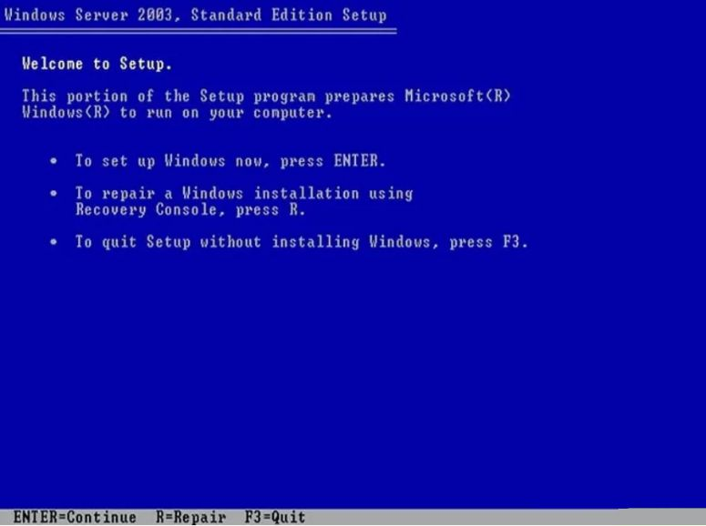
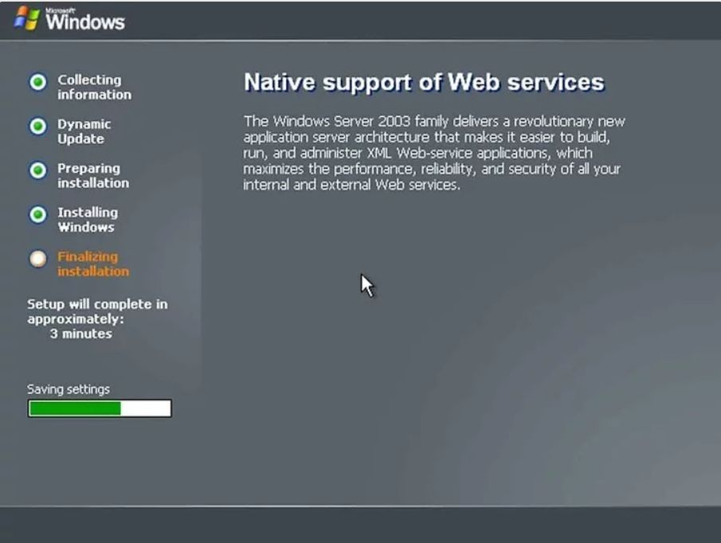
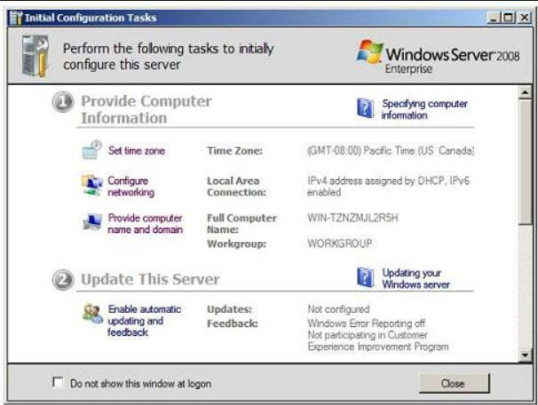
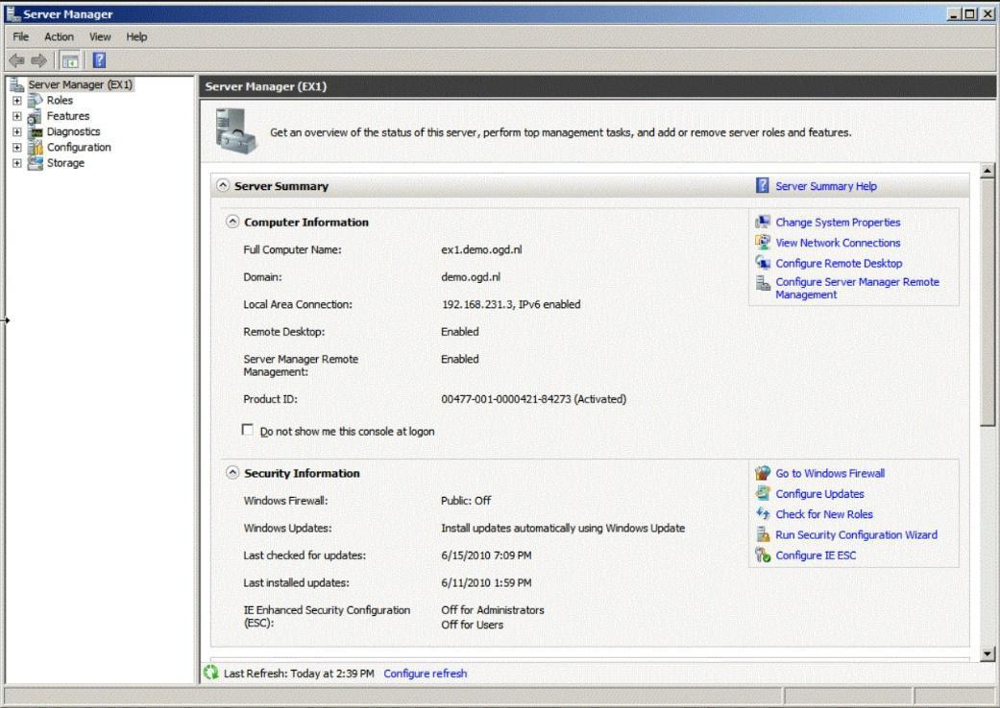
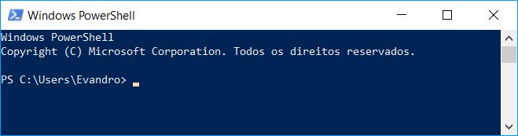

# Capítulo 8 – Windows Server

Após explorarmos em detalhe o ecossistema do Windows em sua versão para desktops, voltamos nosso foco agora para sua contraparte projetada para o coração da infraestrutura de TI: o **Windows Server**. Enquanto um sistema operacional de desktop é otimizado para a interação com um único usuário, um sistema operacional de servidor é construído para fornecer serviços, recursos e dados de forma centralizada para múltiplos usuários e computadores em uma rede. Ele é a espinha dorsal de ambientes corporativos, gerenciando tudo, desde o compartilhamento de arquivos e impressoras até a hospedagem de sites, aplicações complexas e, o mais importante, a identidade e a segurança de toda a organização através de **serviços de diretório**. Neste capítulo, mergulharemos no mais conhecido desses serviços, o Active Directory, começando pelo protocolo fundamental que o sustenta, o LDAP.

## Administração de Serviços de Diretório (Active Directory)

Um serviço de diretório é, em essência, um banco de dados especializado, otimizado para buscas e leituras rápidas, que armazena e organiza informações sobre os recursos de uma rede. Esses recursos, chamados de **objetos**, podem ser qualquer coisa: contas de usuário, computadores, impressoras, grupos de segurança, pastas compartilhadas, etc. O serviço de diretório mais proeminente no ecossistema Windows é o **Active Directory (AD)**.

Antes de nos aprofundarmos na implementação da Microsoft, é crucial entender o protocolo padrão da indústria que permite a comunicação e a consulta a esses diretórios: o **LDAP (Lightweight Directory Access Protocol)**. O nome já é autoexplicativo: é o protocolo "leve" de acesso a diretórios, e serve como a linguagem universal para interagir com o Active Directory e muitos outros serviços de diretório.

### LDAP (Lightweight Directory Access Protocol)

No esforço de padronizar os serviços de diretório, diversas entidades, como a ISO, definiram padrões abrangentes, como o **X.500**. No entanto, a complexidade do X.500 dificultou sua adoção em larga escala. A partir dele, surgiu uma especificação mais simples e otimizada para redes TCP/IP, o LDAP, que rapidamente se tornou o padrão de mercado.

O LDAP define tanto a forma como os dados são organizados quanto o conjunto de operações para acessá-los. Por padrão, um servidor LDAP "escuta" por conexões na porta **TCP 389**. Suas principais características são:

- **Padrão Aberto:** Suas especificações são públicas, permitindo que qualquer desenvolvedor crie aplicações ou serviços compatíveis.
- **APIs Bem Definidas:** Facilita a integração do serviço de diretório com outros softwares.
- **Otimizado para Consultas:** É significativamente mais rápido para operações de busca do que um banco de dados relacional tradicional.
- **Distribuível e Replicável:** A base de dados do diretório pode ser distribuída e replicada em múltiplos servidores, garantindo escalabilidade, tolerância a falhas e desempenho.

#### A Estrutura Hierárquica: DIT, DN e RDN

A informação em um diretório LDAP é organizada em uma estrutura hierárquica em forma de árvore, conhecida como **DIT (Directory Information Tree)**. Cada nó na árvore é uma **entrada** que representa um objeto (um usuário, um grupo, etc.).

Para localizar um objeto de forma única dentro dessa árvore, o LDAP utiliza um sistema de nomeação hierárquico. Os nomes são compostos por uma série de atributos e seus valores. As abreviações mais comuns são:

- `dc` (Domain Component): Um componente do nome de domínio. A raiz do domínio `example.com` seria representada como `dc=example,dc=com`.
- `ou` (Organizational Unit): Uma unidade organizacional, usada para agrupar objetos de forma lógica, como um departamento (`ou=Vendas`) ou um tipo de objeto (`ou=People`).
- `cn` (Common Name): O nome comum de um objeto, como o nome completo de um usuário (`cn=João Silva`) ou o nome de um grupo (`cn=Admins`).
- `sn` (Surname): O sobrenome de um usuário.
- `o` (Organization): O nome da organização, geralmente usado em níveis mais altos da árvore.
- `c` (Country): O código de duas letras do país.

Com base nesses atributos, definimos dois conceitos de nomeação cruciais:

- **Distinguished Name (DN):** É o **nome distinto** de um objeto, que funciona como seu endereço completo e único na DIT. O DN é formado pela concatenação dos nomes dos nós desde o objeto até a raiz da árvore.
- **Relative Distinguished Name (RDN):** É o **nome distinto relativo**, a parte do nome que é única dentro de seu contêiner pai. Por exemplo, `cn=João Silva` é o RDN do usuário João, dentro da `ou=Funcionarios`.

Vamos analisar em detalhe o exemplo de um nome distinto LDAP: `CN=evandrodv, OU=professores, DC=ti, DC=cursos, DC=com, DC=br`.

- **RDN:** `CN=evandrodv`. Identifica o objeto com o nome comum "evandrodv".
- **Caminho:** Lendo da esquerda para a direita, vemos que o objeto `evandrodv` está dentro da Unidade Organizacional `professores`. Esta, por sua vez, está dentro do domínio `ti.cursos.com.br`, que é representado pelos Componentes de Domínio `dc=ti`, `dc=cursos`, `dc=com`, `dc=br`.

#### Schema LDAP

O "dicionário" de um diretório LDAP, que define quais tipos de objetos podem ser criados (`objectClass`) e quais atributos eles devem (`must`) ou podem (`may`) ter, é chamado de **Schema**. O Schema garante a integridade e a consistência dos dados, estabelecendo, por exemplo, que um objeto da classe "usuário" (`inetOrgPerson`) deve ter um "nome comum" (`cn`) e um "sobrenome" (`sn`), e pode ter um "número de telefone" (`telephoneNumber`).

#### Operações LDAP

O protocolo LDAP define um conjunto de operações padrão para interagir com o diretório:

- **Bind:** A operação de "login", usada para autenticar um cliente no servidor e estabelecer uma sessão.
- **Search:** A operação mais comum, usada para procurar e recuperar entradas do diretório com base em filtros complexos.
- **Compare:** Verifica se uma entrada específica possui um determinado valor de atributo.
- **Add, Delete, Modify:** Operações para criar, remover e alterar entradas e seus atributos.
- **Modify DN (Distinguished Name):** Operação específica para renomear ou mover uma entrada na árvore.
- **Unbind:** A operação de "logout", que encerra a sessão e fecha a conexão de forma limpa.
- **Abandon:** Permite que um cliente cancele uma operação em andamento (como uma busca muito longa).
- **Extended Operation:** Uma operação genérica que permite a extensão do protocolo com funcionalidades personalizadas.
- **StartTLS:** Uma operação crucial de segurança que eleva uma conexão não criptografada (na porta 389) para uma conexão criptografada usando TLS, protegendo os dados em trânsito.

É importante não confundir um caminho LDAP com um caminho de rede UNC. Um caminho como `\\serv.cursos.com.br\curso01` utiliza o protocolo **SMB/CIFS** para acessar diretamente uma pasta compartilhada. O serviço de diretório (como o Active Directory) pode ser usado para _localizar_ o recurso "curso01" (por exemplo, buscando um objeto de compartilhamento), mas o _acesso_ em si ocorre através de outro protocolo de rede.

### AD (Active Directory)

Antes de mergulharmos nos detalhes técnicos do Active Directory (AD), é essencial compreender o problema que ele foi projetado para resolver. Para isso, precisamos diferenciar os dois modelos fundamentais de organização de redes no ambiente Windows: o grupo de trabalho (_workgroup_) e o domínio (_domain_).

#### Grupo de Trabalho vs. Domínio

Um **grupo de trabalho (workgroup)** é um modelo de rede descentralizado, também conhecido como _peer-to-peer_. Neste cenário, cada computador ou servidor na rede é uma ilha administrativa independente. Ele gerencia sua própria base de dados de contas de usuário e grupos locais. Não há um ponto central de autenticação ou de gerenciamento de políticas.

Imagine uma pequena empresa com três servidores para diferentes finalidades. Em um modelo de grupo de trabalho, a administração de usuários seria fragmentada:

Neste cenário, se a usuária "Ana" precisa de acesso a dois dos servidores, seria necessário criar uma conta para ela em cada um desses servidores. Se ela decidir alterar sua senha, terá que fazê-lo em dois lugares diferentes. Se um novo funcionário precisar de acesso a todos os três servidores, o administrador terá que criar três contas separadas. Fica claro que, embora simples, este modelo não é escalável e rapidamente se torna um caos administrativo e um risco de segurança. Por isso, os grupos de trabalho são indicados apenas para redes muito pequenas (geralmente com menos de 10 computadores).

Para superar essas limitações, foi criado o modelo de **domínio**, que é implementado através de um **serviço de diretório**. Um diretório é uma base de dados centralizada e hierárquica que armazena todas as informações sobre os recursos da rede.

Em um modelo de domínio, todos os servidores compartilham essa base de dados única. A usuária "Ana" possui apenas **uma identidade e uma senha** em toda a rede. Com essas credenciais únicas, ela pode se autenticar uma vez e acessar qualquer recurso em qualquer servidor ao qual tenha permissão, um conceito conhecido como **Single Sign-On (SSO)**. Visualmente, temos a impressão de uma base única, mas na realidade, múltiplos servidores (chamados Controladores de Domínio) mantêm cópias sincronizadas dessa base, garantindo redundância e alta disponibilidade através da replicação de dados.

#### A Definição de Active Directory

O **Active Directory (AD)** é a implementação da Microsoft para um serviço de diretório, introduzida a partir do Windows 2000 Server. Ele é o serviço responsável por armazenar informações sobre os objetos da rede e disponibilizá-las para usuários e administradores. O banco de dados do AD (o arquivo `ntds.dit`) deve residir em uma partição formatada com o sistema de arquivos **NTFS**.

As principais funções do AD são:

- **Autenticação e Autorização Centralizada:** Verifica a identidade dos usuários (autenticação) e determina a quais recursos eles podem ter acesso (autorização).
- **Repositório Central:** Armazena informações sobre contas de usuário, grupos, computadores, impressoras, políticas de segurança e outros objetos da rede.
- **Replicação:** Garante que as informações do diretório sejam mantidas consistentes em todos os servidores que participam do domínio.
- **Interface de Consulta e Programação:** Permite que usuários e aplicações pesquisem e interajam com os objetos do diretório, primariamente através do protocolo LDAP.

#### Componentes Lógicos do Active Directory

Os principais componentes lógicos do Active Directory são:

- **Domínio (Domain):** É a unidade fundamental de administração e segurança no AD. Um domínio agrupa logicamente um conjunto de objetos que compartilham um banco de dados de diretório, políticas de segurança e relações de confiança com outros domínios.
- **Controlador de Domínio (Domain Controller - DC):** É um servidor Windows Server que hospeda uma cópia do banco de dados do Active Directory. Sua principal responsabilidade é a autenticação de usuários e a aplicação das políticas de segurança do domínio. Em um domínio moderno, todos os DCs operam em um modelo de replicação _multi-master_, o que significa que alterações podem ser feitas em qualquer DC e serão replicadas para os demais.
- **Servidor Membro (Member Server):** É um servidor que foi ingressado no domínio, mas que **não** é um Controlador de Domínio. Ele utiliza o AD para autenticar usuários, mas não hospeda uma cópia do banco de dados do diretório.
- **Unidades Organizacionais (Organizational Units - OUs):** São contêineres dentro de um domínio usados para organizar objetos de forma hierárquica, geralmente espelhando a estrutura administrativa ou geográfica de uma empresa. O principal propósito das OUs é **delegar controle administrativo** (permitindo, por exemplo, que um gerente de TI local gerencie apenas os usuários e computadores de sua filial) e **aplicar Políticas de Grupo (Group Policies)** a conjuntos específicos de objetos.

Para "promover" um Servidor Membro a um Controlador de Domínio, em versões mais antigas do Windows Server (até 2008 R2), utilizava-se o assistente `dcpromo.exe`. Em versões mais recentes, este processo foi integrado ao **Gerenciador de Servidores** e utiliza o PowerShell nos bastidores.

#### Partições do Banco de Dados do AD

O banco de dados do Active Directory é logicamente dividido em partições (ou _naming contexts_) para controlar o escopo da replicação de dados.

- **Partição de Esquema (Schema):** Contém a definição de todas as classes de objetos e atributos que podem existir na floresta do AD. É o "blueprint" do diretório. Esta partição é replicada para todos os DCs na floresta.
- **Partição de Configuração (Configuration):** Armazena informações sobre a estrutura lógica da floresta e dos domínios, como a topologia de replicação. Também é replicada para todos os DCs na floresta.
- **Partição de Domínio (Domain):** Armazena todos os objetos de um domínio específico, como usuários, grupos e computadores. Esta partição é replicada **apenas** para os DCs dentro daquele mesmo domínio.

Existem também partições de **Aplicação**, que são configuráveis e permitem que aplicações (como o DNS integrado ao AD) armazenem seus dados e controlem o escopo de sua replicação.

#### Estrutura Lógica: Árvores, Florestas e Relações de Confiança

O Active Directory organiza seus objetos em uma estrutura lógica e hierárquica que pode ser expandida para acomodar desde pequenas empresas até corporações multinacionais. Os blocos de construção dessa estrutura são as árvores e as florestas.

- **Árvore de Domínios (Domain Tree):** Uma árvore é uma coleção de um ou mais domínios do Active Directory que compartilham um **espaço de nomes DNS contíguo e hierárquico**. O primeiro domínio criado em uma árvore é chamado de **domínio raiz da árvore**. Qualquer outro domínio adicionado diretamente abaixo dele é um **domínio filho**. Por exemplo, se uma empresa cria o domínio `empresa.com`, este é a raiz da árvore. Se, posteriormente, forem criados domínios para os departamentos de vendas e de recursos humanos, eles se tornarão `vendas.empresa.com` e `rh.empresa.com`, sendo filhos de `empresa.com` e parte da mesma árvore.
- **Floresta (Forest):** Uma floresta é o contêiner de mais alto nível na estrutura do Active Directory. Ela é uma coleção de **uma ou mais árvores de domínios**. A primeira árvore criada em uma floresta define o nome da floresta. Todas as árvores em uma floresta compartilham um **Schema** e uma **Partição de Configuração** em comum, o que garante consistência em toda a organização. As florestas são frequentemente usadas por grandes corporações que podem ter unidades de negócios com nomes DNS diferentes (ex: `empresa-a.com` e `empresa-b.net`), mas que precisam se comunicar e compartilhar recursos de forma segura.

Para permitir a comunicação e o acesso a recursos entre esses diferentes domínios, o AD estabelece automaticamente **relações de confiança (trusts)**.

- **Confiança Bidirecional e Transitiva:** Por padrão, dentro de uma floresta, todas as confianças são **bidirecionais** (se o domínio A confia no B, o B confia no A) e **transitivas** (se A confia em B, e B confia em C, então A confia automaticamente em C). Isso significa que, uma vez que um usuário é autenticado em qualquer domínio da floresta, sua identidade pode ser reconhecida e utilizada para conceder acesso a recursos em qualquer outro domínio da mesma floresta, simplificando a administração.
- **Confiança Unidirecional:** É possível criar confianças manuais que são de mão única, onde o domínio A confia no B, mas o B não confia no A. Isso é comum em cenários de parcerias entre empresas diferentes.

#### Catálogo Global (Global Catalog)

Em uma floresta com múltiplos domínios, encontrar um objeto (como um usuário ou uma impressora) exigiria uma busca em cada domínio separadamente. Para resolver isso e agilizar os processos de logon, o Active Directory utiliza um componente especial chamado **Catálogo Global (Global Catalog - GC)**.

Um GC é um Controlador de Domínio que, além de sua função normal, hospeda um índice especial de toda a floresta. Ele armazena:

- Uma **cópia completa e gravável** de todos os objetos de seu próprio domínio.
- Uma **cópia parcial e somente leitura** de todos os objetos de **todos os outros domínios** da floresta. Essa cópia parcial contém apenas os atributos mais utilizados em buscas (como nome do usuário, e-mail, etc.).

A função do Catálogo Global é crucial para o logon de usuários e para a localização rápida de recursos em toda a floresta, sem a necessidade de contatar múltiplos Controladores de Domínio em locais de rede diferentes.

#### Serviços e Componentes Físicos do Active Directory

O Active Directory não é um único serviço monolítico, mas sim um conjunto de serviços de função (_roles_) que podem ser instalados em um Windows Server.

- **AD DS (Active Directory Domain Services):** Este é o serviço principal, o coração do AD. É ele que armazena o banco de dados do diretório e gerencia os processos de autenticação e replicação.
- **AD CS (Certificate Services):** Atua como uma Autoridade Certificadora (CA) para a organização, permitindo a criação e o gerenciamento de certificados digitais para aumentar a segurança em comunicações, autenticação de usuários e proteção de dados.
- **AD FS (Federation Services):** Permite estender o gerenciamento de identidade para fora da rede corporativa, criando relações de confiança com outras organizações ou serviços em nuvem (como o Microsoft 365), habilitando o Single Sign-On entre plataformas diferentes.
- **AD LDS (Lightweight Directory Services):** Uma versão "leve" do AD DS, que fornece um serviço de diretório para aplicações específicas que precisam armazenar dados de forma hierárquica, sem a necessidade de criar um domínio completo.
- **AD RMS (Rights Management Services):** Um serviço de proteção da informação que permite aplicar políticas de uso persistentes a documentos e e-mails (ex: impedir a impressão, o encaminhamento ou a cópia de conteúdo), garantindo que a proteção viaje junto com o arquivo.

Fisicamente, o banco de dados do Active Directory e seus componentes de suporte são armazenados como arquivos no disco de cada Controlador de Domínio:

- **`Ntds.dit`:** O arquivo de banco de dados principal, que contém todas as partições do diretório (Schema, Configuração e Domínio).
- **`Edb.log`:** O arquivo de log de transações. Todas as alterações no diretório são escritas primeiro neste arquivo antes de serem aplicadas ao `Ntds.dit`. Este mecanismo (_write-ahead logging_) garante a integridade do banco de dados em caso de uma falha.
- **`Edb.chk`:** O arquivo de _checkpoint_, que marca até que ponto as transações do log já foram salvas com sucesso no arquivo de banco de dados.
- **`Res1.log` e `Res2.log`:** Arquivos de log reservados, que garantem que o sistema possa registrar transações críticas mesmo que o disco esteja cheio.

### Administração de Usuários, Grupos e Permissões

Com a estrutura lógica do Active Directory estabelecida, a tarefa contínua do administrador de sistemas é gerenciar os objetos dentro dela, principalmente as contas de usuário, os grupos e o controle de acesso aos recursos da rede. A ferramenta central para essas operações é o console **"Usuários e Computadores do Active Directory"** (`dsa.msc`), acessível através das "Ferramentas Administrativas" em um Controlador de Domínio ou em uma estação de trabalho com as ferramentas de administração instaladas.

#### Gerenciamento de Contas de Usuário

As contas de usuário são a representação digital de cada indivíduo na rede, servindo como a base para a autenticação e autorização.

- **Criação de Usuários:** Para criar uma nova conta, o administrador navega até a Unidade Organizacional (OU) apropriada, clica com o botão direito e seleciona "Novo" → "Usuário". Um assistente é iniciado, solicitando informações essenciais, como o nome completo e o **Nome de Logon do Usuário**. Este último é crucial e existe em dois formatos:
    - **UPN (User Principal Name):** O formato moderno, semelhante a um e-mail (ex: `j.silva@empresa.com`).
    - Nome de Logon Pré-Windows 2000: O formato legado (ex: EMPRESA\jsilva), ainda amplamente utilizado por questões de compatibilidade.
        Durante a criação, são definidas as políticas iniciais de senha, como a opção de segurança padrão "O usuário deve alterar a senha no próximo logon".

- **Edição de Propriedades:** Após a criação, um vasto leque de atributos pode ser gerenciado clicando com o botão direito no objeto do usuário e selecionando "Propriedades". As diversas abas permitem configurar informações de contato, detalhes da organização, e, o mais importante, gerenciar a aba **"Membro de"**, que define a quais grupos o usuário pertence, determinando assim suas permissões na rede.
- **Desativar vs. Excluir Contas:** Quando um funcionário deixa a organização, o administrador tem duas opções:
    - **Desativar Conta:** Esta é a **melhor prática recomendada**. A conta é desabilitada e não pode mais ser usada para logon, mas ela continua a existir no diretório, preservando seu SID único e todas as suas permissões e associações a grupos. Isso permite que a conta seja facilmente reativada se necessário e facilita a transferência de propriedade de arquivos.
    - **Excluir:** Esta ação é **permanente e irreversível**. O objeto do usuário e seu SID são destruídos. Mesmo que uma nova conta seja criada com o mesmo nome, ela terá um novo SID e não herdará nenhuma das permissões da conta antiga.

#### Gerenciamento de Grupos

A administração de permissões em escala é realizada através de grupos. A melhor prática é sempre atribuir permissões a grupos, e não a usuários individuais.

- **Criação de Grupos:** O processo é semelhante ao da criação de usuários: dentro de uma OU, clica-se com o botão direito e seleciona-se "Novo" → "Grupo". O assistente solicitará o nome do grupo e seu tipo.
- **Tipos de Grupo:** É fundamental entender a diferença entre os dois tipos de grupo:
    - **Grupos de Segurança:** São o pilar do controle de acesso. Possuem um SID e podem ser usados para atribuir permissões a recursos (pastas, impressoras, etc.) através de Listas de Controle de Acesso (ACLs).
    - **Grupos de Distribuição:** Servem **exclusivamente** como listas para distribuição de e-mails. São utilizados por servidores de e-mail (como o Microsoft Exchange) para enviar uma mensagem para um único endereço (ex: `marketing@empresa.com`) que será então entregue a todos os membros do grupo. Grupos de distribuição não podem ser usados para definir permissões.
- **Adicionando Membros:** Para adicionar usuários a um grupo, basta abrir as propriedades do grupo, navegar até a aba "Membros" e adicionar as contas de usuário desejadas. Um grupo pode conter usuários, computadores e até mesmo outros grupos (aninhamento).

#### Atribuição de Permissões a Recursos

Com usuários e grupos devidamente criados, o passo final é aplicar o controle de acesso aos recursos da rede, como pastas compartilhadas.

O processo é realizado através do Explorador de Arquivos, diretamente no recurso:

1. Navegue até a pasta ou arquivo desejado.
2. Clique com o botão direito e selecione "Propriedades".
3. Vá para a aba **"Segurança"**. Esta aba exibe a Lista de Controle de Acesso (ACL) do objeto.
4. Para modificar as permissões, clique em "Editar...".
5. Na nova janela, é possível adicionar um grupo (ou, menos recomendado, um usuário) à lista e, em seguida, marcar as caixas de seleção "Permitir" ou "Negar" para as permissões granulares, como "Leitura", "Gravação", "Modificar" e "Controle Total".

Seguindo a prática de atribuir permissões a grupos, o gerenciamento do acesso se torna uma tarefa simples de apenas adicionar ou remover usuários dos grupos apropriados, sem a necessidade de alterar as permissões no recurso a cada mudança de pessoal.

#### Gerenciamento Centralizado com Políticas de Grupo (GPO)

O Active Directory vai além do simples armazenamento de contas e grupos; ele fornece uma estrutura robusta para o gerenciamento centralizado de computadores e usuários em toda a rede. A principal ferramenta para essa tarefa é a **Política de Grupo (Group Policy)**. Uma **GPO (Group Policy Object)** é um conjunto de regras e configurações que um administrador pode definir para impor um padrão de segurança e de ambiente de trabalho para os objetos de um domínio.

Através das GPOs, é possível controlar, de forma centralizada, milhares de configurações, desde a política de complexidade de senhas e regras de firewall até a padronização do papel de parede da área de trabalho, a instalação automática de softwares e o mapeamento de impressoras de rede.

##### Estrutura e Tipos de GPOs

Cada GPO é dividido em duas seções principais, permitindo a aplicação de configurações distintas para as máquinas e para quem as utiliza:

- **Configuração do Computador:** Estas políticas afetam o computador como um todo, independentemente de qual usuário está logado. Elas são aplicadas durante a inicialização do sistema. Exemplos incluem:
    - Políticas de segurança (ex: exigir senhas complexas, configurar o firewall).
    - Instalação de softwares que devem estar disponíveis em uma máquina para todos os usuários.
    - Configurações de sistema, como definir as regras do Windows Update.
- **Configuração do Usuário:** Estas políticas afetam a experiência do usuário e "seguem" o usuário de um computador para outro. Elas são aplicadas no momento em que o usuário faz o logon. Exemplos incluem:
    - Redirecionamento de pastas (ex: salvar a pasta "Documentos" em um servidor de arquivos).
    - Mapeamento de unidades de rede e impressoras.
    - Restrições de interface (ex: desabilitar o acesso ao Painel de Controle ou ao Editor do Registro).
    - Padronização da aparência da área de trabalho.

As GPOs existem em diferentes escopos:

- **GPOs Locais:** Cada computador Windows possui uma política local, que é a primeira a ser aplicada.
- **GPOs de Site, Domínio e OU:** São as GPOs armazenadas no Active Directory e vinculadas a diferentes níveis da estrutura, permitindo um gerenciamento centralizado e escalável.

##### A Hierarquia de Aplicação (LSDOU)

A grande flexibilidade das GPOs reside na forma hierárquica como são aplicadas. O sistema processa as políticas em uma ordem específica, conhecida como **LSDOU**:

1. **L (Local):** Primeiro, a GPO local do próprio computador é aplicada.
2. **S (Site):** Em seguida, são aplicadas as GPOs vinculadas ao site do Active Directory onde o computador está localizado.
3. **D (Domínio):** Depois, são aplicadas as GPOs vinculadas ao domínio.
4. **OU (Unidade Organizacional):** Por último, são aplicadas as GPOs vinculadas às OUs, começando pela OU mais próxima da raiz do domínio e descendo até a OU que contém o objeto do computador ou do usuário.

A regra mais importante deste processo é que **a última política aplicada prevalece**. Isso significa que uma configuração em uma GPO de OU substituirá uma configuração conflitante de uma GPO de Domínio, pois a da OU é aplicada por último. Essa hierarquia permite que administradores definam políticas gerais para todo o domínio e, ao mesmo tempo, criem exceções ou configurações mais específicas para departamentos ou grupos de usuários em OUs distintas.

##### Gerenciamento Prático de GPOs

A criação, edição e vinculação de GPOs são realizadas através do console **GPMC (Group Policy Management Console)**, acessível em "Ferramentas Administrativas".

Para criar uma nova política e aplicá-la, o administrador navega até a Unidade Organizacional desejada, clica com o botão direito e seleciona a opção **"Criar um GPO neste domínio e vinculá-lo aqui"**. Esta ação realiza duas operações: cria o objeto da GPO no Active Directory e o **vincula** àquela OU, fazendo com que suas regras se apliquem a todos os usuários e computadores contidos nela.

Para definir as regras, clica-se com o botão direito na GPO recém-criada e seleciona-se "Editar". Isso abre o **Editor de Gerenciamento de Política de Grupo**, onde o administrador pode navegar pela árvore de configurações de Computador e de Usuário para habilitar e configurar as políticas desejadas.

Por padrão, os computadores clientes verificam e aplicam novas políticas de grupo periodicamente. Para acelerar o processo e testar uma nova configuração imediatamente, um administrador pode forçar a atualização em um computador cliente executando o comando `gpupdate /force` no Prompt de Comando.

## Característica, Instalação e Operação do Windows Server

O universo dos sistemas operacionais de servidor é vasto e complexo. Enquanto as edições Desktop são projetadas para a interação do usuário final, as edições Server são otimizadas para fornecer serviços de rede, gerenciar recursos de forma centralizada e operar com alta disponibilidade e segurança. Para abordar um tema tão amplo, focaremos nos aspectos mais importantes e recorrentes, utilizando versões históricas como o Windows Server 2003 para introduzir tecnologias e conceitos que evoluíram, mas cuja essência permanece nas versões mais modernas.

### Windows Server 2003

O Windows Server 2003 foi um marco na família de sistemas operacionais de servidor da Microsoft, trazendo melhorias significativas de desempenho, segurança e confiabilidade em relação ao seu predecessor. Ele solidificou a base para muitos dos serviços que são padrão em redes corporativas hoje.

#### Sistemas de Arquivos Suportados

O Windows Server 2003 oferecia suporte a três sistemas de arquivos: FAT16, FAT32 e NTFS. No entanto, em um ambiente de servidor, a escolha é, na prática, única. Embora o sistema pudesse ler e escrever em partições FAT, o **NTFS** era o sistema de arquivos preferencial e, de fato, obrigatório para funcionalidades críticas. Apenas o NTFS fornecia os recursos de segurança granular (permissões de acesso), confiabilidade (journaling), compressão, cotas de disco e, o mais importante, o suporte necessário para hospedar um banco de dados do **Active Directory**.

#### Processo de Instalação

A instalação do Windows Server 2003, realizada a partir de uma mídia como um CD, seguia um processo baseado em texto em sua fase inicial, antes de transicionar para uma interface gráfica. O passo a passo geral consistia em:

1. **Inicialização (Boot):** Com a BIOS do computador configurada para dar prioridade à unidade de CD/DVD, a instalação era iniciada. A primeira tela, baseada em texto, apresentava as opções para iniciar uma nova instalação, reparar uma existente usando o Console de Recuperação ou sair.

2. **Particionamento e Formatação:** O instalador guiava o usuário na criação da partição de disco onde o sistema seria instalado e, em seguida, na sua formatação, sendo o NTFS a escolha padrão.
3. **Cópia de Arquivos e Reinicialização:** Após a formatação, os arquivos de instalação eram copiados para o disco rígido, e o computador era reiniciado, passando para a fase gráfica da instalação.
4. **Configuração do Sistema:** Nesta fase, o usuário configurava opções regionais, inseria a chave do produto (licença) e definia o modo de licenciamento de conexões. Para um servidor, era necessário definir uma senha forte para a conta "Administrador" local e configurar os parâmetros de rede (seja de forma automática via DHCP ou, o mais comum para servidores, com um endereço IP estático).
5. **Finalização:** O processo era concluído, e após uma nova reinicialização, o sistema estava pronto para uso. O Windows Server 2003, assim como outras versões da época, oferecia um período de carência (geralmente 30 dias) para a ativação da licença junto à Microsoft.

É importante notar que, em uma instalação padrão, serviços de alto nível como o servidor Web **IIS (Internet Information Services)** não eram instalados por padrão. Eles eram componentes opcionais que o administrador deveria adicionar posteriormente através da ferramenta "Gerenciar seu servidor".

#### Edições do Windows Server 2003

Para atender a diferentes necessidades de mercado, o Windows Server 2003 foi lançado em quatro edições principais:

- **Web Edition:** Uma edição de baixo custo e com funcionalidades limitadas, projetada especificamente para atuar como um servidor Web, rodando o IIS e a plataforma ASP.NET. Não podia atuar como Controlador de Domínio e tinha limitações de memória (até 2 GB) e processadores (até 2).
- **Standard Edition:** A versão para pequenas e médias empresas, oferecendo um sistema operacional completo para serviços de arquivo, impressão, rede e aplicações. Suportava até 4 GB de RAM e 4 processadores.
- **Enterprise Edition:** Voltada para médias e grandes corporações, esta edição introduzia recursos de alta disponibilidade, como clustering de 8 nós, e suportava mais hardware, incluindo até 8 processadores e até 64 GB de RAM através da tecnologia PAE.
- **Datacenter Edition:** A edição mais robusta, projetada para data centers com requisitos extremos de desempenho e confiabilidade. Suportava até 64 processadores e maiores quantidades de memória, sendo licenciada principalmente através de fabricantes de hardware.

#### Conceitos e Tecnologias Fundamentais

Alguns conceitos e tecnologias importantes relacionados ao Windows Server 2003 e que valem a pena serem mencionados são:

- **PAE (Physical Address Extension):** Para superar a limitação de 4 GB de memória endereçável dos sistemas de 32 bits, o Windows Server 2003 (nas edições Enterprise e Datacenter) utilizava o PAE. Esta tecnologia permitia que o sistema operacional acessasse e gerenciasse mais de 4 GB de RAM física, embora cada processo individual ainda ficasse restrito ao seu próprio espaço de endereçamento virtual de 32 bits. A ativação era feita adicionando o parâmetro `/PAE` ao arquivo de inicialização `Boot.ini`.
- **Assinatura Digital de Drivers:** Para garantir a estabilidade do sistema, a Microsoft implementou a assinatura digital de drivers. Um driver assinado digitalmente foi testado e verificado pela Microsoft (através do programa WHQL - Windows Hardware Quality Labs), garantindo sua compatibilidade e confiabilidade. O sistema podia ser configurado para alertar ou até mesmo bloquear a instalação de drivers não assinados.
- **Server Core (Contexto Histórico):** Embora a opção de instalação **Server Core** tenha sido introduzida apenas em uma versão posterior (Windows Server 2008), o conceito é fundamental para a administração moderna. Trata-se de uma instalação mínima do sistema operacional, sem a interface gráfica completa (GUI). Um servidor em modo Server Core possui menor consumo de recursos, uma superfície de ataque reduzida (mais seguro) e exige menos atualizações. Ele é gerenciado primariamente via linha de comando (Prompt e PowerShell) ou através de ferramentas de administração remota a partir de outro computador.

### Windows Server 2008

Baseado no mesmo núcleo do Windows Vista, o Windows Server 2008 foi uma versão que introduziu mudanças fundamentais na forma como os servidores eram instalados, gerenciados e operados. Ele foi um marco por ser a **última versão do Windows Server a oferecer uma edição de 32 bits**, servindo como uma ponte para a era de 64 bits que se tornaria padrão a partir de então.

#### Instalação e Gerenciamento Inicial

O processo de instalação e a experiência pós-instalação foram redesenhados para serem mais orientados a funções e mais intuitivos para o administrador.

- **Tarefas de Configuração Iniciais (Initial Configuration Tasks):** Logo após o primeiro logon em uma nova instalação, o sistema apresentava uma janela de "Tarefas de Configuração Iniciais". Esta interface funcionava como um checklist, guiando o administrador através dos passos essenciais para colocar o servidor em funcionamento, como configurar o fuso horário, definir as configurações de rede, atribuir um nome ao computador e ingressá-lo em um domínio.

- **Gerenciador de Servidores (Server Manager):** Esta versão introduziu o Gerenciador de Servidores como o console de gerenciamento centralizado. Ele substituiu várias ferramentas separadas das versões anteriores e consolidou a administração do servidor em um único painel. A partir dele, os administradores podiam visualizar o estado do servidor, monitorar eventos e, o mais importante, adicionar e remover **Funções** (os papéis principais do servidor, como Active Directory ou Servidor Web) e **Recursos** (funcionalidades de suporte, como o .NET Framework ou o Failover Clustering).

#### Inovações Tecnológicas

O Windows Server 2008 foi a plataforma de lançamento para várias tecnologias que se tornariam padrão no ecossistema da Microsoft.

- **Windows PowerShell:** Integrado pela primeira vez, o PowerShell representou uma revolução para a administração via linha de comando. Como vimos no capítulo anterior, ele é um shell e uma linguagem de script orientada a objetos, muito mais poderosa que o antigo Prompt de Comando, permitindo a automação complexa de tarefas administrativas através de seus **cmdlets**.

- **Hyper-V:** Talvez a adição mais impactante tenha sido a introdução do Hyper-V, o **hipervisor nativo** da Microsoft para virtualização. Sendo um hipervisor do **Tipo 1 (bare-metal)**, ele permitia a criação e o gerenciamento de múltiplas máquinas virtuais (VMs) em um único servidor físico com alto desempenho. O Hyper-V marcou a entrada definitiva da Microsoft no mercado de virtualização de servidores, permitindo que as empresas consolidassem suas cargas de trabalho, reduzindo custos com hardware, energia e espaço físico.
- **Terminal Services com RemoteApp:** O serviço de Terminal (posteriormente renomeado para Remote Desktop Services) foi aprimorado com o **TS RemoteApp**. Esta funcionalidade permitia que um administrador publicasse uma única aplicação a partir do servidor. Para o usuário final, a aplicação aparecia como um ícone em sua própria área de trabalho e, ao ser executada, abria em sua própria janela, comportando-se como se estivesse instalada localmente, embora estivesse sendo processada remotamente no servidor.

#### Edições e Windows Server 2008 R2

Mantendo a estrutura de edições do seu predecessor (Web, Standard, Enterprise, Datacenter), o Server 2008 adicionou a edição **Itanium**, projetada para sistemas de 64 bits com processadores Intel Itanium, focada em cargas de trabalho de grande escala, como bancos de dados, e suportando recursos de alta disponibilidade como a troca "a quente" (_hot-swap_) de processadores e memória.

Uma atualização significativa veio com o **Windows Server 2008 R2**. Mais do que um simples pacote de serviços, foi uma nova versão, baseada no núcleo do Windows 7 e, crucialmente, **disponível apenas em 64 bits**. O R2 focou em refinar e expandir os recursos da versão original, trazendo melhorias de desempenho e eficiência, além de novas funcionalidades como:

- **Live Migration** para o Hyper-V, permitindo mover uma máquina virtual em execução de um servidor físico para outro sem interrupção do serviço.
- **DirectAccess**, uma nova forma de conectividade remota para clientes que funcionava de forma mais transparente que as VPNs tradicionais.
- A **Lixeira do Active Directory**, que permitia a recuperação de objetos do AD excluídos acidentalmente.
