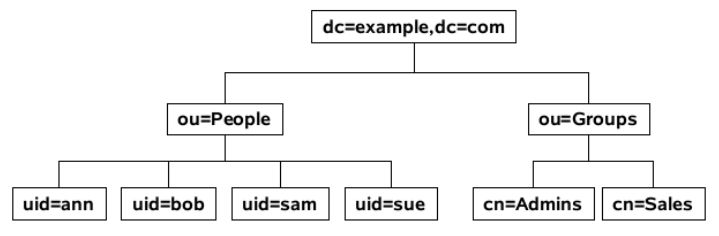
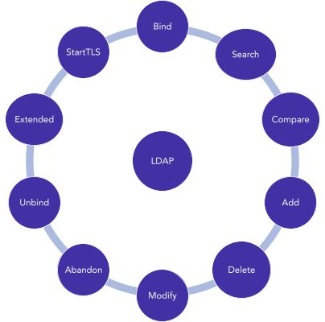
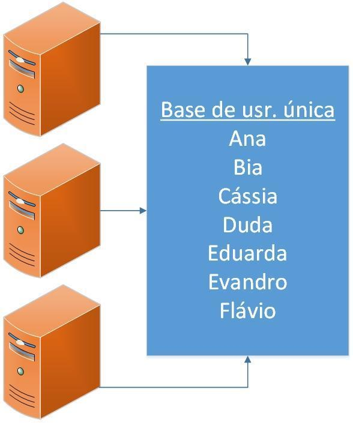
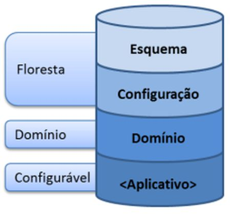
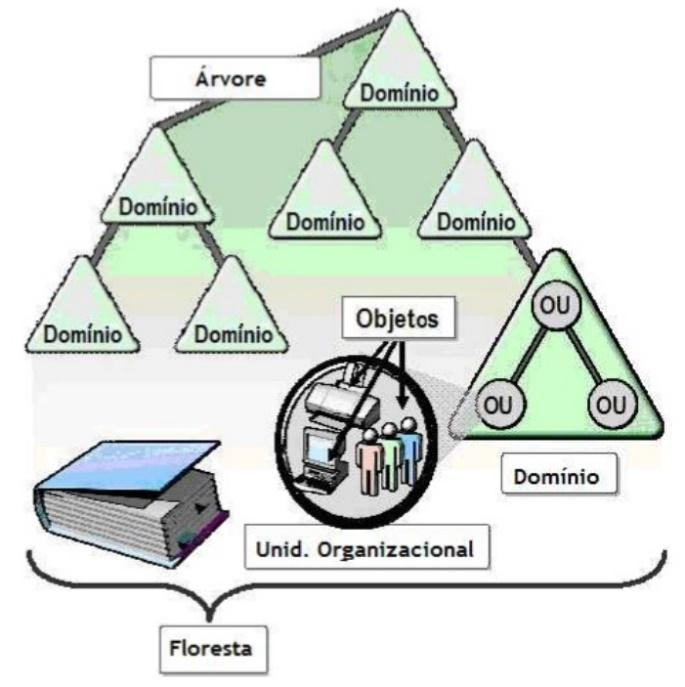
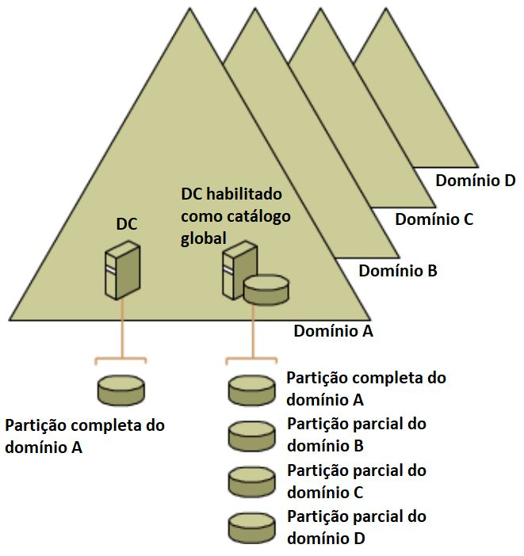

# Capítulo 8 – Windows Server

Após explorarmos em detalhe o ecossistema do Windows em sua versão para desktops, voltamos nosso foco agora para sua contraparte projetada para o coração da infraestrutura de TI: o **Windows Server**. Enquanto um sistema operacional de desktop é otimizado para a interação com um único usuário, um sistema operacional de servidor é construído para fornecer serviços, recursos e dados de forma centralizada para múltiplos usuários e computadores em uma rede. Ele é a espinha dorsal de ambientes corporativos, gerenciando tudo, desde o compartilhamento de arquivos e impressoras até a hospedagem de sites, aplicações complexas e, o mais importante, a identidade e a segurança de toda a organização através de **serviços de diretório**. Neste capítulo, mergulharemos no mais conhecido desses serviços, o Active Directory, começando pelo protocolo fundamental que o sustenta, o LDAP.

## Administração de Serviços de Diretório (Active Directory)

Um serviço de diretório é, em essência, um banco de dados especializado, otimizado para buscas e leituras rápidas, que armazena e organiza informações sobre os recursos de uma rede. Esses recursos, chamados de **objetos**, podem ser qualquer coisa: contas de usuário, computadores, impressoras, grupos de segurança, pastas compartilhadas, etc. O serviço de diretório mais proeminente no ecossistema Windows é o **Active Directory (AD)**.

Antes de nos aprofundarmos na implementação da Microsoft, é crucial entender o protocolo padrão da indústria que permite a comunicação e a consulta a esses diretórios: o **LDAP (Lightweight Directory Access Protocol)**. O nome já é autoexplicativo: é o protocolo "leve" de acesso a diretórios, e serve como a linguagem universal para interagir com o Active Directory e muitos outros serviços de diretório.

### LDAP (Lightweight Directory Access Protocol)

No esforço de padronizar os serviços de diretório, diversas entidades, como a ISO, definiram padrões abrangentes, como o **X.500**. No entanto, a complexidade do X.500 dificultou sua adoção em larga escala. A partir dele, surgiu uma especificação mais simples e otimizada para redes TCP/IP, o LDAP, que rapidamente se tornou o padrão de mercado.

O LDAP define tanto a forma como os dados são organizados quanto o conjunto de operações para acessá-los. Por padrão, um servidor LDAP "escuta" por conexões na porta **TCP 389**. Suas principais características são:

- **Padrão Aberto:** Suas especificações são públicas, permitindo que qualquer desenvolvedor crie aplicações ou serviços compatíveis.
- **APIs Bem Definidas:** Facilita a integração do serviço de diretório com outros softwares.
- **Otimizado para Consultas:** É significativamente mais rápido para operações de busca do que um banco de dados relacional tradicional.
- **Distribuível e Replicável:** A base de dados do diretório pode ser distribuída e replicada em múltiplos servidores, garantindo escalabilidade, tolerância a falhas e desempenho.

#### A Estrutura Hierárquica: DIT, DN e RDN

A informação em um diretório LDAP é organizada em uma estrutura hierárquica em forma de árvore, conhecida como **DIT (Directory Information Tree)**. Cada nó na árvore é uma **entrada** que representa um objeto (um usuário, um grupo, etc.).

Para localizar um objeto de forma única dentro dessa árvore, o LDAP utiliza um sistema de nomeação hierárquico. Os nomes são compostos por uma série de atributos e seus valores. As abreviações mais comuns são:

- `dc` (Domain Component): Um componente do nome de domínio. A raiz do domínio `example.com` seria representada como `dc=example,dc=com`.
- `ou` (Organizational Unit): Uma unidade organizacional, usada para agrupar objetos de forma lógica, como um departamento (`ou=Vendas`) ou um tipo de objeto (`ou=People`).
- `cn` (Common Name): O nome comum de um objeto, como o nome completo de um usuário (`cn=João Silva`) ou o nome de um grupo (`cn=Admins`).
- `sn` (Surname): O sobrenome de um usuário.
- `o` (Organization): O nome da organização, geralmente usado em níveis mais altos da árvore.
- `c` (Country): O código de duas letras do país.

Com base nesses atributos, definimos dois conceitos de nomeação cruciais:

- **Distinguished Name (DN):** É o **nome distinto** de um objeto, que funciona como seu endereço completo e único na DIT. O DN é formado pela concatenação dos nomes dos nós desde o objeto até a raiz da árvore.
- **Relative Distinguished Name (RDN):** É o **nome distinto relativo**, a parte do nome que é única dentro de seu contêiner pai. Por exemplo, `cn=João Silva` é o RDN do usuário João, dentro da `ou=Funcionarios`.

Vamos analisar em detalhe o exemplo de um nome distinto LDAP: `CN=evandrodv, OU=professores, DC=ti, DC=cursos, DC=com, DC=br`.

- **RDN:** `CN=evandrodv`. Identifica o objeto com o nome comum "evandrodv".
- **Caminho:** Lendo da esquerda para a direita, vemos que o objeto `evandrodv` está dentro da Unidade Organizacional `professores`. Esta, por sua vez, está dentro do domínio `ti.cursos.com.br`, que é representado pelos Componentes de Domínio `dc=ti`, `dc=cursos`, `dc=com`, `dc=br`.

#### Schema LDAP

O "dicionário" de um diretório LDAP, que define quais tipos de objetos podem ser criados (`objectClass`) e quais atributos eles devem (`must`) ou podem (`may`) ter, é chamado de **Schema**. O Schema garante a integridade e a consistência dos dados, estabelecendo, por exemplo, que um objeto da classe "usuário" (`inetOrgPerson`) deve ter um "nome comum" (`cn`) e um "sobrenome" (`sn`), e pode ter um "número de telefone" (`telephoneNumber`).

#### Operações LDAP

O protocolo LDAP define um conjunto de operações padrão para interagir com o diretório:

- **Bind:** A operação de "login", usada para autenticar um cliente no servidor e estabelecer uma sessão.
- **Search:** A operação mais comum, usada para procurar e recuperar entradas do diretório com base em filtros complexos.
- **Compare:** Verifica se uma entrada específica possui um determinado valor de atributo.
- **Add, Delete, Modify:** Operações para criar, remover e alterar entradas e seus atributos.
- **Modify DN (Distinguished Name):** Operação específica para renomear ou mover uma entrada na árvore.
- **Unbind:** A operação de "logout", que encerra a sessão e fecha a conexão de forma limpa.
- **Abandon:** Permite que um cliente cancele uma operação em andamento (como uma busca muito longa).
- **Extended Operation:** Uma operação genérica que permite a extensão do protocolo com funcionalidades personalizadas.
- **StartTLS:** Uma operação crucial de segurança que eleva uma conexão não criptografada (na porta 389) para uma conexão criptografada usando TLS, protegendo os dados em trânsito.

É importante não confundir um caminho LDAP com um caminho de rede UNC. Um caminho como `\\serv.cursos.com.br\curso01` utiliza o protocolo **SMB/CIFS** para acessar diretamente uma pasta compartilhada. O serviço de diretório (como o Active Directory) pode ser usado para _localizar_ o recurso "curso01" (por exemplo, buscando um objeto de compartilhamento), mas o _acesso_ em si ocorre através de outro protocolo de rede.

### AD (Active Directory)

Antes de mergulharmos nos detalhes técnicos do Active Directory (AD), é essencial compreender o problema que ele foi projetado para resolver. Para isso, precisamos diferenciar os dois modelos fundamentais de organização de redes no ambiente Windows: o grupo de trabalho (_workgroup_) e o domínio (_domain_).

#### Grupo de Trabalho vs. Domínio

Um **grupo de trabalho (workgroup)** é um modelo de rede descentralizado, também conhecido como _peer-to-peer_. Neste cenário, cada computador ou servidor na rede é uma ilha administrativa independente. Ele gerencia sua própria base de dados de contas de usuário e grupos locais. Não há um ponto central de autenticação ou de gerenciamento de políticas.

Imagine uma pequena empresa com três servidores para diferentes finalidades. Em um modelo de grupo de trabalho, a administração de usuários seria fragmentada:

Neste cenário, se a usuária "Ana" precisa de acesso a dois dos servidores, seria necessário criar uma conta para ela em cada um desses servidores. Se ela decidir alterar sua senha, terá que fazê-lo em dois lugares diferentes. Se um novo funcionário precisar de acesso a todos os três servidores, o administrador terá que criar três contas separadas. Fica claro que, embora simples, este modelo não é escalável e rapidamente se torna um caos administrativo e um risco de segurança. Por isso, os grupos de trabalho são indicados apenas para redes muito pequenas (geralmente com menos de 10 computadores).

Para superar essas limitações, foi criado o modelo de **domínio**, que é implementado através de um **serviço de diretório**. Um diretório é uma base de dados centralizada e hierárquica que armazena todas as informações sobre os recursos da rede.

Em um modelo de domínio, todos os servidores compartilham essa base de dados única. A usuária "Ana" possui apenas **uma identidade e uma senha** em toda a rede. Com essas credenciais únicas, ela pode se autenticar uma vez e acessar qualquer recurso em qualquer servidor ao qual tenha permissão, um conceito conhecido como **Single Sign-On (SSO)**. Visualmente, temos a impressão de uma base única, mas na realidade, múltiplos servidores (chamados Controladores de Domínio) mantêm cópias sincronizadas dessa base, garantindo redundância e alta disponibilidade através da replicação de dados.

#### A Definição de Active Directory

O **Active Directory (AD)** é a implementação da Microsoft para um serviço de diretório, introduzida a partir do Windows 2000 Server. Ele é o serviço responsável por armazenar informações sobre os objetos da rede e disponibilizá-las para usuários e administradores. O banco de dados do AD (o arquivo `ntds.dit`) deve residir em uma partição formatada com o sistema de arquivos **NTFS**.

As principais funções do AD são:

- **Autenticação e Autorização Centralizada:** Verifica a identidade dos usuários (autenticação) e determina a quais recursos eles podem ter acesso (autorização).
- **Repositório Central:** Armazena informações sobre contas de usuário, grupos, computadores, impressoras, políticas de segurança e outros objetos da rede.
- **Replicação:** Garante que as informações do diretório sejam mantidas consistentes em todos os servidores que participam do domínio.
- **Interface de Consulta e Programação:** Permite que usuários e aplicações pesquisem e interajam com os objetos do diretório, primariamente através do protocolo LDAP.

#### Componentes Lógicos do Active Directory

Os principais componentes lógicos do Active Directory são:

- **Domínio (Domain):** É a unidade fundamental de administração e segurança no AD. Um domínio agrupa logicamente um conjunto de objetos que compartilham um banco de dados de diretório, políticas de segurança e relações de confiança com outros domínios.
- **Controlador de Domínio (Domain Controller - DC):** É um servidor Windows Server que hospeda uma cópia do banco de dados do Active Directory. Sua principal responsabilidade é a autenticação de usuários e a aplicação das políticas de segurança do domínio. Em um domínio moderno, todos os DCs operam em um modelo de replicação _multi-master_, o que significa que alterações podem ser feitas em qualquer DC e serão replicadas para os demais.
- **Servidor Membro (Member Server):** É um servidor que foi ingressado no domínio, mas que **não** é um Controlador de Domínio. Ele utiliza o AD para autenticar usuários, mas não hospeda uma cópia do banco de dados do diretório.
- **Unidades Organizacionais (Organizational Units - OUs):** São contêineres dentro de um domínio usados para organizar objetos de forma hierárquica, geralmente espelhando a estrutura administrativa ou geográfica de uma empresa. O principal propósito das OUs é **delegar controle administrativo** (permitindo, por exemplo, que um gerente de TI local gerencie apenas os usuários e computadores de sua filial) e **aplicar Políticas de Grupo (Group Policies)** a conjuntos específicos de objetos.

Para "promover" um Servidor Membro a um Controlador de Domínio, em versões mais antigas do Windows Server (até 2008 R2), utilizava-se o assistente `dcpromo.exe`. Em versões mais recentes, este processo foi integrado ao **Gerenciador de Servidores** e utiliza o PowerShell nos bastidores.

#### Partições do Banco de Dados do AD

O banco de dados do Active Directory é logicamente dividido em partições (ou _naming contexts_) para controlar o escopo da replicação de dados.

- **Partição de Esquema (Schema):** Contém a definição de todas as classes de objetos e atributos que podem existir na floresta do AD. É o "blueprint" do diretório. Esta partição é replicada para todos os DCs na floresta.
- **Partição de Configuração (Configuration):** Armazena informações sobre a estrutura lógica da floresta e dos domínios, como a topologia de replicação. Também é replicada para todos os DCs na floresta.
- **Partição de Domínio (Domain):** Armazena todos os objetos de um domínio específico, como usuários, grupos e computadores. Esta partição é replicada **apenas** para os DCs dentro daquele mesmo domínio.

Existem também partições de **Aplicação**, que são configuráveis e permitem que aplicações (como o DNS integrado ao AD) armazenem seus dados e controlem o escopo de sua replicação.

#### Estrutura Lógica: Árvores, Florestas e Relações de Confiança

O Active Directory organiza seus objetos em uma estrutura lógica e hierárquica que pode ser expandida para acomodar desde pequenas empresas até corporações multinacionais. Os blocos de construção dessa estrutura são as árvores e as florestas.

- **Árvore de Domínios (Domain Tree):** Uma árvore é uma coleção de um ou mais domínios do Active Directory que compartilham um **espaço de nomes DNS contíguo e hierárquico**. O primeiro domínio criado em uma árvore é chamado de **domínio raiz da árvore**. Qualquer outro domínio adicionado diretamente abaixo dele é um **domínio filho**. Por exemplo, se uma empresa cria o domínio `empresa.com`, este é a raiz da árvore. Se, posteriormente, forem criados domínios para os departamentos de vendas e de recursos humanos, eles se tornarão `vendas.empresa.com` e `rh.empresa.com`, sendo filhos de `empresa.com` e parte da mesma árvore.
- **Floresta (Forest):** Uma floresta é o contêiner de mais alto nível na estrutura do Active Directory. Ela é uma coleção de **uma ou mais árvores de domínios**. A primeira árvore criada em uma floresta define o nome da floresta. Todas as árvores em uma floresta compartilham um **Schema** e uma **Partição de Configuração** em comum, o que garante consistência em toda a organização. As florestas são frequentemente usadas por grandes corporações que podem ter unidades de negócios com nomes DNS diferentes (ex: `empresa-a.com` e `empresa-b.net`), mas que precisam se comunicar e compartilhar recursos de forma segura.

Para permitir a comunicação e o acesso a recursos entre esses diferentes domínios, o AD estabelece automaticamente **relações de confiança (trusts)**.

- **Confiança Bidirecional e Transitiva:** Por padrão, dentro de uma floresta, todas as confianças são **bidirecionais** (se o domínio A confia no B, o B confia no A) e **transitivas** (se A confia em B, e B confia em C, então A confia automaticamente em C). Isso significa que, uma vez que um usuário é autenticado em qualquer domínio da floresta, sua identidade pode ser reconhecida e utilizada para conceder acesso a recursos em qualquer outro domínio da mesma floresta, simplificando a administração.
- **Confiança Unidirecional:** É possível criar confianças manuais que são de mão única, onde o domínio A confia no B, mas o B não confia no A. Isso é comum em cenários de parcerias entre empresas diferentes.

#### Catálogo Global (Global Catalog)

Em uma floresta com múltiplos domínios, encontrar um objeto (como um usuário ou uma impressora) exigiria uma busca em cada domínio separadamente. Para resolver isso e agilizar os processos de logon, o Active Directory utiliza um componente especial chamado **Catálogo Global (Global Catalog - GC)**.

Um GC é um Controlador de Domínio que, além de sua função normal, hospeda um índice especial de toda a floresta. Ele armazena:

- Uma **cópia completa e gravável** de todos os objetos de seu próprio domínio.
- Uma **cópia parcial e somente leitura** de todos os objetos de **todos os outros domínios** da floresta. Essa cópia parcial contém apenas os atributos mais utilizados em buscas (como nome do usuário, e-mail, etc.).

A função do Catálogo Global é crucial para o logon de usuários e para a localização rápida de recursos em toda a floresta, sem a necessidade de contatar múltiplos Controladores de Domínio em locais de rede diferentes.

#### Serviços e Componentes Físicos do Active Directory

O Active Directory não é um único serviço monolítico, mas sim um conjunto de serviços de função (_roles_) que podem ser instalados em um Windows Server.

- **AD DS (Active Directory Domain Services):** Este é o serviço principal, o coração do AD. É ele que armazena o banco de dados do diretório e gerencia os processos de autenticação e replicação.
- **AD CS (Certificate Services):** Atua como uma Autoridade Certificadora (CA) para a organização, permitindo a criação e o gerenciamento de certificados digitais para aumentar a segurança em comunicações, autenticação de usuários e proteção de dados.
- **AD FS (Federation Services):** Permite estender o gerenciamento de identidade para fora da rede corporativa, criando relações de confiança com outras organizações ou serviços em nuvem (como o Microsoft 365), habilitando o Single Sign-On entre plataformas diferentes.
- **AD LDS (Lightweight Directory Services):** Uma versão "leve" do AD DS, que fornece um serviço de diretório para aplicações específicas que precisam armazenar dados de forma hierárquica, sem a necessidade de criar um domínio completo.
- **AD RMS (Rights Management Services):** Um serviço de proteção da informação que permite aplicar políticas de uso persistentes a documentos e e-mails (ex: impedir a impressão, o encaminhamento ou a cópia de conteúdo), garantindo que a proteção viaje junto com o arquivo.

Fisicamente, o banco de dados do Active Directory e seus componentes de suporte são armazenados como arquivos no disco de cada Controlador de Domínio:

- **`Ntds.dit`:** O arquivo de banco de dados principal, que contém todas as partições do diretório (Schema, Configuração e Domínio).
- **`Edb.log`:** O arquivo de log de transações. Todas as alterações no diretório são escritas primeiro neste arquivo antes de serem aplicadas ao `Ntds.dit`. Este mecanismo (_write-ahead logging_) garante a integridade do banco de dados em caso de uma falha.
- **`Edb.chk`:** O arquivo de _checkpoint_, que marca até que ponto as transações do log já foram salvas com sucesso no arquivo de banco de dados.
- **`Res1.log` e `Res2.log`:** Arquivos de log reservados, que garantem que o sistema possa registrar transações críticas mesmo que o disco esteja cheio.
