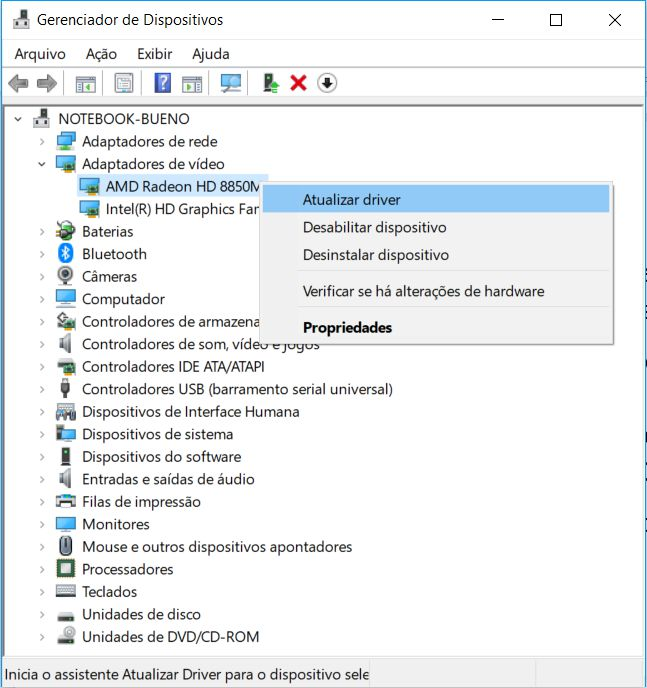
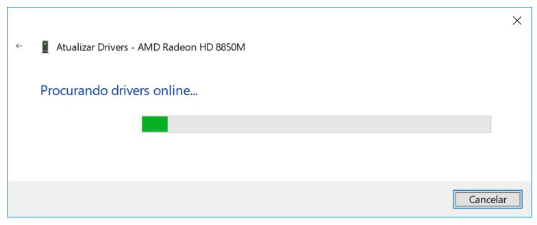
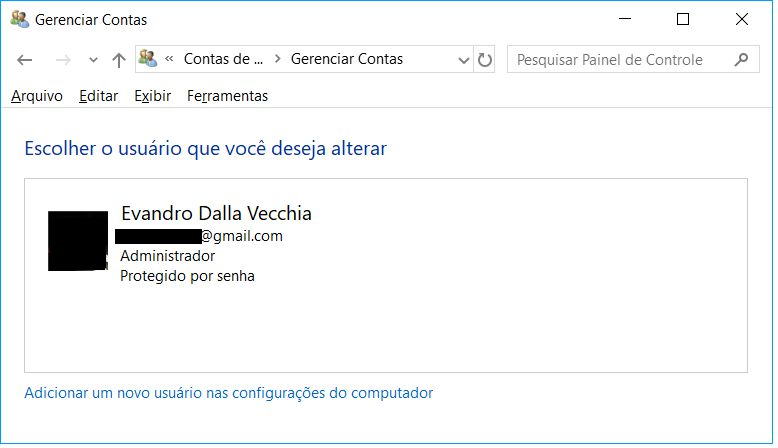
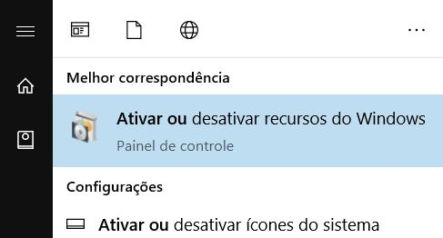

# Capítulo 8 – Windows Server

Após explorarmos em detalhe o ecossistema do Windows em sua versão para desktops, voltamos nosso foco agora para sua contraparte projetada para o coração da infraestrutura de TI: o **Windows Server**. Enquanto um sistema operacional de desktop é otimizado para a interação com um único usuário, um sistema operacional de servidor é construído para fornecer serviços, recursos e dados de forma centralizada para múltiplos usuários e computadores em uma rede. Ele é a espinha dorsal de ambientes corporativos, gerenciando tudo, desde o compartilhamento de arquivos e impressoras até a hospedagem de sites, aplicações complexas e, o mais importante, a identidade e a segurança de toda a organização através de **serviços de diretório**. Neste capítulo, mergulharemos no mais conhecido desses serviços, o Active Directory, começando pelo protocolo fundamental que o sustenta, o LDAP.

## Administração de Serviços de Diretório (Active Directory)

Um serviço de diretório é, em essência, um banco de dados especializado, otimizado para buscas e leituras rápidas, que armazena e organiza informações sobre os recursos de uma rede. Esses recursos, chamados de **objetos**, podem ser qualquer coisa: contas de usuário, computadores, impressoras, grupos de segurança, pastas compartilhadas, etc. O serviço de diretório mais proeminente no ecossistema Windows é o **Active Directory (AD)**.

Antes de nos aprofundarmos na implementação da Microsoft, é crucial entender o protocolo padrão da indústria que permite a comunicação e a consulta a esses diretórios: o **LDAP (Lightweight Directory Access Protocol)**. O nome já é autoexplicativo: é o protocolo "leve" de acesso a diretórios, e serve como a linguagem universal para interagir com o Active Directory e muitos outros serviços de diretório.

### LDAP (Lightweight Directory Access Protocol)

No esforço de padronizar os serviços de diretório, diversas entidades, como a ISO, definiram padrões abrangentes, como o **X.500**. No entanto, a complexidade do X.500 dificultou sua adoção em larga escala. A partir dele, surgiu uma especificação mais simples e otimizada para redes TCP/IP, o LDAP, que rapidamente se tornou o padrão de mercado.

O LDAP define tanto a forma como os dados são organizados quanto o conjunto de operações para acessá-los. Por padrão, um servidor LDAP "escuta" por conexões na porta **TCP 389**. Suas principais características são:

- **Padrão Aberto:** Suas especificações são públicas, permitindo que qualquer desenvolvedor crie aplicações ou serviços compatíveis.
- **APIs Bem Definidas:** Facilita a integração do serviço de diretório com outros softwares.
- **Otimizado para Consultas:** É significativamente mais rápido para operações de busca do que um banco de dados relacional tradicional.
- **Distribuível e Replicável:** A base de dados do diretório pode ser distribuída e replicada em múltiplos servidores, garantindo escalabilidade, tolerância a falhas e desempenho.

#### A Estrutura Hierárquica: DIT, DN e RDN

A informação em um diretório LDAP é organizada em uma estrutura hierárquica em forma de árvore, conhecida como **DIT (Directory Information Tree)**. Cada nó na árvore é uma **entrada** que representa um objeto (um usuário, um grupo, etc.).

<div align="center">

</div>

Para localizar um objeto de forma única dentro dessa árvore, o LDAP utiliza um sistema de nomeação hierárquico. Os nomes são compostos por uma série de atributos e seus valores. As abreviações mais comuns são:

- `dc` (Domain Component): Um componente do nome de domínio. A raiz do domínio `example.com` seria representada como `dc=example,dc=com`.
- `ou` (Organizational Unit): Uma unidade organizacional, usada para agrupar objetos de forma lógica, como um departamento (`ou=Vendas`) ou um tipo de objeto (`ou=People`).
- `cn` (Common Name): O nome comum de um objeto, como o nome completo de um usuário (`cn=João Silva`) ou o nome de um grupo (`cn=Admins`).
- `sn` (Surname): O sobrenome de um usuário.
- `o` (Organization): O nome da organização, geralmente usado em níveis mais altos da árvore.
- `c` (Country): O código de duas letras do país.

Com base nesses atributos, definimos dois conceitos de nomeação cruciais:

- **Distinguished Name (DN):** É o **nome distinto** de um objeto, que funciona como seu endereço completo e único na DIT. O DN é formado pela concatenação dos nomes dos nós desde o objeto até a raiz da árvore.
- **Relative Distinguished Name (RDN):** É o **nome distinto relativo**, a parte do nome que é única dentro de seu contêiner pai. Por exemplo, `cn=João Silva` é o RDN do usuário João, dentro da `ou=Funcionarios`.

Vamos analisar em detalhe o exemplo de um nome distinto LDAP: `CN=evandrodv, OU=professores, DC=ti, DC=cursos, DC=com, DC=br`.

- **RDN:** `CN=evandrodv`. Identifica o objeto com o nome comum "evandrodv".
- **Caminho:** Lendo da esquerda para a direita, vemos que o objeto `evandrodv` está dentro da Unidade Organizacional `professores`. Esta, por sua vez, está dentro do domínio `ti.cursos.com.br`, que é representado pelos Componentes de Domínio `dc=ti`, `dc=cursos`, `dc=com`, `dc=br`.

#### Schema LDAP

O "dicionário" de um diretório LDAP, que define quais tipos de objetos podem ser criados (`objectClass`) e quais atributos eles devem (`must`) ou podem (`may`) ter, é chamado de **Schema**. O Schema garante a integridade e a consistência dos dados, estabelecendo, por exemplo, que um objeto da classe "usuário" (`inetOrgPerson`) deve ter um "nome comum" (`cn`) e um "sobrenome" (`sn`), e pode ter um "número de telefone" (`telephoneNumber`).

#### Operações LDAP

O protocolo LDAP define um conjunto de operações padrão para interagir com o diretório:

<div align="center">

</div>

- **Bind:** A operação de "login", usada para autenticar um cliente no servidor e estabelecer uma sessão.
- **Search:** A operação mais comum, usada para procurar e recuperar entradas do diretório com base em filtros complexos.
- **Compare:** Verifica se uma entrada específica possui um determinado valor de atributo.
- **Add, Delete, Modify:** Operações para criar, remover e alterar entradas e seus atributos.
- **Modify DN (Distinguished Name):** Operação específica para renomear ou mover uma entrada na árvore.
- **Unbind:** A operação de "logout", que encerra a sessão e fecha a conexão de forma limpa.
- **Abandon:** Permite que um cliente cancele uma operação em andamento (como uma busca muito longa).
- **Extended Operation:** Uma operação genérica que permite a extensão do protocolo com funcionalidades personalizadas.
- **StartTLS:** Uma operação crucial de segurança que eleva uma conexão não criptografada (na porta 389) para uma conexão criptografada usando TLS, protegendo os dados em trânsito.

É importante não confundir um caminho LDAP com um caminho de rede UNC. Um caminho como `\\serv.cursos.com.br\curso01` utiliza o protocolo **SMB/CIFS** para acessar diretamente uma pasta compartilhada. O serviço de diretório (como o Active Directory) pode ser usado para _localizar_ o recurso "curso01" (por exemplo, buscando um objeto de compartilhamento), mas o _acesso_ em si ocorre através de outro protocolo de rede.

### AD (Active Directory)

Antes de mergulharmos nos detalhes técnicos do Active Directory (AD), é essencial compreender o problema que ele foi projetado para resolver. Para isso, precisamos diferenciar os dois modelos fundamentais de organização de redes no ambiente Windows: o grupo de trabalho (_workgroup_) e o domínio (_domain_).

#### Grupo de Trabalho vs. Domínio

Um **grupo de trabalho (workgroup)** é um modelo de rede descentralizado, também conhecido como _peer-to-peer_. Neste cenário, cada computador ou servidor na rede é uma ilha administrativa independente. Ele gerencia sua própria base de dados de contas de usuário e grupos locais. Não há um ponto central de autenticação ou de gerenciamento de políticas.

Imagine uma pequena empresa com três servidores para diferentes finalidades. Em um modelo de grupo de trabalho, a administração de usuários seria fragmentada:

<div align="center">

</div>

Neste cenário, se a usuária "Ana" precisa de acesso a dois dos servidores, seria necessário criar uma conta para ela em cada um desses servidores. Se ela decidir alterar sua senha, terá que fazê-lo em dois lugares diferentes. Se um novo funcionário precisar de acesso a todos os três servidores, o administrador terá que criar três contas separadas. Fica claro que, embora simples, este modelo não é escalável e rapidamente se torna um caos administrativo e um risco de segurança. Por isso, os grupos de trabalho são indicados apenas para redes muito pequenas (geralmente com menos de 10 computadores).

Para superar essas limitações, foi criado o modelo de **domínio**, que é implementado através de um **serviço de diretório**. Um diretório é uma base de dados centralizada e hierárquica que armazena todas as informações sobre os recursos da rede.

<div align="center">

</div>

Em um modelo de domínio, todos os servidores compartilham essa base de dados única. A usuária "Ana" possui apenas **uma identidade e uma senha** em toda a rede. Com essas credenciais únicas, ela pode se autenticar uma vez e acessar qualquer recurso em qualquer servidor ao qual tenha permissão, um conceito conhecido como **Single Sign-On (SSO)**. Visualmente, temos a impressão de uma base única, mas na realidade, múltiplos servidores (chamados Controladores de Domínio) mantêm cópias sincronizadas dessa base, garantindo redundância e alta disponibilidade através da replicação de dados.

#### A Definição de Active Directory

O **Active Directory (AD)** é a implementação da Microsoft para um serviço de diretório, introduzida a partir do Windows 2000 Server. Ele é o serviço responsável por armazenar informações sobre os objetos da rede e disponibilizá-las para usuários e administradores. O banco de dados do AD (o arquivo `ntds.dit`) deve residir em uma partição formatada com o sistema de arquivos **NTFS**.

As principais funções do AD são:

- **Autenticação e Autorização Centralizada:** Verifica a identidade dos usuários (autenticação) e determina a quais recursos eles podem ter acesso (autorização).
- **Repositório Central:** Armazena informações sobre contas de usuário, grupos, computadores, impressoras, políticas de segurança e outros objetos da rede.
- **Replicação:** Garante que as informações do diretório sejam mantidas consistentes em todos os servidores que participam do domínio.
- **Interface de Consulta e Programação:** Permite que usuários e aplicações pesquisem e interajam com os objetos do diretório, primariamente através do protocolo LDAP.

#### Componentes Lógicos do Active Directory

Os principais componentes lógicos do Active Directory são:

- **Domínio (Domain):** É a unidade fundamental de administração e segurança no AD. Um domínio agrupa logicamente um conjunto de objetos que compartilham um banco de dados de diretório, políticas de segurança e relações de confiança com outros domínios.
- **Controlador de Domínio (Domain Controller - DC):** É um servidor Windows Server que hospeda uma cópia do banco de dados do Active Directory. Sua principal responsabilidade é a autenticação de usuários e a aplicação das políticas de segurança do domínio. Em um domínio moderno, todos os DCs operam em um modelo de replicação _multi-master_, o que significa que alterações podem ser feitas em qualquer DC e serão replicadas para os demais.
- **Servidor Membro (Member Server):** É um servidor que foi ingressado no domínio, mas que **não** é um Controlador de Domínio. Ele utiliza o AD para autenticar usuários, mas não hospeda uma cópia do banco de dados do diretório.
- **Unidades Organizacionais (Organizational Units - OUs):** São contêineres dentro de um domínio usados para organizar objetos de forma hierárquica, geralmente espelhando a estrutura administrativa ou geográfica de uma empresa. O principal propósito das OUs é **delegar controle administrativo** (permitindo, por exemplo, que um gerente de TI local gerencie apenas os usuários e computadores de sua filial) e **aplicar Políticas de Grupo (Group Policies)** a conjuntos específicos de objetos.

Para "promover" um Servidor Membro a um Controlador de Domínio, em versões mais antigas do Windows Server (até 2008 R2), utilizava-se o assistente `dcpromo.exe`. Em versões mais recentes, este processo foi integrado ao **Gerenciador de Servidores** e utiliza o PowerShell nos bastidores.

#### Partições do Banco de Dados do AD

O banco de dados do Active Directory é logicamente dividido em partições (ou _naming contexts_) para controlar o escopo da replicação de dados.

<div align="center">

</div>

- **Partição de Esquema (Schema):** Contém a definição de todas as classes de objetos e atributos que podem existir na floresta do AD. É o "blueprint" do diretório. Esta partição é replicada para todos os DCs na floresta.
- **Partição de Configuração (Configuration):** Armazena informações sobre a estrutura lógica da floresta e dos domínios, como a topologia de replicação. Também é replicada para todos os DCs na floresta.
- **Partição de Domínio (Domain):** Armazena todos os objetos de um domínio específico, como usuários, grupos e computadores. Esta partição é replicada **apenas** para os DCs dentro daquele mesmo domínio.

Existem também partições de **Aplicação**, que são configuráveis e permitem que aplicações (como o DNS integrado ao AD) armazenem seus dados e controlem o escopo de sua replicação.

#### Estrutura Lógica: Árvores, Florestas e Relações de Confiança

O Active Directory organiza seus objetos em uma estrutura lógica e hierárquica que pode ser expandida para acomodar desde pequenas empresas até corporações multinacionais. Os blocos de construção dessa estrutura são as árvores e as florestas.

- **Árvore de Domínios (Domain Tree):** Uma árvore é uma coleção de um ou mais domínios do Active Directory que compartilham um **espaço de nomes DNS contíguo e hierárquico**. O primeiro domínio criado em uma árvore é chamado de **domínio raiz da árvore**. Qualquer outro domínio adicionado diretamente abaixo dele é um **domínio filho**. Por exemplo, se uma empresa cria o domínio `empresa.com`, este é a raiz da árvore. Se, posteriormente, forem criados domínios para os departamentos de vendas e de recursos humanos, eles se tornarão `vendas.empresa.com` e `rh.empresa.com`, sendo filhos de `empresa.com` e parte da mesma árvore.
- **Floresta (Forest):** Uma floresta é o contêiner de mais alto nível na estrutura do Active Directory. Ela é uma coleção de **uma ou mais árvores de domínios**. A primeira árvore criada em uma floresta define o nome da floresta. Todas as árvores em uma floresta compartilham um **Schema** e uma **Partição de Configuração** em comum, o que garante consistência em toda a organização. As florestas são frequentemente usadas por grandes corporações que podem ter unidades de negócios com nomes DNS diferentes (ex: `empresa-a.com` e `empresa-b.net`), mas que precisam se comunicar e compartilhar recursos de forma segura.

<div align="center">

</div>

Para permitir a comunicação e o acesso a recursos entre esses diferentes domínios, o AD estabelece automaticamente **relações de confiança (trusts)**.

- **Confiança Bidirecional e Transitiva:** Por padrão, dentro de uma floresta, todas as confianças são **bidirecionais** (se o domínio A confia no B, o B confia no A) e **transitivas** (se A confia em B, e B confia em C, então A confia automaticamente em C). Isso significa que, uma vez que um usuário é autenticado em qualquer domínio da floresta, sua identidade pode ser reconhecida e utilizada para conceder acesso a recursos em qualquer outro domínio da mesma floresta, simplificando a administração.
- **Confiança Unidirecional:** É possível criar confianças manuais que são de mão única, onde o domínio A confia no B, mas o B não confia no A. Isso é comum em cenários de parcerias entre empresas diferentes.

#### Catálogo Global (Global Catalog)

Em uma floresta com múltiplos domínios, encontrar um objeto (como um usuário ou uma impressora) exigiria uma busca em cada domínio separadamente. Para resolver isso e agilizar os processos de logon, o Active Directory utiliza um componente especial chamado **Catálogo Global (Global Catalog - GC)**.

Um GC é um Controlador de Domínio que, além de sua função normal, hospeda um índice especial de toda a floresta. Ele armazena:

- Uma **cópia completa e gravável** de todos os objetos de seu próprio domínio.
- Uma **cópia parcial e somente leitura** de todos os objetos de **todos os outros domínios** da floresta. Essa cópia parcial contém apenas os atributos mais utilizados em buscas (como nome do usuário, e-mail, etc.).

<div align="center">

</div>

A função do Catálogo Global é crucial para o logon de usuários e para a localização rápida de recursos em toda a floresta, sem a necessidade de contatar múltiplos Controladores de Domínio em locais de rede diferentes.

#### Serviços e Componentes Físicos do Active Directory

O Active Directory não é um único serviço monolítico, mas sim um conjunto de serviços de função (_roles_) que podem ser instalados em um Windows Server.

- **AD DS (Active Directory Domain Services):** Este é o serviço principal, o coração do AD. É ele que armazena o banco de dados do diretório e gerencia os processos de autenticação e replicação.
- **AD CS (Certificate Services):** Atua como uma Autoridade Certificadora (CA) para a organização, permitindo a criação e o gerenciamento de certificados digitais para aumentar a segurança em comunicações, autenticação de usuários e proteção de dados.
- **AD FS (Federation Services):** Permite estender o gerenciamento de identidade para fora da rede corporativa, criando relações de confiança com outras organizações ou serviços em nuvem (como o Microsoft 365), habilitando o Single Sign-On entre plataformas diferentes.
- **AD LDS (Lightweight Directory Services):** Uma versão "leve" do AD DS, que fornece um serviço de diretório para aplicações específicas que precisam armazenar dados de forma hierárquica, sem a necessidade de criar um domínio completo.
- **AD RMS (Rights Management Services):** Um serviço de proteção da informação que permite aplicar políticas de uso persistentes a documentos e e-mails (ex: impedir a impressão, o encaminhamento ou a cópia de conteúdo), garantindo que a proteção viaje junto com o arquivo.

Fisicamente, o banco de dados do Active Directory e seus componentes de suporte são armazenados como arquivos no disco de cada Controlador de Domínio:

- **`Ntds.dit`:** O arquivo de banco de dados principal, que contém todas as partições do diretório (Schema, Configuração e Domínio).
- **`Edb.log`:** O arquivo de log de transações. Todas as alterações no diretório são escritas primeiro neste arquivo antes de serem aplicadas ao `Ntds.dit`. Este mecanismo (_write-ahead logging_) garante a integridade do banco de dados em caso de uma falha.
- **`Edb.chk`:** O arquivo de _checkpoint_, que marca até que ponto as transações do log já foram salvas com sucesso no arquivo de banco de dados.
- **`Res1.log` e `Res2.log`:** Arquivos de log reservados, que garantem que o sistema possa registrar transações críticas mesmo que o disco esteja cheio.

### Administração de Usuários, Grupos e Permissões

Com a estrutura lógica do Active Directory estabelecida, a tarefa contínua do administrador de sistemas é gerenciar os objetos dentro dela, principalmente as contas de usuário, os grupos e o controle de acesso aos recursos da rede. A ferramenta central para essas operações é o console **"Usuários e Computadores do Active Directory"** (`dsa.msc`), acessível através das "Ferramentas Administrativas" em um Controlador de Domínio ou em uma estação de trabalho com as ferramentas de administração instaladas.

#### Gerenciamento de Contas de Usuário

As contas de usuário são a representação digital de cada indivíduo na rede, servindo como a base para a autenticação e autorização.

- **Criação de Usuários:** Para criar uma nova conta, o administrador navega até a Unidade Organizacional (OU) apropriada, clica com o botão direito e seleciona "Novo" → "Usuário". Um assistente é iniciado, solicitando informações essenciais, como o nome completo e o **Nome de Logon do Usuário**. Este último é crucial e existe em dois formatos:
    - **UPN (User Principal Name):** O formato moderno, semelhante a um e-mail (ex: `j.silva@empresa.com`).
    - Nome de Logon Pré-Windows 2000: O formato legado (ex: EMPRESA\jsilva), ainda amplamente utilizado por questões de compatibilidade.
        Durante a criação, são definidas as políticas iniciais de senha, como a opção de segurança padrão "O usuário deve alterar a senha no próximo logon".

- **Edição de Propriedades:** Após a criação, um vasto leque de atributos pode ser gerenciado clicando com o botão direito no objeto do usuário e selecionando "Propriedades". As diversas abas permitem configurar informações de contato, detalhes da organização, e, o mais importante, gerenciar a aba **"Membro de"**, que define a quais grupos o usuário pertence, determinando assim suas permissões na rede.
- **Desativar vs. Excluir Contas:** Quando um funcionário deixa a organização, o administrador tem duas opções:
    - **Desativar Conta:** Esta é a **melhor prática recomendada**. A conta é desabilitada e não pode mais ser usada para logon, mas ela continua a existir no diretório, preservando seu SID único e todas as suas permissões e associações a grupos. Isso permite que a conta seja facilmente reativada se necessário e facilita a transferência de propriedade de arquivos.
    - **Excluir:** Esta ação é **permanente e irreversível**. O objeto do usuário e seu SID são destruídos. Mesmo que uma nova conta seja criada com o mesmo nome, ela terá um novo SID e não herdará nenhuma das permissões da conta antiga.

#### Gerenciamento de Grupos

A administração de permissões em escala é realizada através de grupos. A melhor prática é sempre atribuir permissões a grupos, e não a usuários individuais.

- **Criação de Grupos:** O processo é semelhante ao da criação de usuários: dentro de uma OU, clica-se com o botão direito e seleciona-se "Novo" → "Grupo". O assistente solicitará o nome do grupo e seu tipo.
- **Tipos de Grupo:** É fundamental entender a diferença entre os dois tipos de grupo:
    - **Grupos de Segurança:** São o pilar do controle de acesso. Possuem um SID e podem ser usados para atribuir permissões a recursos (pastas, impressoras, etc.) através de Listas de Controle de Acesso (ACLs).
    - **Grupos de Distribuição:** Servem **exclusivamente** como listas para distribuição de e-mails. São utilizados por servidores de e-mail (como o Microsoft Exchange) para enviar uma mensagem para um único endereço (ex: `marketing@empresa.com`) que será então entregue a todos os membros do grupo. Grupos de distribuição não podem ser usados para definir permissões.
- **Adicionando Membros:** Para adicionar usuários a um grupo, basta abrir as propriedades do grupo, navegar até a aba "Membros" e adicionar as contas de usuário desejadas. Um grupo pode conter usuários, computadores e até mesmo outros grupos (aninhamento).

#### Atribuição de Permissões a Recursos

Com usuários e grupos devidamente criados, o passo final é aplicar o controle de acesso aos recursos da rede, como pastas compartilhadas.

O processo é realizado através do Explorador de Arquivos, diretamente no recurso:

1. Navegue até a pasta ou arquivo desejado.
2. Clique com o botão direito e selecione "Propriedades".
3. Vá para a aba **"Segurança"**. Esta aba exibe a Lista de Controle de Acesso (ACL) do objeto.
4. Para modificar as permissões, clique em "Editar...".
5. Na nova janela, é possível adicionar um grupo (ou, menos recomendado, um usuário) à lista e, em seguida, marcar as caixas de seleção "Permitir" ou "Negar" para as permissões granulares, como "Leitura", "Gravação", "Modificar" e "Controle Total".

Seguindo a prática de atribuir permissões a grupos, o gerenciamento do acesso se torna uma tarefa simples de apenas adicionar ou remover usuários dos grupos apropriados, sem a necessidade de alterar as permissões no recurso a cada mudança de pessoal.

#### Gerenciamento Centralizado com Políticas de Grupo (GPO)

O Active Directory vai além do simples armazenamento de contas e grupos; ele fornece uma estrutura robusta para o gerenciamento centralizado de computadores e usuários em toda a rede. A principal ferramenta para essa tarefa é a **Política de Grupo (Group Policy)**. Uma **GPO (Group Policy Object)** é um conjunto de regras e configurações que um administrador pode definir para impor um padrão de segurança e de ambiente de trabalho para os objetos de um domínio.

Através das GPOs, é possível controlar, de forma centralizada, milhares de configurações, desde a política de complexidade de senhas e regras de firewall até a padronização do papel de parede da área de trabalho, a instalação automática de softwares e o mapeamento de impressoras de rede.

##### Estrutura e Tipos de GPOs

Cada GPO é dividido em duas seções principais, permitindo a aplicação de configurações distintas para as máquinas e para quem as utiliza:

- **Configuração do Computador:** Estas políticas afetam o computador como um todo, independentemente de qual usuário está logado. Elas são aplicadas durante a inicialização do sistema. Exemplos incluem:
    - Políticas de segurança (ex: exigir senhas complexas, configurar o firewall).
    - Instalação de softwares que devem estar disponíveis em uma máquina para todos os usuários.
    - Configurações de sistema, como definir as regras do Windows Update.
- **Configuração do Usuário:** Estas políticas afetam a experiência do usuário e "seguem" o usuário de um computador para outro. Elas são aplicadas no momento em que o usuário faz o logon. Exemplos incluem:
    - Redirecionamento de pastas (ex: salvar a pasta "Documentos" em um servidor de arquivos).
    - Mapeamento de unidades de rede e impressoras.
    - Restrições de interface (ex: desabilitar o acesso ao Painel de Controle ou ao Editor do Registro).
    - Padronização da aparência da área de trabalho.

As GPOs existem em diferentes escopos:

- **GPOs Locais:** Cada computador Windows possui uma política local, que é a primeira a ser aplicada.
- **GPOs de Site, Domínio e OU:** São as GPOs armazenadas no Active Directory e vinculadas a diferentes níveis da estrutura, permitindo um gerenciamento centralizado e escalável.

##### A Hierarquia de Aplicação (LSDOU)

A grande flexibilidade das GPOs reside na forma hierárquica como são aplicadas. O sistema processa as políticas em uma ordem específica, conhecida como **LSDOU**:

1. **L (Local):** Primeiro, a GPO local do próprio computador é aplicada.
2. **S (Site):** Em seguida, são aplicadas as GPOs vinculadas ao site do Active Directory onde o computador está localizado.
3. **D (Domínio):** Depois, são aplicadas as GPOs vinculadas ao domínio.
4. **OU (Unidade Organizacional):** Por último, são aplicadas as GPOs vinculadas às OUs, começando pela OU mais próxima da raiz do domínio e descendo até a OU que contém o objeto do computador ou do usuário.

A regra mais importante deste processo é que **a última política aplicada prevalece**. Isso significa que uma configuração em uma GPO de OU substituirá uma configuração conflitante de uma GPO de Domínio, pois a da OU é aplicada por último. Essa hierarquia permite que administradores definam políticas gerais para todo o domínio e, ao mesmo tempo, criem exceções ou configurações mais específicas para departamentos ou grupos de usuários em OUs distintas.

##### Gerenciamento Prático de GPOs

A criação, edição e vinculação de GPOs são realizadas através do console **GPMC (Group Policy Management Console)**, acessível em "Ferramentas Administrativas".

Para criar uma nova política e aplicá-la, o administrador navega até a Unidade Organizacional desejada, clica com o botão direito e seleciona a opção **"Criar um GPO neste domínio e vinculá-lo aqui"**. Esta ação realiza duas operações: cria o objeto da GPO no Active Directory e o **vincula** àquela OU, fazendo com que suas regras se apliquem a todos os usuários e computadores contidos nela.

Para definir as regras, clica-se com o botão direito na GPO recém-criada e seleciona-se "Editar". Isso abre o **Editor de Gerenciamento de Política de Grupo**, onde o administrador pode navegar pela árvore de configurações de Computador e de Usuário para habilitar e configurar as políticas desejadas.

Por padrão, os computadores clientes verificam e aplicam novas políticas de grupo periodicamente. Para acelerar o processo e testar uma nova configuração imediatamente, um administrador pode forçar a atualização em um computador cliente executando o comando `gpupdate /force` no Prompt de Comando.

## Característica, Instalação e Operação do Windows Server

O universo dos sistemas operacionais de servidor é vasto e complexo. Enquanto as edições Desktop são projetadas para a interação do usuário final, as edições Server são otimizadas para fornecer serviços de rede, gerenciar recursos de forma centralizada e operar com alta disponibilidade e segurança. Para abordar um tema tão amplo, focaremos nos aspectos mais importantes e recorrentes, utilizando versões históricas como o Windows Server 2003 para introduzir tecnologias e conceitos que evoluíram, mas cuja essência permanece nas versões mais modernas.

### Windows Server 2003

O Windows Server 2003 foi um marco na família de sistemas operacionais de servidor da Microsoft, trazendo melhorias significativas de desempenho, segurança e confiabilidade em relação ao seu predecessor. Ele solidificou a base para muitos dos serviços que são padrão em redes corporativas hoje.

#### Sistemas de Arquivos Suportados

O Windows Server 2003 oferecia suporte a três sistemas de arquivos: FAT16, FAT32 e NTFS. No entanto, em um ambiente de servidor, a escolha é, na prática, única. Embora o sistema pudesse ler e escrever em partições FAT, o **NTFS** era o sistema de arquivos preferencial e, de fato, obrigatório para funcionalidades críticas. Apenas o NTFS fornecia os recursos de segurança granular (permissões de acesso), confiabilidade (journaling), compressão, cotas de disco e, o mais importante, o suporte necessário para hospedar um banco de dados do **Active Directory**.

#### Processo de Instalação

A instalação do Windows Server 2003, realizada a partir de uma mídia como um CD, seguia um processo baseado em texto em sua fase inicial, antes de transicionar para uma interface gráfica. O passo a passo geral consistia em:

1. **Inicialização (Boot):** Com a BIOS do computador configurada para dar prioridade à unidade de CD/DVD, a instalação era iniciada. A primeira tela, baseada em texto, apresentava as opções para iniciar uma nova instalação, reparar uma existente usando o Console de Recuperação ou sair.

<div align="center">

</div>

2. **Particionamento e Formatação:** O instalador guiava o usuário na criação da partição de disco onde o sistema seria instalado e, em seguida, na sua formatação, sendo o NTFS a escolha padrão.
3. **Cópia de Arquivos e Reinicialização:** Após a formatação, os arquivos de instalação eram copiados para o disco rígido, e o computador era reiniciado, passando para a fase gráfica da instalação.
4. **Configuração do Sistema:** Nesta fase, o usuário configurava opções regionais, inseria a chave do produto (licença) e definia o modo de licenciamento de conexões. Para um servidor, era necessário definir uma senha forte para a conta "Administrador" local e configurar os parâmetros de rede (seja de forma automática via DHCP ou, o mais comum para servidores, com um endereço IP estático).
5. **Finalização:** O processo era concluído, e após uma nova reinicialização, o sistema estava pronto para uso. O Windows Server 2003, assim como outras versões da época, oferecia um período de carência (geralmente 30 dias) para a ativação da licença junto à Microsoft.

<div align="center">

</div>

É importante notar que, em uma instalação padrão, serviços de alto nível como o servidor Web **IIS (Internet Information Services)** não eram instalados por padrão. Eles eram componentes opcionais que o administrador deveria adicionar posteriormente através da ferramenta "Gerenciar seu servidor".

#### Edições do Windows Server 2003

Para atender a diferentes necessidades de mercado, o Windows Server 2003 foi lançado em quatro edições principais:

<div align="center">

</div>

- **Web Edition:** Uma edição de baixo custo e com funcionalidades limitadas, projetada especificamente para atuar como um servidor Web, rodando o IIS e a plataforma ASP.NET. Não podia atuar como Controlador de Domínio e tinha limitações de memória (até 2 GB) e processadores (até 2).
- **Standard Edition:** A versão para pequenas e médias empresas, oferecendo um sistema operacional completo para serviços de arquivo, impressão, rede e aplicações. Suportava até 4 GB de RAM e 4 processadores.
- **Enterprise Edition:** Voltada para médias e grandes corporações, esta edição introduzia recursos de alta disponibilidade, como clustering de 8 nós, e suportava mais hardware, incluindo até 8 processadores e até 64 GB de RAM através da tecnologia PAE.
- **Datacenter Edition:** A edição mais robusta, projetada para data centers com requisitos extremos de desempenho e confiabilidade. Suportava até 64 processadores e maiores quantidades de memória, sendo licenciada principalmente através de fabricantes de hardware.

#### Conceitos e Tecnologias Fundamentais

Alguns conceitos e tecnologias importantes relacionados ao Windows Server 2003 e que valem a pena serem mencionados são:

- **PAE (Physical Address Extension):** Para superar a limitação de 4 GB de memória endereçável dos sistemas de 32 bits, o Windows Server 2003 (nas edições Enterprise e Datacenter) utilizava o PAE. Esta tecnologia permitia que o sistema operacional acessasse e gerenciasse mais de 4 GB de RAM física, embora cada processo individual ainda ficasse restrito ao seu próprio espaço de endereçamento virtual de 32 bits. A ativação era feita adicionando o parâmetro `/PAE` ao arquivo de inicialização `Boot.ini`.
- **Assinatura Digital de Drivers:** Para garantir a estabilidade do sistema, a Microsoft implementou a assinatura digital de drivers. Um driver assinado digitalmente foi testado e verificado pela Microsoft (através do programa WHQL - Windows Hardware Quality Labs), garantindo sua compatibilidade e confiabilidade. O sistema podia ser configurado para alertar ou até mesmo bloquear a instalação de drivers não assinados.
- **Server Core (Contexto Histórico):** Embora a opção de instalação **Server Core** tenha sido introduzida apenas em uma versão posterior (Windows Server 2008), o conceito é fundamental para a administração moderna. Trata-se de uma instalação mínima do sistema operacional, sem a interface gráfica completa (GUI). Um servidor em modo Server Core possui menor consumo de recursos, uma superfície de ataque reduzida (mais seguro) e exige menos atualizações. Ele é gerenciado primariamente via linha de comando (Prompt e PowerShell) ou através de ferramentas de administração remota a partir de outro computador.

### Windows Server 2008

Baseado no mesmo núcleo do Windows Vista, o Windows Server 2008 foi uma versão que introduziu mudanças fundamentais na forma como os servidores eram instalados, gerenciados e operados. Ele foi um marco por ser a **última versão do Windows Server a oferecer uma edição de 32 bits**, servindo como uma ponte para a era de 64 bits que se tornaria padrão a partir de então.

#### Instalação e Gerenciamento Inicial

O processo de instalação e a experiência pós-instalação foram redesenhados para serem mais orientados a funções e mais intuitivos para o administrador.

- **Tarefas de Configuração Iniciais (Initial Configuration Tasks):** Logo após o primeiro logon em uma nova instalação, o sistema apresentava uma janela de "Tarefas de Configuração Iniciais". Esta interface funcionava como um checklist, guiando o administrador através dos passos essenciais para colocar o servidor em funcionamento, como configurar o fuso horário, definir as configurações de rede, atribuir um nome ao computador e ingressá-lo em um domínio.

<div align="center">

</div>

- **Gerenciador de Servidores (Server Manager):** Esta versão introduziu o Gerenciador de Servidores como o console de gerenciamento centralizado. Ele substituiu várias ferramentas separadas das versões anteriores e consolidou a administração do servidor em um único painel. A partir dele, os administradores podiam visualizar o estado do servidor, monitorar eventos e, o mais importante, adicionar e remover **Funções** (os papéis principais do servidor, como Active Directory ou Servidor Web) e **Recursos** (funcionalidades de suporte, como o .NET Framework ou o Failover Clustering).

<div align="center">

</div>

#### Inovações Tecnológicas

O Windows Server 2008 foi a plataforma de lançamento para várias tecnologias que se tornariam padrão no ecossistema da Microsoft.

- **Windows PowerShell:** Integrado pela primeira vez, o PowerShell representou uma revolução para a administração via linha de comando. Como vimos no capítulo anterior, ele é um shell e uma linguagem de script orientada a objetos, muito mais poderosa que o antigo Prompt de Comando, permitindo a automação complexa de tarefas administrativas através de seus **cmdlets**.

<div align="center">

</div>

- **Hyper-V:** Talvez a adição mais impactante tenha sido a introdução do Hyper-V, o **hipervisor nativo** da Microsoft para virtualização. Sendo um hipervisor do **Tipo 1 (bare-metal)**, ele permitia a criação e o gerenciamento de múltiplas máquinas virtuais (VMs) em um único servidor físico com alto desempenho. O Hyper-V marcou a entrada definitiva da Microsoft no mercado de virtualização de servidores, permitindo que as empresas consolidassem suas cargas de trabalho, reduzindo custos com hardware, energia e espaço físico.
- **Terminal Services com RemoteApp:** O serviço de Terminal (posteriormente renomeado para Remote Desktop Services) foi aprimorado com o **TS RemoteApp**. Esta funcionalidade permitia que um administrador publicasse uma única aplicação a partir do servidor. Para o usuário final, a aplicação aparecia como um ícone em sua própria área de trabalho e, ao ser executada, abria em sua própria janela, comportando-se como se estivesse instalada localmente, embora estivesse sendo processada remotamente no servidor.

#### Edições e Windows Server 2008 R2

Mantendo a estrutura de edições do seu predecessor (Web, Standard, Enterprise, Datacenter), o Server 2008 adicionou a edição **Itanium**, projetada para sistemas de 64 bits com processadores Intel Itanium, focada em cargas de trabalho de grande escala, como bancos de dados, e suportando recursos de alta disponibilidade como a troca "a quente" (_hot-swap_) de processadores e memória.

Uma atualização significativa veio com o **Windows Server 2008 R2**. Mais do que um simples pacote de serviços, foi uma nova versão, baseada no núcleo do Windows 7 e, crucialmente, **disponível apenas em 64 bits**. O R2 focou em refinar e expandir os recursos da versão original, trazendo melhorias de desempenho e eficiência, além de novas funcionalidades como:

- **Live Migration** para o Hyper-V, permitindo mover uma máquina virtual em execução de um servidor físico para outro sem interrupção do serviço.
- **DirectAccess**, uma nova forma de conectividade remota para clientes que funcionava de forma mais transparente que as VPNs tradicionais.
- A **Lixeira do Active Directory**, que permitia a recuperação de objetos do AD excluídos acidentalmente.

### Windows Server 2012

Lançado como o sucessor do Windows Server 2008 R2 e construído sobre o mesmo núcleo do Windows 8, o Windows Server 2012 representou uma mudança de paradigma na filosofia de servidores da Microsoft. Fortemente influenciado pela ascensão da computação em nuvem, esta versão introduziu melhorias massivas em virtualização, armazenamento, automação e gerenciamento multi-servidor, além de apresentar uma nova interface de usuário, a mesma do Windows 8.

#### A Inovação no Armazenamento: ReFS (Resilient File System)

A novidade mais significativa no Windows Server 2012 foi a introdução de um novo sistema de arquivos, o **ReFS (Resilient File System)**. O ReFS não foi projetado para substituir imediatamente o NTFS (o volume de inicialização do sistema ainda precisava ser NTFS), mas sim para ser um sucessor para volumes de dados, especialmente em cenários que exigem alta disponibilidade e integridade, como servidores de arquivos e armazenamento para máquinas virtuais. Ele foi concebido para superar desafios que o NTFS, projetado décadas antes, não previa, como o gerenciamento de volumes de dados na escala de petabytes e a proteção contra a degradação silenciosa de dados (_bit rot_).

As principais vantagens do ReFS são:

- **Integridade e Auto-recuperação:** O ReFS utiliza _checksums_ (somas de verificação) para os metadados e, opcionalmente, para os dados dos arquivos. Um processo em segundo plano, chamado _scrubber_, periodicamente verifica a integridade de todo o volume. Se uma corrupção for detectada, o ReFS, em conjunto com a tecnologia **Espaços de Armazenamento (Storage Spaces)**, pode reparar o erro automaticamente usando uma cópia espelhada ou de paridade dos dados, sem a necessidade de tirar o volume do ar.
- **Resiliência a Falhas:** Graças a essa capacidade de auto-recuperação, a necessidade de executar o utilitário `chkdsk` para corrigir corrupções é praticamente eliminada. Em caso de um erro de disco, o ReFS pode isolar a falha, mantendo o restante do volume online e acessível enquanto tenta corrigir o problema.
- **Escalabilidade Massiva:** O ReFS foi projetado para volumes e arquivos de tamanhos gigantescos, com suporte a nomes e caminhos de arquivo de até 32.768 caracteres, superando em muito os limites do NTFS.
- **Otimização para Virtualização:** O ReFS introduziu otimizações específicas para o Hyper-V, como a criação quase instantânea de arquivos de disco virtual de tamanho fixo (`.vhdx`) e a mesclagem mais rápida de _checkpoints_ (snapshots) de máquinas virtuais.

#### Outras Características Marcantes

- **Hyper-V 3.0:** A plataforma de virtualização recebeu uma de suas maiores atualizações, introduzindo recursos de classe empresarial como o **Hyper-V Replica**, que permitia a replicação assíncrona de máquinas virtuais para outro servidor para fins de recuperação de desastres, e a **migração de armazenamento ao vivo**, que possibilitava mover os arquivos de uma VM para um novo local de armazenamento sem desligá-la.
- **Gerenciador de Servidores:** A interface do Gerenciador de Servidores foi completamente redesenhada. A nova versão, baseada em um painel de controle com blocos dinâmicos, foi projetada para o **gerenciamento de múltiplos servidores**. A partir de um único console, um administrador podia adicionar e gerenciar dezenas ou centenas de servidores, refletindo a necessidade de administrar data centers e ambientes de nuvem em escala.
- **PowerShell 3.0:** A automação foi um foco central, com o PowerShell recebendo milhares de novos _cmdlets_, tornando possível configurar e gerenciar praticamente todos os aspectos do sistema operacional via linha de comando.

#### Requisitos de Sistema e Windows Server 2012 R2

Os requisitos mínimos para a instalação do Windows Server 2012 eram modestos, exigindo um processador de 64 bits de 1.4 GHz, 512 MB de memória RAM e 32 GB de espaço em disco.

Assim como seu predecessor, o Windows Server 2012 recebeu uma versão de atualização chamada **Windows Server 2012 R2**. Esta versão refinou os recursos existentes e adicionou novas funcionalidades, como a **classificação automática de dados em camadas (automated tiering)** nos Espaços de Armazenamento, que move dados acessados com frequência para discos mais rápidos (SSDs) e dados frios para discos mais lentos (HDDs), e a introdução das **máquinas virtuais de Geração 2** no Hyper-V.

### Windows Server 2016

Construído sobre o núcleo do Windows 10, o Windows Server 2016 foi uma versão focada em trazer para o data center local os paradigmas da computação em nuvem, com um foco massivo em segurança, automação e novas formas de implantação de aplicações.

#### Fortalecendo a Segurança da Plataforma

O Server 2016 introduziu um conjunto de tecnologias projetadas para proteger as identidades e o sistema operacional contra ameaças modernas.

- **Credential Guard:** Uma das inovações de segurança mais significativas. Utilizando a **Segurança Baseada em Virtualização (VBS)**, esta tecnologia usa o Hyper-V para criar uma área de memória completamente isolada e protegida, onde os "segredos" do sistema, como os hashes de senha NTLM e os tickets Kerberos, são armazenados. O sistema operacional principal não tem acesso direto a essa área. Isso mitiga de forma eficaz os ataques do tipo _pass-the-hash_, nos quais um invasor que compromete o sistema tenta roubar as credenciais da memória para se mover lateralmente pela rede.
- **Remote Credential Guard:** Estende a proteção do Credential Guard para sessões de Área de Trabalho Remota (RDP). Em uma conexão RDP padrão, as credenciais do usuário são enviadas e armazenadas em cache no servidor de destino. Se o servidor estiver comprometido, as credenciais podem ser roubadas. Com o Remote Credential Guard, as credenciais permanecem no lado do cliente, e a autenticação ocorre sem expô-las ao servidor, protegendo a identidade do usuário mesmo ao se conectar a uma máquina potencialmente insegura.
- **Just Enough Administration (JEA):** Uma tecnologia de segurança que implementa o **princípio do menor privilégio** para a administração do sistema. Em vez de conceder a um usuário privilégios de Administrador do Domínio para realizar uma tarefa específica (como reiniciar um serviço), o JEA permite a criação de _endpoints_ de PowerShell restritos. Esses _endpoints_ expõem apenas os comandos estritamente necessários para a função daquele usuário, limitando drasticamente o que ele pode fazer no servidor e reduzindo o risco de danos acidentais ou maliciosos.
- **Windows Defender:** No Server 2016, o antivírus nativo da Microsoft, Windows Defender, passou a vir instalado e habilitado por padrão. A interface gráfica do usuário, no entanto, não é instalada para minimizar a superfície de ataque e o consumo de recursos, com o gerenciamento sendo feito via PowerShell ou ferramentas centralizadas.

#### Inovações em Gerenciamento e Implantação

- **PowerShell 5.0:** Recebeu melhorias significativas, incluindo aprimoramentos no registro de logs e na transcrição de comandos, o que auxilia enormemente em auditorias e investigações de perícia digital, além de introduzir novas funcionalidades para a criação de scripts mais seguros.
- **PackageManagement (OneGet):** Esta versão introduziu um gerenciador de pacotes unificado, trazendo uma experiência semelhante à de sistemas Linux para o Windows. Com o PackageManagement, administradores podem descobrir, instalar e inventariar softwares de forma automatizada a partir de diversos repositórios (como a Galeria do PowerShell) usando comandos simples, como `Install-Package`, agilizando a configuração de servidores.
- **Contêineres Windows e Nano Server:** O Server 2016 foi o primeiro a oferecer suporte nativo a **contêineres**, em parceria com a tecnologia Docker. Isso permitiu que aplicações fossem empacotadas com suas dependências em ambientes leves e isolados. Para suportar essa nova abordagem, foi introduzido o **Nano Server**, uma opção de implantação radicalmente minimalista, sem interface gráfica e com um espaço em disco muito reduzido, otimizado para atuar como host de contêineres e aplicações "nascidas na nuvem".

#### Serviços de Aplicação

- **IIS (Serviços de Informações da Internet) 10.0:** O servidor web da Microsoft foi atualizado para a versão 10.0, trazendo como principal novidade o suporte ao protocolo **HTTP/2**. O HTTP/2 oferece melhorias massivas de desempenho para sites e serviços web através de recursos como a multiplexação de requisições em uma única conexão TCP, resultando em um carregamento de páginas mais rápido e eficiente.

### Windows Server 2019

Construído sobre a mesma base do Windows 10, o Windows Server 2019 foi uma versão de refinamento e maturação, focada em quatro temas principais: **Nuvem Híbrida, Segurança, Plataforma de Aplicações e Infraestrutura Hiperconvergente (HCI)**. Esta versão foi distribuída no modelo **LTSC (Long-Term Servicing Channel)**, garantindo um ciclo de vida de 10 anos com atualizações de segurança, mas sem as atualizações semestrais de recursos, oferecendo a estabilidade e previsibilidade exigidas por ambientes de servidor.

#### Edições e Licenciamento

O Windows Server 2019 continuou o modelo de edições para atender a diferentes escalas de infraestrutura, com o licenciamento sendo baseado no número de núcleos de processador físicos do servidor.

- **Windows Server 2019 Standard:** A edição ideal para ambientes físicos ou com pouca virtualização. Oferece a maioria das funcionalidades do sistema, mas com direitos de virtualização limitados: uma licença Standard, que cobre todos os núcleos do servidor, permite a execução de até **duas máquinas virtuais (VMs)** ou dois contêineres Hyper-V.
- **Windows Server 2019 Datacenter:** A edição definitiva para data centers e ambientes de nuvem privada altamente virtualizados. Inclui todas as funcionalidades da edição Standard e remove os limites de virtualização, permitindo a execução de um **número ilimitado de VMs** e contêineres. Além disso, oferece recursos exclusivos, como os **Espaços de Armazenamento Diretos (Storage Spaces Direct)** e as **Máquinas Virtuais Protegidas (Shielded VMs)**.
- **Windows Server 2019 Essentials:** Projetada para pequenas empresas com até 25 usuários e 50 dispositivos. É uma solução simplificada, com uma interface de gerenciamento mais fácil e recursos básicos de servidor, como compartilhamento de arquivos e impressão.
- **Hyper-V Server 2019:** Não é uma edição do Windows Server, mas sim um produto gratuito e autônomo. Ele contém apenas o necessário para atuar como um host de virtualização (o hipervisor Hyper-V), sem outras funções de servidor e sem interface gráfica. As máquinas virtuais executadas nele precisam ser licenciadas separadamente.

#### Principais Recursos e Inovações

- **Windows Admin Center:** Uma das novidades mais importantes, o Windows Admin Center é uma ferramenta de gerenciamento moderna, centralizada e baseada em navegador web. A partir de uma única interface, um administrador pode gerenciar servidores, clusters, infraestrutura hiperconvergente e até mesmo computadores com Windows 10/11, substituindo a necessidade de abrir múltiplos consoles de gerenciamento (MMC) legados.
- **Segurança Aprimorada:** O Server 2019 aprofundou as funcionalidades de segurança, introduzindo o **Windows Defender Advanced Threat Protection (ATP)**. O ATP é uma plataforma de segurança unificada que vai além do antivírus tradicional, oferecendo detecção e resposta a ameaças avançadas, investigação de ataques e redução da superfície de ataque do sistema.
- **Plataforma de Aplicações e Contêineres:** O suporte a contêineres Windows foi aprimorado, com imagens de base menores e maior compatibilidade de aplicações. A principal evolução foi a melhoria na integração com o **Kubernetes**, o orquestrador de contêineres padrão da indústria, facilitando a implantação e o gerenciamento de aplicações modernas e microserviços em ambientes Windows.
- **Infraestrutura Hiperconvergente (HCI):** O Server 2019 consolidou a plataforma da Microsoft para HCI, que combina computação (Hyper-V), armazenamento (Storage Spaces Direct) e rede (Software-Defined Networking) em uma única solução definida por software, rodando em hardware de servidor padrão.
- **Melhorias de Armazenamento:**
    - **Serviço de Migração de Armazenamento (Storage Migration Service):** Uma nova ferramenta que simplifica drasticamente a migração de servidores de arquivos antigos para versões mais novas do Windows Server. O serviço inventaria, transfere os dados e a configuração, e assume a identidade do servidor antigo, tornando o processo transparente para os usuários.
    - **Storage Replica:** Funcionalidade que permite a replicação de volumes em nível de bloco, de forma síncrona ou assíncrona, entre servidores ou clusters para fins de recuperação de desastres.

### Windows Server 2022

O Windows Server 2022, construído sobre a base sólida do Windows 10 e alinhado com o Windows 11, é a mais recente versão no **LTSC (Long-Term Servicing Channel)**. Esta versão aprofunda as tendências de seus predecessores, focando em três pilares estratégicos: **segurança avançada em múltiplas camadas**, **capacidades de nuvem híbrida com o Azure** e uma **plataforma de aplicações flexível**.

#### Segurança Avançada Multicamadas

A segurança é o tema central do Windows Server 2022, com a introdução do conceito de **Servidor com Núcleo Protegido (Secured-core Server)**. Esta não é uma única funcionalidade, mas uma combinação de hardware, firmware e software do sistema operacional para fornecer proteção profunda contra ameaças complexas.

- **Proteção de Hardware e Firmware:** Utiliza hardware de segurança como o **TPM 2.0 (Trusted Platform Module)** para criar uma raiz de confiança de hardware e o **UEFI Secure Boot** para garantir que apenas softwares e drivers assinados e confiáveis sejam carregados durante a inicialização do sistema, protegendo contra _bootkits_ e _rootkits_.
- **Segurança Baseada em Virtualização (VBS):** Expande o uso do Hyper-V para criar regiões de memória seguras e isoladas do sistema operacional principal. A VBS é a base para tecnologias como o **Credential Guard** e a **Integridade de Código Protegida por Hipervisor (HVCI)**, que protege o kernel do Windows contra a injeção de código malicioso.
- **SMB sobre QUIC:** Uma inovação de segurança de rede que permite o acesso a compartilhamentos de arquivos através da Internet de forma segura e criptografada (usando TLS 1.3), **sem a necessidade de uma VPN**. Isso simplifica e protege o acesso a arquivos para trabalhadores remotos e filiais.

#### Integração Híbrida com o Azure

O Server 2022 foi projetado para operar de forma transparente em ambientes que mesclam a infraestrutura local (_on-premises_) com a nuvem da Microsoft.

- **Azure Arc:** Permite que servidores Windows Server 2022, mesmo estando em um data center local, sejam "projetados" e gerenciados através do portal do Azure. Isso cria um painel de gerenciamento unificado ("single pane of glass"), onde administradores podem aplicar políticas, monitorar e proteger seus servidores locais e na nuvem usando as mesmas ferramentas do Azure.
- **Windows Server 2022 Azure Edition:** Uma edição especial, otimizada para ser executada como uma máquina virtual no Azure ou em clusters do Azure Stack HCI. Ela oferece funcionalidades exclusivas, como:
    - **Hotpatching:** Permite a instalação de atualizações de segurança críticas **sem a necessidade de reiniciar o servidor**, um recurso revolucionário para maximizar o tempo de atividade (_uptime_) de serviços críticos.
    - **Azure Automanage:** Um serviço que automatiza as melhores práticas de gerenciamento do ciclo de vida do servidor, incluindo configuração, monitoramento e aplicação de patches.

#### Plataforma de Aplicações, Desempenho e Escalabilidade

- **Contêineres:** O suporte a contêineres Windows foi aprimorado, com a Microsoft produzindo imagens de base significativamente menores. Isso resulta em tempos de inicialização mais rápidos, downloads mais eficientes e a capacidade de executar mais contêineres por servidor. A compatibilidade com o orquestrador Kubernetes também foi aprimorada.
- **Desempenho e Escalabilidade:** O sistema foi projetado para as cargas de trabalho mais exigentes, com suporte para especificações de hardware massivas, como até **48 TB de memória RAM** e **2048 núcleos lógicos** em até 64 soquetes de processador.

#### Edições e Suporte

O Windows Server 2022 segue uma estrutura de edições clara, com o licenciamento baseado em núcleos físicos:

- **Standard:** A edição padrão para ambientes com pouca ou nenhuma virtualização, incluindo direitos para até 2 VMs.
- **Datacenter:** A edição para data centers e nuvens privadas, com direitos de virtualização ilimitados e acesso a recursos avançados como Storage Spaces Direct e Máquinas Virtuais Protegidas.
- **Datacenter: Azure Edition:** A edição focada em nuvem e ambientes híbridos, com todos os recursos da Datacenter mais as funcionalidades exclusivas de integração com o Azure.
- **Essentials:** A solução para pequenas empresas, com licenciamento simplificado para até 25 usuários e 50 dispositivos.

Como parte do canal LTSC, o Windows Server 2022 recebe um ciclo de vida de suporte de **10 anos**, consistindo em 5 anos de suporte base (_mainstream_) e 5 anos de suporte estendido (_extended_), garantindo uma plataforma estável e segura a longo prazo.

### Instalação e Configuração de Periféricos e Drivers

A interação entre o sistema operacional e o hardware é mediada por softwares especializados chamados **drivers**. Como vimos, um driver é o componente que "ensina" o Windows a se comunicar e a controlar um periférico específico, desde uma placa de rede até um controlador de armazenamento.

O Windows Server, assim como sua contraparte desktop, utiliza a tecnologia **PnP (Plug and Play)** e possui uma vasta biblioteca de drivers genéricos, o que permite a detecção e a configuração automática de muitos componentes de hardware. No entanto, em um ambiente de servidor, a prática recomendada muitas vezes difere da de um desktop. Enquanto um driver genérico fornecido pelo Windows Update pode ser suficiente para um computador pessoal, em um servidor, a prioridade máxima é a **estabilidade e o desempenho otimizado**. Por isso, administradores de sistemas frequentemente optam por baixar e instalar manualmente os drivers certificados, fornecidos diretamente pelo fabricante do servidor (como Dell, HP, Lenovo) ou do componente (como Intel, Broadcom, NVIDIA), pois estes foram testados exaustivamente para aquela carga de trabalho específica.

#### Gerenciador de Dispositivos

A ferramenta central para o gerenciamento de hardware em um servidor com interface gráfica é o **Gerenciador de Dispositivos**. Acessível através do Gerenciador de Servidores ou do Painel de Controle, ele fornece uma visão completa de todos os dispositivos reconhecidos pelo sistema e o status de seus drivers.

<div align="center">

</div>

Através do Gerenciador de Dispositivos, um administrador pode realizar tarefas críticas:

- **Atualizar driver:** Aplicar uma nova versão de um driver para corrigir bugs, fechar brechas de segurança ou melhorar o desempenho.
- **Desabilitar dispositivo:** Desativar um componente para solucionar conflitos de hardware ou isolar um problema sem removê-lo fisicamente.
- **Desinstalar dispositivo:** Remover completamente um dispositivo e seu driver do sistema para forçar uma nova detecção e reinstalação.
- **Propriedades:** Acessar informações detalhadas, incluindo os IDs de hardware do dispositivo, que são essenciais para localizar manualmente o driver correto no site do fabricante caso o Windows não o encontre.

#### Processo de Atualização de Drivers

Quando se opta por atualizar um driver, o Windows apresenta um assistente com duas opções principais:

<div align="center">

</div>

1. **Pesquisar automaticamente software de driver atualizado:** O sistema buscará primeiro em seu repositório local e, em seguida, no serviço Windows Update.
2. **Procurar software de driver no computador:** Esta é a opção utilizada quando o administrador já baixou o pacote de drivers do fabricante e deseja instalá-lo de forma controlada.

Após uma busca automática, é comum que o sistema informe que "Os melhores drivers para seu dispositivo já estão instalados".

<div align="center">

</div>

<div align="center">

</div>

É importante interpretar essa mensagem corretamente no contexto de um servidor. "Melhor" para o Windows Update geralmente significa o driver mais estável e compatível testado pela Microsoft, mas não necessariamente o mais recente ou o que oferece o melhor desempenho. O driver específico do fabricante pode conter otimizações cruciais para a carga de trabalho do servidor.

Em instalações **Server Core**, que não possuem interface gráfica, o Gerenciamento de Dispositivos não está disponível localmente. Nestes casos, a administração de drivers é realizada via linha de comando (com ferramentas como `PnPUtil.exe`) ou, mais comumente, de forma **remota** a partir de uma estação de trabalho de administração, utilizando o mesmo console de Gerenciamento do Computador conectado ao servidor de destino.

### Gerenciamento de Atualizações e Implantação de Software

Manter os sistemas operacionais e aplicativos de uma rede corporativa atualizados é uma tarefa contínua e de vital importância. Além disso, a necessidade de instalar novos softwares de forma padronizada em dezenas ou milhares de máquinas exige ferramentas de automação e gerenciamento centralizado. O Windows Server oferece um ecossistema de soluções para ambas as necessidades.

#### Atualização Centralizada com WSUS (Windows Server Update Services)

Em uma rede sem gerenciamento central, cada computador se conecta individualmente à Internet para baixar as mesmas atualizações da Microsoft. Isso não apenas consome uma quantidade massiva de banda de internet, como também retira do administrador o controle sobre quais atualizações são aplicadas e quando os computadores são reiniciados. Para resolver esses problemas, a Microsoft oferece o **Windows Server Update Services (WSUS)**.

O WSUS é uma função (_role_) que pode ser instalada no Windows Server, transformando-o em um servidor de atualizações local para toda a rede.

##### Fluxo de Trabalho do WSUS

1. **Sincronização:** O servidor WSUS se conecta aos servidores da Microsoft Update e baixa o **catálogo** de todas as atualizações disponíveis para os produtos e idiomas selecionados pelo administrador (ex: Windows 10, Windows Server 2022, Office 365, em Português e Inglês).
2. **Aprovação:** As atualizações aparecem no console do WSUS para que o administrador as avalie. Ele pode testar uma atualização em um grupo piloto de computadores e, em seguida, **aprovar** sua instalação para diferentes grupos de computadores na rede (ex: aprovar para "Estações de TI", mas aguardar para aprovar para "Servidores de Produção"). Somente as atualizações aprovadas são efetivamente baixadas para o repositório local do servidor WSUS.
3. **Distribuição e Instalação:** Os computadores clientes da rede, configurados via **Política de Grupo (GPO)**, deixam de contatar a Microsoft na Internet e passam a verificar as atualizações disponíveis em seu servidor WSUS interno. Eles baixam e instalam apenas as atualizações que foram aprovadas para o grupo ao qual pertencem.
4. **Relatórios:** Os clientes reportam o status da instalação de cada atualização de volta para o servidor WSUS, permitindo que o administrador monitore o nível de conformidade de toda a rede a partir de um painel central.

##### Benefícios do WSUS

- **Centralização e Controle:** O administrador tem controle granular para aprovar, recusar, agendar e definir prazos para a instalação de atualizações, garantindo que o ambiente permaneça padronizado e estável.
- **Eficiência de Banda de Internet:** Uma atualização de 1 GB é baixada da Internet **apenas uma vez** para o servidor WSUS e, em seguida, distribuída para centenas de clientes através da rápida rede local (LAN).
- **Relatórios e Conformidade:** Fornece uma visão centralizada do status de atualização de todos os computadores, uma informação crucial para auditorias de segurança.

#### Implantação de Software em Massa

Instalar um aplicativo manualmente em centenas de computadores é inviável. O ambiente Windows Server oferece diversas estratégias para automatizar e gerenciar a distribuição de software.

##### 1. Política de Grupo (GPO) e Pacotes MSI

Este é o método nativo e integrado ao Active Directory. Ele utiliza as Políticas de Grupo para distribuir pacotes de instalação no formato **MSI (Microsoft Installer)**. Um arquivo MSI é um banco de dados que contém todas as informações e arquivos necessários para que o serviço Windows Installer possa instalar, reparar e remover um software de forma padronizada.

Através de uma GPO de instalação de software, um administrador pode:

- **Atribuir (Assign) um software:** Se atribuído a um **computador**, o software é instalado automaticamente na próxima vez que a máquina for ligada. Se atribuído a um **usuário**, o atalho do programa aparece em seu menu Iniciar, e a instalação ocorre na primeira vez que ele tenta executar o programa.
- **Publicar (Publish) um software:** Disponível apenas para usuários, esta opção não força a instalação. Em vez disso, o aplicativo aparece na lista de programas disponíveis no Painel de Controle, permitindo que o usuário o instale quando desejar.

##### 2. System Center Configuration Manager (SCCM)

Para ambientes de grande porte que exigem um controle mais robusto, o **SCCM** (atualmente parte do Microsoft Endpoint Configuration Manager) é a solução de gerenciamento padrão da indústria. Ele vai muito além das GPOs, oferecendo:

- **Suporte a Múltiplos Formatos:** Implanta não apenas pacotes MSI, mas também instaladores `.exe`, scripts, pacotes App-V e outros formatos.
- **Controle Avançado:** Permite o agendamento de instalações dentro de "janelas de manutenção" específicas, a criação de dependências (ex: instalar o .NET Framework antes da aplicação principal) e a segmentação de implantações com base em inventários detalhados de hardware e software.
- **Relatórios e Autoatendimento:** Oferece relatórios em tempo real sobre o progresso das instalações e um "Centro de Software" onde os usuários podem navegar e instalar aplicativos aprovados por conta própria.

##### 3. Scripts de Automação e Gerenciamento Moderno

- **PowerShell:** Scripts de PowerShell podem ser desenvolvidos para automatizar instalações silenciosas e personalizadas. Esses scripts podem ser distribuídos e executados através de GPOs ou do SCCM.
- **Microsoft Intune:** É a contrapartida do SCCM baseada em nuvem, parte do Microsoft Endpoint Manager. O Intune é projetado para o **Gerenciamento Moderno**, permitindo a implantação de software e a aplicação de políticas em dispositivos que podem estar em qualquer lugar, dentro ou fora da rede corporativa, incluindo notebooks de trabalhadores remotos e dispositivos móveis.

### Central de Segurança do Windows Defender

A segurança é um pilar fundamental dos sistemas operacionais modernos. Para centralizar e simplificar a gestão das diversas tecnologias de proteção, a Microsoft integrou-as em um único painel de controle chamado **Central de Segurança do Windows Defender** (ou, em versões mais recentes, simplesmente "Segurança do Windows"). Esta suíte de segurança vem ativada por padrão no Windows Server e no Windows Desktop, fornecendo uma camada de proteção essencial contra uma vasta gama de ameaças digitais.

<div align="center">

</div>

Este painel unificado oferece uma visão geral do estado de segurança do dispositivo e serve como ponto de partida para a configuração de seus componentes principais.

#### Componentes da Suíte de Segurança

- **Proteção contra vírus e ameaças:** Este é o módulo **antivírus e antimalware** do sistema. Ele oferece:
    - **Proteção em tempo real:** Analisa continuamente os arquivos à medida que são acessados, baixados ou executados, bloqueando ameaças antes que possam infectar o sistema.
    - **Verificações agendadas e manuais:** Permite que o usuário ou administrador execute verificações completas ou rápidas no sistema em busca de malwares já existentes.
    - **Atualizações de Definições:** Baixa automaticamente as "assinaturas" de vírus mais recentes para garantir a detecção das novas ameaças.
    - **Proteção contra Ransomware:** Inclui um recurso chamado "Acesso controlado a pastas", que impede que aplicativos não autorizados modifiquem arquivos em pastas protegidas (como Documentos e Imagens), uma defesa eficaz contra ransomwares.

<div align="center">

</div>

- **Firewall e proteção de rede:** Como vimos anteriormente, este módulo controla o tráfego de rede de entrada e saída. A interface na Central de Segurança oferece uma visão simplificada do status do firewall para os perfis de rede (Público, Privado) e permite o acesso a configurações importantes.
	Uma configuração importante é a notificação que alerta o usuário quando o firewall bloqueia um novo aplicativo que tenta se comunicar com a rede. Isso pode ajudar a identificar um software malicioso tentando "telefonar para casa". Outra opção poderosa é a de "Bloquear todas as conexões de entrada", que oferece um nível máximo de segurança, ideal para uso em redes públicas não confiáveis, pois o comportamento normal de um cliente é iniciar conexões de saída, e não receber conexões de entrada não solicitadas.

<div align="center">

</div>

- **Controle de aplicativos e do navegador:** Este componente é alimentado pela tecnologia **Windows Defender SmartScreen**. Trata-se de um sistema de proteção baseado em reputação. Sempre que um usuário tenta executar um aplicativo baixado da internet ou acessar um site, o SmartScreen verifica sua reputação em um serviço de nuvem da Microsoft. Se o arquivo ou site for conhecido como malicioso ou for de um editor desconhecido, o SmartScreen exibirá um alerta, protegendo o usuário contra phishing, malwares e sites fraudulentos.
- **Opções da família:** Este é o conjunto de ferramentas de **controle parental** da Microsoft. A partir daqui, é possível gerenciar as contas de membros da família para definir limites de tempo de uso de dispositivos, filtrar o conteúdo da web, restringir a compra de aplicativos e jogos e visualizar relatórios de atividade, promovendo um ambiente digital mais seguro para crianças.

É importante notar que, em ambientes de Windows Server, especialmente em instalações **Server Core** (sem interface gráfica), este painel da Central de Segurança não está presente. No entanto, os motores de proteção subjacentes (o antivírus e o firewall) estão ativos e em execução. A administração, neste caso, é realizada remotamente ou via linha de comando, utilizando o PowerShell ou Políticas de Grupo (GPO) para configurar e monitorar a segurança do servidor.

### Visão Geral das Funções e Recursos do Servidor

A administração de um Windows Server é uma tarefa abrangente, que envolve a configuração de uma vasta gama de serviços. A arquitetura do sistema é modular, baseada em **Funções** (_Roles_) e **Recursos** (_Features_). A distinção entre os dois é fundamental:

- **Função:** Define o propósito principal ou a principal "profissão" de um servidor. Um servidor é tipicamente configurado para desempenhar uma ou algumas funções principais (ex: um Servidor de Arquivos, um Servidor Web).
- **Recurso:** É um software de suporte que adiciona uma capacidade ou ferramenta ao sistema, podendo ser utilizado para aprimorar uma função ou para a administração geral, mas não define a identidade primária do servidor (ex: o _Cluster de Failover_ é um recurso que pode ser adicionado para tornar uma _Função_ de Servidor de Arquivos altamente disponível).

Ambos são adicionados através do assistente "Adicionar Funções e Recursos" no Gerenciador de Servidores. A seguir, uma descrição dos principais componentes.

#### Principais Funções do Servidor

- **Hyper-V:** A plataforma de virtualização nativa da Microsoft. Permite que um único servidor físico execute múltiplas máquinas virtuais (VMs), cada uma operando como um computador independente e isolado. É a base para a consolidação de servidores e para a criação de ambientes de teste e desenvolvimento.
- **Serviços de Área de Trabalho Remota (RDS):** Fornece um conjunto de tecnologias que permitem aos usuários acessar áreas de trabalho completas baseadas em sessão ou aplicações individuais (RemoteApp) que são executadas centralmente no servidor.
- **Serviços de Arquivo e Armazenamento:** Engloba as tecnologias para o gerenciamento de armazenamento e o compartilhamento de arquivos. Inclui suporte a protocolos como SMB (para clientes Windows) e NFS (para clientes baseados em UNIX/Linux), além de ferramentas como o Gerenciador de Recursos de Servidor de Arquivos (FSRM) para aplicar cotas e triagem de arquivos.
- **Serviços de Domínio Active Directory (AD DS):** A função central para o gerenciamento de identidades. Como visto anteriormente, armazena informações sobre usuários, computadores e outros dispositivos, gerenciando a autenticação e autorização em toda a rede.
- **Serviços de Impressão e Documentos:** Permite que o servidor atue como um **servidor de impressão** centralizado, gerenciando filas de impressão e facilitando a implantação de impressoras de rede para os usuários.
- **Servidor de Aplicativos:** Fornece um ambiente integrado para hospedar e gerenciar aplicativos de negócios distribuídos e de alto desempenho, geralmente baseados na plataforma .NET Framework.
- **Servidor Web (IIS):** O Internet Information Services (IIS) é o robusto e escalável servidor Web da Microsoft, utilizado para hospedar sites, serviços web e aplicações.

#### Recursos Essenciais do Servidor

- **Assistência Remota:** Diferente da Área de Trabalho Remota (que é para acesso não supervisionado), a Assistência Remota é uma ferramenta colaborativa. Ela permite que um usuário convide um técnico ou colega para visualizar sua tela e, com permissão, assumir o controle do mouse e teclado para solucionar um problema.
- **Balanceamento de Carga de Rede (NLB):** Distribui o tráfego de rede entre múltiplos servidores para aumentar a escalabilidade e a disponibilidade de aplicações _stateless_ (sem estado), como um farm de servidores web.
- **Cliente de Impressão via Internet:** Permite que os computadores se conectem e imprimam em impressoras na Internet ou em redes privadas utilizando o IPP (Internet Printing Protocol).
- **Cluster de Failover:** Uma tecnologia de alta disponibilidade para aplicações _stateful_ (com estado), como bancos de dados e servidores de arquivos. Em um cluster, se um servidor (nó) falhar, seus serviços são automaticamente transferidos ("failover") para outro nó saudável do cluster, minimizando o tempo de inatividade.
- **BitLocker:** Ferramenta de criptografia de volume completo, que protege todos os dados de uma partição contra acesso não autorizado em caso de roubo ou perda do disco físico.
- **Serviços SNMP:** Habilita o Simple Network Management Protocol, permitindo que o servidor seja monitorado por sistemas de gerenciamento de rede padrão para coletar métricas de desempenho e enviar alertas.
- **Servidor WINS:** Um serviço legado (predecessor do DNS) para a resolução de nomes NetBIOS em endereços IP. É mantido por compatibilidade com aplicações e sistemas operacionais mais antigos.
- **Windows PowerShell ISE (Integrated Scripting Environment):** Um editor gráfico para o PowerShell, que oferece recursos como realce de sintaxe, preenchimento de código (IntelliSense) e depuração, facilitando enormemente o desenvolvimento de scripts de automação.

### Usuários, Grupos e Controle de Acesso

A administração de um Windows Server envolve, fundamentalmente, o controle de quem pode acessar o quê. Este controle é implementado através de um sistema robusto de contas de usuário, grupos e permissões. Antes de operar em um ambiente de domínio, cada servidor possui sua própria base de segurança local, gerenciada através de ferramentas que são a base para a compreensão da administração em maior escala.

#### Gerenciamento de Contas de Usuário Locais

Cada servidor Windows possui um banco de dados de segurança local chamado **SAM (Security Accounts Manager)**, que armazena as contas de usuário e grupos que são válidos **apenas naquele computador específico**.

A interface mais simples para gerenciar a conta de usuário atual é o applet "Contas de Usuário" no **Painel de Controle**.

<div align="center">

</div>

Esta tela oferece uma visão geral e acesso a tarefas comuns para a conta logada, como alterar a senha ou o tipo da conta.

<div align="center">

</div>

- **Tipos de Contas e Níveis de Privilégio:** As contas locais, assim como as de domínio, são divididas em tipos com diferentes níveis de poder:
    - **Administrador:** Possui controle total sobre o servidor local.
    - **Padrão:** Pode executar programas e gerenciar seus próprios arquivos, mas não pode realizar alterações que afetem o sistema ou outros usuários.
    - **Convidado:** Uma conta de acesso temporário com permissões extremamente restritas.

Por segurança, o sistema operacional sempre exige a existência de pelo menos uma conta de Administrador ativa.

<div align="center">

</div>

- **Criando Novas Contas Locais:** Para adicionar novas contas, utiliza-se a opção "Gerenciar outra conta". Em um servidor, a prática comum é criar contas locais (sem vínculo a uma conta Microsoft) para fins administrativos específicos ou para serviços que precisam rodar com uma identidade particular.

<div align="center">

</div>

<div align="center">

</div>

- **Logon Automático (`netplwiz`):** O Windows oferece a possibilidade de configurar o logon automático através do comando `netplwiz`. No entanto, é crucial destacar que **esta funcionalidade é altamente desaconselhada em um ambiente de servidor**. Servidores são a espinha dorsal da infraestrutura de TI e devem sempre exigir autenticação forte a cada acesso.

<div align="center">

</div>

#### Gerenciamento de Grupos Locais

Assim como em um domínio, a maneira mais eficiente de gerenciar permissões para múltiplos usuários é através de **grupos**. A ferramenta profissional para gerenciar usuários e grupos locais de forma detalhada é o console de **"Gerenciamento do Computador"** (`compmgmt.msc`).

<div align="center">

</div>

Dentro do snap-in "Usuários e Grupos Locais", um administrador pode criar novos grupos, como o grupo "Estratégia" do exemplo, e adicionar as contas de usuário locais como membros.

<div align="center">

</div>

#### Atribuição de Permissões

Com os usuários e grupos devidamente configurados (sejam eles locais ou de domínio), o passo seguinte é atribuir permissões de acesso aos recursos, como pastas e arquivos. Este processo é idêntico ao que vimos no capítulo sobre o Windows Desktop.

Ao clicar com o botão direito em uma pasta, selecionar "Propriedades" e ir na aba "Compartilhamento", o assistente de compartilhamento simplificado permite adicionar usuários e grupos e definir níveis de permissão básicos, como "Leitura" ou "Leitura/Gravação".

<div align="center">

</div>

Neste exemplo, o grupo "Estratégia" recebeu permissão de Leitura/Gravação, enquanto o usuário "aprov" recebeu apenas a permissão de Leitura. A melhor prática, sempre, é atribuir permissões a **grupos**, e não a usuários individuais, para simplificar a administração.

### Ferramentas e Comandos Essenciais de Administração

Embora o Gerenciador de Servidores seja o painel central, a administração diária do Windows Server depende de um conjunto de ferramentas e comandos especializados, muitos dos quais existem há várias versões do sistema operacional e continuam sendo essenciais para a solução de problemas e a configuração do sistema.

#### Gerenciamento de Armazenamento

- **`diskmgmt.msc`:** Este comando abre o console de **Gerenciamento de Disco**. Como detalhado anteriormente, é a principal ferramenta gráfica para todas as tarefas de particionamento, incluindo criar, formatar, excluir, redimensionar (diminuir/estender) volumes e alterar letras de unidade.
- **`diskpart`:** É a contraparte de linha de comando para o Gerenciamento de Disco. `Diskpart` é um utilitário poderoso que oferece controle total sobre discos, partições e volumes através de um interpretador de comandos interativo ou através de scripts. Ele substituiu a antiga ferramenta `fdisk` do MS-DOS. Seu principal uso em ambientes de servidor é na **automação** de tarefas de configuração de disco e em cenários de recuperação ou instalação a partir do Ambiente de Pré-instalação do Windows (WinPE). Um exemplo de sequência de comandos para preparar um novo disco seria:
    1. `list disk` (lista os discos físicos)
    2. `select disk 1` (seleciona o disco desejado)
    3. `clean` (apaga todas as partições do disco selecionado)
    4. `create partition primary` (cria uma nova partição primária usando todo o espaço)
    5. `format fs=ntfs quick` (formata a nova partição com NTFS de forma rápida)
    6. `assign letter=E` (atribui a letra E: à nova partição)
- **`chkdsk`:** Abreviação de _Check Disk_, este comando é a ferramenta de linha de comando para verificar a integridade do sistema de arquivos de um volume e corrigir erros.
    - `chkdsk C:` (verifica a unidade C: em modo somente leitura)
    - `chkdsk C: /f` (o parâmetro `/f` de _fix_ tenta corrigir os erros encontrados. Se o volume estiver em uso, como a unidade do sistema, a verificação será agendada para a próxima reinicialização).
    - `chkdsk C: /r` (o parâmetro `/r` de _recover_ localiza setores defeituosos no disco e tenta recuperar as informações legíveis, uma operação muito mais longa que também inclui a funcionalidade do `/f`).

#### Gerenciamento de Sistema e Processos

- **`services.msc`:** Este comando abre o console de **Serviços**. Um serviço é um programa que roda em segundo plano, sem interface de usuário, para fornecer funcionalidades essenciais ao sistema (ex: "Cliente DHCP", "Spooler de Impressão") ou a aplicações. Através deste console, um administrador pode **iniciar, parar, reiniciar e desabilitar** serviços, além de configurar seu **Tipo de Inicialização** (Automático, Manual ou Desativado), o que é uma etapa crucial na otimização e no _hardening_ (reforço da segurança) de um servidor.
- **`taskmgr`:** Executa o **Gerenciador de Tarefas**, a ferramenta primária para o monitoramento em tempo real do desempenho do sistema (CPU, memória, disco, rede) e para o gerenciamento de processos e aplicativos em execução, como detalhado em seções anteriores.

## Configuração e Serviços de Rede, Segurança e Disponibilidade

Um Windows Server é uma plataforma versátil, projetada para hospedar uma vasta gama de serviços que são a espinha dorsal de qualquer rede corporativa. Diferente de uma versão desktop, que consome serviços, um servidor os fornece de forma centralizada. A transformação de um servidor genérico em um especialista (como um servidor de arquivos, de impressão ou de autenticação) é realizada através da instalação de **Funções** (_Roles_), um processo gerenciado pelo **Gerenciador de Servidores**.

<div align="center">

</div>

### DHCP (Dynamic Host Configuration Protocol)

Em uma rede TCP/IP, cada dispositivo precisa de um endereço IP único para se comunicar. A configuração manual desses endereços (IP estático) é uma tarefa demorada e propensa a erros, como a duplicação de IPs. Para automatizar e centralizar este processo, utiliza-se o **DHCP (Dynamic Host Configuration Protocol)**. A função de servidor DHCP permite que um Windows Server distribua automaticamente as configurações de rede para os clientes (computadores, impressoras, smartphones, etc.).

<div align="center">

</div>

#### Processo de Concessão de Endereço (DORA)

Quando um dispositivo cliente configurado para usar DHCP se conecta à rede, ele inicia um processo de comunicação de quatro etapas, conhecido como **DORA**:

1. **Discover (Descoberta):** O cliente, sem um endereço IP, envia uma mensagem em _broadcast_ (para todos na rede) chamada `DHCPDISCOVER`, basicamente perguntando "Existe algum servidor DHCP aqui?".
2. **Offer (Oferta):** Os servidores DHCP na rede que recebem a solicitação respondem com uma mensagem `DHCPOFFER`, oferecendo um endereço IP disponível e outras configurações de rede.
3. **Request (Requisição):** O cliente seleciona uma das ofertas e envia uma mensagem `DHCPREQUEST`, também em broadcast, para informar a todos os servidores qual oferta ele aceitou.
4. **Acknowledge (Confirmação):** O servidor DHCP cuja oferta foi aceita finaliza o processo enviando uma mensagem `DHCPACK`, confirmando a concessão (_lease_) do endereço IP para o cliente por um período de tempo determinado.

#### Configuração do Servidor DHCP

Para que o servidor possa distribuir as configurações, um administrador precisa definir os parâmetros da rede. É fundamental que **o próprio servidor DHCP tenha um endereço IP estático**, para que os clientes sempre saibam onde encontrá-lo. As principais configurações são:

- **Escopo (Scope):** O intervalo de endereços IP que o servidor está autorizado a distribuir (ex: `192.168.1.100` a `192.168.1.150`). Dentro do escopo, o administrador pode criar **Exclusões** (endereços que não devem ser distribuídos) e **Reservas** (vincular um endereço IP específico ao endereço MAC de um dispositivo, garantindo que ele sempre receba o mesmo IP).
- **Máscara de Sub-rede:** Define o tamanho da rede local (ex: `255.255.255.0`).
- **Gateway Padrão:** O endereço IP do roteador, que serve como a "saída" para a Internet.
- **Servidores DNS:** Os endereços dos servidores que os clientes devem usar para a resolução de nomes de domínio.

#### Configuração do Cliente DHCP

Na máquina cliente (seja Windows Desktop ou Server), a configuração para receber um endereço via DHCP é o padrão. Ela é feita nas propriedades do adaptador de rede, na seção do **Protocolo IP Versão 4 (TCP/IPv4)**.

<div align="center">

</div>

Ao selecionar a opção **"Obter um endereço IP automaticamente"** e "Obter o endereço dos servidores DNS automaticamente", o sistema operacional é instruído a realizar o processo DORA sempre que se conectar à rede, recebendo toda a sua configuração de rede de forma transparente e automática.

<div align="center">

</div>

### DNS e o Windows DNS Server

A usabilidade da Internet e das redes de computadores depende da capacidade de nos referirmos a recursos através de nomes amigáveis, em vez de endereços numéricos. O **DNS (Domain Name System)** é o serviço de infraestrutura global que torna isso possível, atuando como um sistema de tradução que converte nomes de domínio (como `www.microsoft.com`) em seus respectivos endereços IP (como `20.50.47.110`), que são necessários para a comunicação na rede.

Formalmente, o DNS é definido como um sistema de banco de dados distribuído e hierárquico. "Distribuído" porque nenhuma máquina armazena todos os nomes da Internet; a responsabilidade é delegada através de milhares de servidores. "Hierárquico" porque os nomes são organizados em uma estrutura de árvore. O DNS opera na camada de Aplicação e utiliza a porta **53**, primariamente com o protocolo **UDP** para consultas rápidas e com **TCP** para transferências de dados mais volumosas e confiáveis, como a replicação de zonas entre servidores.

#### Cliente DNS (Resolver)

Todo computador em uma rede TCP/IP atua como um cliente DNS. O componente do sistema operacional responsável por fazer as consultas é chamado de **resolvedor (resolver)**. A configuração do resolvedor, que informa a quais servidores DNS ele deve enviar suas consultas, é tipicamente recebida via DHCP ou pode ser configurada estaticamente. O comando `ipconfig /all` exibe os servidores DNS que o cliente está configurado para usar.

<div align="center">

</div>

#### O Processo de Resolução de Nomes

Quando um aplicativo, como um navegador web, precisa acessar um recurso por nome, o resolvedor local inicia o processo:

1. O aplicativo solicita ao resolvedor o endereço IP de um nome de domínio.
2. O resolvedor envia a consulta ao seu **servidor DNS local** configurado.
3. Se o servidor local tiver a resposta em sua memória **cache**, ele a devolve imediatamente.
4. O resolvedor entrega o endereço IP ao aplicativo, que pode então iniciar a conexão.

No entanto, se o servidor DNS local não conhecer a resposta, um processo mais complexo é iniciado, envolvendo dois tipos de consulta:

<div align="center">

</div>

- **Consulta Recursiva:** É a relação entre o cliente (resolvedor) e seu servidor DNS local. O cliente faz uma única pergunta e delega a responsabilidade total de encontrar a resposta final ao servidor. Os passos 1 e 10 na figura representam a consulta recursiva.
- **Consulta Iterativa:** É o processo que o servidor DNS local realiza para encontrar a resposta. Ele pergunta a outros servidores DNS na hierarquia da Internet, passo a passo:
    1. Ele primeiro pergunta a um **servidor raiz** da Internet. O servidor raiz não sabe a resposta completa, mas sabe quem é o responsável pelo domínio de mais alto nível (TLD), como `.edu`, e o indica.
    2. O servidor local então pergunta ao servidor **TLD `.edu`**. Este, por sua vez, não sabe a resposta completa, mas sabe qual servidor é o responsável pelo domínio de segundo nível (`b.edu`) e o indica.
    3. Este processo iterativo continua, descendo na hierarquia, até que o servidor local encontre o **servidor de nomes autoritativo** que detém a resposta final e a devolve.

#### Hierarquia e Administração de Domínios

A estrutura hierárquica do DNS é administrada por várias organizações. No topo, a **ICANN (Internet Corporation for Assigned Names and Numbers)** é responsável pela gestão dos domínios de mais alto nível (TLDs). Essa gestão é então delegada a entidades locais para os domínios de código de país (ccTLDs). Para o domínio **`.br`**, o responsável é o **Comitê Gestor da Internet no Brasil (CGI.br)**.

<div align="center">

</div>

Qualquer pessoa ou empresa que deseje registrar um domínio `.com.br`, por exemplo, deve fazê-lo através do serviço `registro.br`, fornecendo, entre outras informações, os endereços dos servidores de nomes que serão os autoritativos para aquele novo domínio.

#### A Função de Servidor DNS no Windows Server

Ao instalar a função de **Servidor DNS** em um Windows Server, um administrador pode criar e gerenciar suas próprias **zonas DNS autoritativas**. Isso permite que a organização gerencie a resolução de nomes tanto para sua rede interna (ex: `intranet.empresa.local`) quanto para seus domínios públicos na Internet (ex: `www.empresa.com.br`). Quando o DNS é integrado ao Active Directory, as zonas podem ser armazenadas no próprio banco de dados do AD, permitindo recursos avançados como atualizações dinâmicas seguras, onde os computadores clientes registram e atualizam seus próprios nomes e endereços IP no DNS automaticamente.

#### A Estrutura Hierárquica e a Nomenclatura

A genialidade do DNS reside em sua estrutura hierárquica, que garante que cada nome de domínio seja globalmente único, ao mesmo tempo em que delega a administração de forma distribuída. Cada nome de domínio completo, conhecido como **FQDN (Fully Qualified Domain Name)**, é uma representação textual do caminho desde um host específico até a raiz da árvore DNS.

<div align="center">

</div>

Vamos decompor a hierarquia, lendo um nome de domínio da direita para a esquerda:

1. **Raiz (Root):** O topo absoluto da hierarquia, representado por um ponto (`.`) que geralmente é omitido no uso diário. A raiz é gerenciada por um conjunto de servidores globais altamente seguros.
2. **Top-Level Domains (TLDs):** Os domínios de primeiro nível, como `.com`, `.org`, `.net` (genéricos) e `.br`, `.pt`, `.de` (geográficos).
3. **Second-Level Domains (SLDs):** O nome principal registrado por uma organização, como `microsoft` em `microsoft.com` ou `estrategiaconcursos` em `estrategiaconcursos.com.br`.
4. **Subdomínios (Third-Level Domains e além):** Subdivisões criadas por uma organização para organizar seus serviços. Por exemplo, em `mail.google.com`, `mail` é um subdomínio.
5. **Nome do Host (Host Name):** O nome específico de um computador ou serviço dentro do domínio. Por convenção, `www` é o nome de host frequentemente usado para servidores web.

<div align="center">

</div>

#### Zonas, Servidores e o Fluxo de Resolução

O banco de dados do DNS é dividido em **zonas**. Uma zona é uma porção administrável do espaço de nomes. Por exemplo, a organização "Microsoft" gerencia a zona `microsoft.com`. Ela pode, se desejar, delegar a administração de um subdomínio, como `ejemplo.microsoft.com`, para outro conjunto de servidores, criando uma nova zona.

<div align="center">

</div>

Essa estrutura é mantida por diferentes tipos de servidores DNS:

- **Servidores Autoritativos:** São os servidores que detêm a informação oficial para uma zona. Incluem **Servidores Primários** (que mantêm a cópia mestre da zona) e **Servidores Secundários** (que mantêm cópias somente leitura, sincronizadas a partir do primário via **transferência de zona**). Uma resposta vinda de um servidor autoritativo é uma **resposta autoritativa**.
- **Servidores Recursivos (ou de Cache):** São os servidores que os clientes consultam. Eles não são autoritativos para a maioria dos domínios, mas realizam o trabalho de consulta iterativa e armazenam as respostas em **cache** para acelerar futuras requisições. Uma resposta vinda do cache é uma **resposta não autoritativa**.

#### Registros de Recursos (RRs): A Base de Dados do DNS

O banco de dados de uma zona é composto por **Registros de Recursos (RRs)**. Cada registro é uma unidade de informação. A ferramenta de linha de comando `nslookup` é usada para consultar esses registros.

<div align="center">

</div>

Cada tipo de registro serve a um propósito específico, desde mapear nomes para endereços IP até direcionar o tráfego de e-mail e fornecer informações de segurança. A tabela a seguir detalha os registros mais importantes.

|Nome do Item (Tipo)|Significado|Valor que Carrega|Explicação Detalhada da Importância e Uso|
|---|---|---|---|
|**SOA**|Início de Autoridade (Start of Authority)|Parâmetros da zona|É o registro mais importante de uma zona DNS, atuando como sua "certidão de nascimento". Ele define qual servidor de nomes é a fonte primária de informações para o domínio, o e-mail do administrador, e temporizadores cruciais que controlam como os servidores secundários devem se sincronizar, garantindo a consistência da replicação.|
|**A**|Endereço IPv4|Endereço IPv4 de 32 bits|É o registro fundamental e mais comum do DNS. Sua função é traduzir um nome de domínio ou host (ex: `www.exemplo.com`) em um endereço IPv4 (ex: `93.184.216.34`), permitindo que navegadores e outras aplicações iniciem conexões.|
|**AAAA**|Endereço IPv6|Endereço IPv6 de 128 bits|É o equivalente do registro A para o protocolo IPv6. À medida que a Internet esgota os endereços IPv4, este registro se torna cada vez mais essencial para garantir a conectividade com a infraestrutura moderna da web. Um host pode ter registros A e AAAA para ser acessível por ambas as redes.|
|**MX**|Troca de Mensagens (Mail Exchange)|Prioridade e nome do servidor de e-mail|Essencial para o funcionamento do e-mail. Este registro informa a outros servidores para qual máquina eles devem enviar as mensagens destinadas a um domínio (ex: `@empresa.com`). O campo de **prioridade** (um número menor é mais prioritário) permite configurar múltiplos servidores, criando um sistema redundante com servidores primários e de backup.|
|**NS**|Servidor de Nomes (Name Server)|Nome de um servidor de nomes|Este registro é o que "cola" a estrutura distribuída do DNS. Ele delega a autoridade sobre uma zona para um conjunto específico de servidores de nomes. Para que o domínio `exemplo.com.br` funcione, a zona `.com.br` deve ter registros NS apontando para os servidores que contêm os dados da `exemplo.com.br`.|
|**CNAME**|Nome Canônico (Canonical Name)|Nome de domínio|Cria um "apelido" (_alias_), fazendo com que um nome aponte para outro. É útil para apontar vários serviços (ex: `ftp.empresa.com` e `www.empresa.com`) para um único servidor físico. Se o IP do servidor mudar, apenas o registro A do nome canônico precisa ser atualizado.|
|**PTR**|Ponteiro (Pointer)|Nome de domínio|Realiza a operação de **DNS Reverso**, mapeando um endereço IP de volta para um nome de domínio. É uma ferramenta de segurança crucial, usada por muitos servidores de e-mail e outros sistemas para verificar a legitimidade de uma conexão, ajudando a filtrar spam e atividades maliciosas.|
|**SPF**|Estrutura de Política do Transmissor (Sender Policy Framework)|String de texto com a política|Um tipo de registro de texto usado para segurança de e-mail. Permite que o dono de um domínio publique uma lista de servidores autorizados a enviar e-mails em seu nome, dificultando a falsificação de remetentes (_spoofing_) e ataques de _phishing_.|
|**SRV**|Serviço (Service)|Prioridade, peso, porta e host do serviço|Um registro de descoberta de serviços mais genérico que o MX. É usado por aplicações modernas como VoIP (SIP) e mensagens instantâneas (XMPP) para encontrar não apenas o servidor de um serviço, mas também a **porta** em que ele opera, além de prioridade e peso para balanceamento de carga.|
|**TXT**|Texto (Text)|String de texto ASCII|Um registro de uso geral para armazenar informações textuais associadas a um domínio. Seus usos mais comuns hoje em dia incluem a **verificação de propriedade de domínio** para serviços de terceiros (como Google Analytics) e a implementação de outras políticas de segurança de e-mail, como DKIM e DMARC.|

Ao instalar a função de **Servidor DNS** no Windows Server, um administrador ganha a capacidade de criar e gerenciar zonas autoritativas para sua organização, integrando-as de forma robusta com o Active Directory para um gerenciamento de nomes seguro e dinâmico.

### Interoperabilidade com Sistemas de Arquivos de Rede

Em uma rede corporativa, é comum a coexistência de diferentes sistemas operacionais. Para que um servidor Windows possa compartilhar recursos de forma eficaz com clientes Windows, Linux e macOS (e vice-versa), é necessário o uso de **protocolos de sistema de arquivos de rede**. Estes protocolos permitem que um computador cliente acesse e manipule arquivos em um servidor remoto como se estivessem em seu disco local, abstraindo toda a complexidade da comunicação de rede. Os dois protocolos dominantes neste cenário são o SMB/CIFS e o NFS.

#### SMB/CIFS: O Padrão do Ecossistema Windows

O **SMB (Server Message Block)** é o protocolo nativo do Windows para o compartilhamento de arquivos, impressoras e outros recursos em uma rede local. **CIFS (Common Internet File System)** é o nome de um dialeto mais antigo do SMB; embora os termos sejam frequentemente usados como sinônimos, "SMB" é a designação mais precisa para as versões modernas e seguras do protocolo (SMB 2.x e 3.x).

O SMB opera em um modelo cliente-servidor, onde o cliente envia uma requisição (ex: "ler o arquivo `relatorio.docx`") e o servidor, após verificar as permissões de acesso do usuário, executa a ação e retorna uma resposta. Historicamente, o SMB utilizava o NetBIOS sobre TCP/IP (porta 139) para transporte, mas as versões modernas operam diretamente sobre a porta **TCP 445**, de forma mais eficiente.

##### O Papel do Samba na Interoperabilidade

Embora seja nativo do Windows, o protocolo SMB se tornou um padrão de interoperabilidade graças ao **Samba**, um projeto de software livre que reimplementa o conjunto de serviços e protocolos SMB/CIFS para sistemas operacionais do tipo Unix (como o Linux).

<div align="center">

</div>

Com o Samba, um servidor Linux pode se integrar perfeitamente a uma rede Windows, desempenhando funções como:

- **Servidor de Arquivos e Impressão:** Compartilhar pastas e impressoras que são totalmente acessíveis por clientes Windows.
- **Membro de um Domínio Active Directory:** O servidor Linux pode ingressar em um domínio AD, utilizando-o para autenticar seus próprios usuários.
- **Controlador de Domínio:** Versões avançadas do Samba podem até mesmo atuar como um Controlador de Domínio Active Directory, oferecendo uma alternativa de código aberto ao Windows Server.

#### NFS (Network File System)

O **NFS (Network File System)** é o protocolo de compartilhamento de arquivos tradicional e nativo do mundo Unix e Linux. Assim como o SMB, ele permite que um diretório em um servidor seja "montado" por um cliente, aparecendo como um diretório local.

Para garantir a interoperabilidade total, o Windows Server também oferece suporte ao NFS através da instalação da função **"Servidor para NFS"**, que permite compartilhar pastas com clientes Linux, e do recurso **"Cliente para NFS"**, que permite que o servidor Windows acesse compartilhamentos em servidores Linux.

<div align="center">

</div>

A imagem acima ilustra perfeitamente um servidor de arquivos interoperável, que atende tanto a clientes Windows (via SMB) quanto a clientes Linux/OS X (via NFS) a partir do mesmo repositório de dados.

#### Desativando o SMBv1 por Segurança

As versões mais recentes do Windows permitem desativar componentes específicos do protocolo SMB através da janela "Ativar ou desativar recursos do Windows".

<div align="center">

</div>

É de **extrema importância para a segurança** desabilitar o suporte ao **"SMB 1.0/CIFS"**. Esta é uma versão muito antiga e obsoleta do protocolo, que contém graves vulnerabilidades de segurança que foram exploradas por malwares de grande impacto, como os ransomwares WannaCry e NotPetya. A Microsoft desaprova fortemente seu uso, mantendo-o apenas por compatibilidade com dispositivos legados muito antigos. Em um ambiente seguro, este recurso deve estar sempre desativado.

<div align="center">

</div>

### WINS (Windows Internet Name Service)

Antes da predominância do DNS em redes locais, a resolução de nomes no ecossistema Windows era primariamente realizada por um protocolo mais antigo chamado **NetBIOS**. O nome NetBIOS é um nome "plano" (não hierárquico), de 15 caracteres, que identifica um computador na rede (ex: `SRV-FINANCEIRO`). Em redes pequenas, os computadores descobriam uns aos outros através de _broadcasts_, um método ineficiente que não funciona através de roteadores.

Para resolver esse problema em redes maiores, a Microsoft criou o **WINS (Windows Internet Name Service)**. O WINS é um serviço de rede que fornece um banco de dados centralizado e dinâmico para o mapeamento de nomes NetBIOS em endereços IP.

#### Funcionamento e Componentes

O WINS opera em um modelo cliente-servidor:

1. **Registro:** Quando um cliente WINS inicia na rede, ele contata o servidor WINS para registrar seu nome NetBIOS e endereço IP.
2. **Consulta:** Quando um cliente precisa se comunicar com outro computador pelo nome NetBIOS, ele envia uma consulta diretamente ao servidor WINS, em vez de enviar um broadcast para toda a rede.
3. **Resposta:** O servidor WINS consulta seu banco de dados e retorna o endereço IP correspondente ao nome solicitado, permitindo que a comunicação seja estabelecida.

Os componentes de uma infraestrutura WINS são:

- **Servidor WINS:** O servidor que hospeda o banco de dados centralizado de mapeamentos nome-IP.
- **Clientes WINS:** Os computadores configurados para registrar e consultar nomes no servidor WINS.
- **Replicação WINS:** Em redes grandes, múltiplos servidores WINS podem ser implementados. Eles replicam seus bancos de dados entre si (através de parceiros _push_ e _pull_) para fornecer tolerância a falhas e resolução de nomes em diferentes segmentos de rede.

#### WINS vs. DNS: A Evolução da Resolução de Nomes

É crucial entender as diferenças fundamentais entre WINS e DNS, pois elas representam a evolução dos serviços de rede.

|Característica|WINS (Windows Internet Name Service)|DNS (Domain Name System)|
|---|---|---|
|**Espaço de Nomes**|Gerencia um espaço de nomes **plano**. O nome `SERVIDOR` deve ser único em toda a rede.|Gerencia um espaço de nomes **hierárquico**. `servidor.vendas.empresa.com` e `servidor.rh.empresa.com` podem coexistir.|
|**Protocolo de Nomes**|Resolve nomes **NetBIOS**.|Resolve nomes de domínio (**FQDNs**).|
|**Escopo**|Projetado para **redes locais (LANs)**.|Projetado para a **Internet global** e redes modernas.|
|**Registro**|Dinâmico. O cliente registra seu próprio nome no servidor.|Pode ser estático (administrador cria os registros) ou dinâmico (clientes se registram, especialmente em ambientes Active Directory).|
|**Relevância Atual**|**Legado**. Usado apenas para compatibilidade com aplicações ou sistemas operacionais muito antigos que dependem de NetBIOS.|**Padrão atual**. Essencial para o funcionamento da Internet e de todas as redes modernas.|

#### Configuração do WINS no Ambiente Windows

- **Lado do Servidor:** A instalação do WINS é feita no Windows Server através do "Gerenciador de Servidores", adicionando a função **"Servidor WINS"**.
- **Lado do Cliente:** A configuração dos clientes para usar um servidor WINS é feita nas configurações avançadas do protocolo TCP/IP de seu adaptador de rede. No entanto, o método mais comum em redes gerenciadas era distribuir a configuração do servidor WINS para os clientes automaticamente via **DHCP**. O servidor DHCP pode ser configurado para entregar o endereço IP do servidor WINS juntamente com as outras configurações de rede.

Em resumo, o WINS é uma tecnologia de transição que foi fundamental para o crescimento das redes Windows no passado, mas que hoje foi quase que inteiramente substituída pela superioridade, escalabilidade e padronização do DNS.

### Autenticação em Redes Windows: NTLM vs. Kerberos

A autenticação é o processo que verifica a identidade de um usuário ou computador que tenta acessar um recurso na rede. É a pergunta fundamental: "Você é quem diz ser?". No ecossistema Windows, dois protocolos principais desempenham essa função: o NTLM, um protocolo legado, e o Kerberos, o padrão moderno e mais seguro para ambientes de Active Directory.

#### NTLM (NT LAN Manager)

O NTLM é o protocolo de autenticação clássico das redes Windows, utilizado desde suas primeiras versões. Ele opera com base em um mecanismo de **desafio-resposta** que não necessita de um servidor de autenticação central.

O fluxo de autenticação NTLM ocorre da seguinte forma:

1. O cliente envia uma solicitação de acesso ao servidor, informando o nome de usuário.
2. O servidor responde com um "desafio", que é um número aleatório e único para aquela sessão.
3. O cliente recebe o desafio e utiliza o _hash_ da senha do usuário (uma representação criptográfica da senha) para criptografar o desafio, gerando uma "resposta".
4. O cliente envia essa resposta de volta ao servidor. O servidor, que tem acesso ao hash da senha do usuário (seja localmente ou consultando um Controlador de Domínio), realiza o mesmo cálculo. Se a resposta do cliente corresponder ao seu próprio cálculo, a identidade é confirmada.

Embora funcional, o NTLM possui limitações e vulnerabilidades significativas:

- **Vulnerabilidades de Segurança:** Como o protocolo depende da transmissão de informações baseadas no hash da senha, ele é vulnerável a ataques de retransmissão (_replay attacks_) e, mais criticamente, a ataques **_pass-the-hash_**. Em um ataque _pass-the-hash_, um invasor que obtém o hash da senha de um usuário da memória de um computador comprometido pode reutilizar esse hash para se autenticar em outros servidores como se fosse o usuário, sem nunca precisar saber a senha original em texto plano.
- **Falta de Recursos Modernos:** O NTLM não suporta criptografia forte e moderna, nem funcionalidades essenciais em ambientes complexos, como a **delegação de autenticação** (permitir que um serviço acesse outro em nome do usuário) ou autenticação multifator (MFA).

Hoje, o NTLM é considerado um protocolo legado. Ele ainda é mantido por questões de compatibilidade e atua como um mecanismo de _fallback_ em cenários onde o Kerberos não pode ser utilizado, como em autenticações dentro de um grupo de trabalho (_workgroup_) ou ao acessar um servidor pelo seu endereço IP em vez do nome DNS.

#### Kerberos

Introduzido como o protocolo de autenticação padrão com o Active Directory no Windows 2000, o **Kerberos** é um sistema muito mais seguro e robusto. Seu nome é uma referência ao cão de três cabeças da mitologia grega, simbolizando seus três participantes: o **cliente**, o **servidor de recursos** e um terceiro confiável, o **Key Distribution Center (KDC)**.

Em um domínio do Active Directory, todo **Controlador de Domínio (DC)** atua como um KDC. O Kerberos opera com base na troca de "tíquetes" criptografados, em um fluxo que evita a transmissão de senhas ou hashes pela rede.

O fluxo de autenticação Kerberos funciona da seguinte maneira:

1. **Autenticação Inicial e Obtenção do TGT:** Quando o usuário faz logon, seu computador solicita ao KDC um **Ticket-Granting Ticket (TGT)**. Essa solicitação inicial é a única vez em que a senha do usuário é utilizada. Se a autenticação for bem-sucedida, o KDC emite o TGT, que funciona como um "cartão de identidade" temporário e seguro para o usuário.
2. **Solicitação de um Tíquete de Serviço:** Quando o usuário tenta acessar um recurso (como um servidor de arquivos), seu computador apresenta o TGT ao KDC e solicita um **tíquete de serviço** específico para aquele recurso.
3. **Acesso ao Recurso:** O KDC emite o tíquete de serviço, que é criptografado de forma que apenas o servidor de arquivos de destino consiga lê-lo. O cliente então apresenta este tíquete de serviço ao servidor de arquivos.
4. **Validação:** O servidor de arquivos decifra o tíquete de serviço, valida a identidade do usuário e concede o acesso.

As principais vantagens do Kerberos são:

- **Segurança Robusta:** Após o logon inicial, a senha ou seus derivados não trafegam mais pela rede. Os tíquetes possuem um tempo de validade, o que os torna inúteis para ataques de retransmissão após sua expiração.
- **Delegação de Autenticação:** Permite que um serviço intermediário (como um servidor web) utilize a identidade de um usuário para se autenticar em um serviço de back-end (como um banco de dados), mantendo a trilha de auditoria e as permissões do usuário original.
- **Desempenho:** Após a obtenção do TGT inicial, a solicitação de tíquetes de serviço para diferentes recursos é um processo rápido e eficiente.
- **Dependências:** O funcionamento correto do Kerberos exige um KDC (Controlador de Domínio) sempre disponível e, crucialmente, que todos os computadores na rede tenham seus relógios sincronizados. Diferenças de tempo superiores a alguns minutos entre um cliente e o KDC farão com que a autenticação falhe, pois os carimbos de data e hora nos tíquetes seriam considerados inválidos.

### RADIUS: Autenticação, Autorização e Auditoria Centralizada

Em ambientes de rede que exigem um alto nível de segurança e controle de acesso — como redes Wi-Fi corporativas, conexões VPN ou acesso a switches de rede gerenciáveis —, um simples compartilhamento de senha (como em uma rede Wi-Fi doméstica) não é suficiente. Nestes cenários, é necessário um mecanismo que possa autenticar cada usuário individualmente contra uma base de dados central. O protocolo padrão da indústria para essa finalidade é o **RADIUS (Remote Authentication Dial-In User Service)**.

O RADIUS é um protocolo de rede cliente-servidor que fornece gerenciamento centralizado de **Autenticação, Autorização e Contabilização (AAA)**.

- **Autenticação:** Confirma a identidade do usuário (ex: através de um nome de usuário e senha).
- **Autorização:** Determina quais recursos ou qual nível de acesso o usuário autenticado terá.
- **Contabilização (ou Auditoria):** Coleta dados sobre o uso do serviço pelo usuário (ex: tempo de conexão, volume de dados transferidos).

No Windows Server, a funcionalidade de servidor RADIUS é implementada através da função **NPS (Network Policy Server)**.

#### A Arquitetura RADIUS em Ação

Uma implementação RADIUS típica envolve três componentes principais:

1. **O Suplicante (_Supplicant_):** É o dispositivo do usuário final que está tentando se conectar à rede (ex: um notebook tentando acessar o Wi-Fi).
2. **O Cliente RADIUS (_RADIUS Client_):** Este **não** é o dispositivo do usuário, mas sim o dispositivo de acesso à rede, como um **Ponto de Acesso (Access Point) Wi-Fi**, um **servidor de VPN** ou um **switch**. Ele atua como um intermediário ou um "porteiro". Ele recebe as credenciais do suplicante e as encaminha para o servidor RADIUS para verificação.
3. **O Servidor RADIUS (_RADIUS Server_):** É o cérebro da operação, o servidor que executa o serviço NPS. Ele recebe a solicitação de autenticação do cliente RADIUS, valida as credenciais contra um banco de dados (como o Active Directory) e envia de volta uma resposta de aceitação ou rejeição.

A comunicação entre o Cliente RADIUS (o Ponto de Acesso) и o Servidor RADIUS (NPS) é protegida por um **"segredo compartilhado"** (_shared secret_), uma senha pré-configurada em ambos os dispositivos que criptografa os pacotes RADIUS, protegendo as credenciais do usuário durante o trânsito na rede interna.

#### Caso de Uso: Autenticação em Wi-Fi Corporativo (802.1X)

O caso de uso mais comum para o RADIUS é a segurança de redes sem fio com o padrão **WPA2/WPA3-Enterprise (802.1X)**. Em vez de uma senha única para todos, cada funcionário usa suas próprias credenciais de domínio (usuário e senha do Active Directory) para se conectar. O fluxo é o seguinte:

1. O funcionário seleciona a rede Wi-Fi corporativa e insere seu nome de usuário e senha.
2. O Ponto de Acesso (Cliente RADIUS) recebe essas credenciais e as encaminha para o servidor NPS (Servidor RADIUS).
3. O servidor NPS verifica as credenciais no Active Directory.
4. O NPS então avalia suas **Políticas de Rede**. Uma política pode, por exemplo, permitir o acesso apenas se o usuário for membro do grupo "Funcionários" e estiver tentando se conectar durante o horário comercial.
5. Se a autenticação for bem-sucedida e as condições da política forem atendidas, o NPS envia uma mensagem de "Acesso Permitido" ao Ponto de Acesso, que finalmente libera a conexão para o notebook do funcionário.

#### Configuração do NPS no Windows Server

A implementação de um servidor RADIUS no Windows Server segue um processo lógico:

1. **Instalação da Função NPS:** Através do "Gerenciador do Servidor", o administrador adiciona a função "Serviços de Acesso e Política de Rede" e seleciona o serviço de função "Servidor de Política de Rede (NPS)".
2. **Registro no Active Directory:** Para que o NPS possa autenticar usuários do domínio, ele precisa de permissão para ler as informações das contas de usuário no Active Directory. Isso é feito registrando o servidor no AD através do console do NPS.
3. **Configuração dos Clientes RADIUS:** O administrador cadastra cada dispositivo de acesso à rede (os Pontos de Acesso, servidores VPN, etc.) como um cliente no NPS, configurando seu endereço IP e o segredo compartilhado.
4. **Criação de Políticas de Rede:** Este é o passo mais importante. O administrador cria as regras que definem as condições de autorização. Uma política consiste em **Condições** (ex: o usuário pertence ao grupo "Vendas"?), **Restrições** (ex: a conexão deve ocorrer entre 9h e 18h?) e **Configurações** (ex: se aprovado, colocar o usuário na VLAN de Vendas).

### Firewall do Windows

O **Firewall do Windows Defender com Segurança Avançada** é um componente de segurança integrado e robusto, que atua como a primeira linha de defesa de um servidor contra ameaças da rede. Trata-se de um firewall _host-based_ (baseado no próprio sistema) e _stateful_ (que monitora o estado das conexões), projetado para controlar todo o tráfego de rede que entra e sai do servidor com base em um conjunto de regras predefinidas.

Enquanto em um desktop o firewall tem um papel primariamente protetivo, em um servidor sua função é dupla: ele não apenas bloqueia tráfego malicioso, mas também **controla e define precisamente quais serviços legítimos o servidor expõe para a rede**, para quem e de que forma.

#### Conceitos Fundamentais do Firewall do Windows Server

- **Inspeção de Pacotes e Políticas:** O firewall inspeciona cada pacote de dados que chega ou sai das interfaces de rede do servidor e o compara com sua lista de regras. Se o pacote corresponder a uma regra de "Permitir", ele passa. Se corresponder a uma regra de "Bloquear" ou a nenhuma regra de "Permitir" (para tráfego de entrada), ele é descartado.
- **Perfis de Rede:** O firewall aplica diferentes conjuntos de regras com base no perfil da rede à qual está conectado:
    - **Domínio:** Ativado quando o servidor está conectado a uma rede com um domínio do Active Directory.
    - **Privado:** Para redes confiáveis que não são de domínio, como uma rede de laboratório ou de gerenciamento separada.
    - **Público:** O perfil mais restritivo, para redes não confiáveis. Um servidor exposto diretamente à Internet, por exemplo, deve ter seu perfil de rede pública com regras extremamente rígidas.
- **Logs e Monitoramento:** O firewall pode ser configurado para registrar as conexões permitidas e, mais importante, as bloqueadas. A análise desses logs é uma ferramenta crucial para a auditoria de segurança (identificando tentativas de ataque) e para a solução de problemas de conectividade.

#### Configuração e Gerenciamento de Regras

A interface profissional para a configuração do firewall é o console **"Firewall do Windows Defender com Segurança Avançada"**, que pode ser aberto executando o comando `wf.msc`.

<div align="center">

</div>

Neste console, a configuração é dividida principalmente em **Regras de Entrada** e **Regras de Saída**.

- **Regras de Entrada (_Inbound Rules_):** São as mais críticas para a segurança do servidor. Elas definem qual tráfego iniciado por outros computadores tem permissão para chegar aos serviços que rodam no servidor. A política padrão do Windows é **bloquear todas as conexões de entrada que não correspondam a uma regra de permissão explícita**.
- **Regras de Saída (_Outbound Rules_):** Controlam o tráfego iniciado pelo próprio servidor e destinado a outros computadores. A política padrão é **permitir todas as conexões de saída**. Em ambientes de alta segurança, regras de saída podem ser criadas para impedir que o servidor ou aplicações específicas se comuniquem com destinos não autorizados.

Para criar uma nova regra, clica-se em "Nova Regra..." e um assistente é iniciado, permitindo a criação de regras com base em:

- **Programa:** A regra se aplica a um executável específico (ex: `httpd.exe` para um servidor web Apache). Esta é a abordagem mais segura.
- **Porta:** A regra abre uma porta de rede específica (ex: permitir tráfego de entrada na porta **TCP 3389** para habilitar a Área de Trabalho Remota).
- **Pré-definida:** Permite habilitar um conjunto de regras prontas para uma função do Windows Server, como "Compartilhamento de Arquivos e Impressoras".

Após escolher o tipo, o administrador define a **Ação** (Permitir ou Bloquear), os **Perfis** de rede aos quais a regra se aplica, e dá um nome descritivo à regra. Um firewall bem configurado é a base da segurança de qualquer servidor, garantindo que apenas os serviços necessários estejam expostos e que todo o resto do tráfego seja devidamente bloqueado.

### Segurança Baseada em Certificados Digitais e a Infraestrutura de Chave Pública (ICP)

Em um mundo digital, a necessidade de provar identidades, garantir a confidencialidade e assegurar a integridade das comunicações é constante. Os **certificados digitais** são a tecnologia fundamental que atende a essas necessidades. Um certificado digital funciona como um "documento de identidade eletrônico" para um usuário, computador ou serviço. Ele vincula uma identidade a um par de chaves criptográficas (uma pública e uma privada), e essa vinculação é atestada por uma entidade confiável.

Essa estrutura de confiança é gerenciada por uma **Infraestrutura de Chave Pública (ICP)**, ou _Public Key Infrastructure (PKI)_. Uma PKI é o conjunto de hardware, software, políticas e procedimentos necessários para criar, gerenciar, distribuir, usar, armazenar e revogar certificados digitais.

Os certificados digitais são essenciais em diversos cenários de segurança, como:

- **Autenticação Segura de Redes:** Em redes Wi-Fi corporativas que usam o padrão 802.1X (com um servidor RADIUS/NPS), certificados podem ser usados para autenticar os computadores que tentam se conectar, garantindo que apenas máquinas autorizadas pela empresa possam acessar a rede.
- **Conexões VPN:** Para aumentar a segurança de redes privadas virtuais (VPNs), certificados podem ser exigidos tanto no cliente quanto no servidor para estabelecer uma conexão confiável.
- **Assinatura Digital:** Garante a autenticidade (quem assinou) e a integridade (o documento não foi alterado) de documentos e e-mails.
- **Segurança de Servidores Web (SSL/TLS):** Quando você acessa um site `https://`, seu navegador está usando um certificado digital do servidor web para criptografar a comunicação e verificar a identidade do site.

#### Implementando uma PKI com o Active Directory Certificate Services (AD CS)

Para que uma organização possa emitir e gerenciar seus próprios certificados digitais, ela precisa de uma **Autoridade Certificadora (CA - Certificate Authority)**. A CA é a entidade confiável que emite, assina e pode revogar certificados. No Windows Server, essa funcionalidade é fornecida pela função **Active Directory Certificate Services (AD CS)**.

##### Instalação e Configuração da Autoridade Certificadora

1. **Instalação da Função:** O processo começa no "Gerenciador do Servidor", através do assistente "Adicionar funções e recursos". O administrador seleciona a função "Serviços de Certificados do Active Directory" e, dentro dela, o serviço de função "Autoridade de Certificação".
2. **Configuração da CA:** Após a instalação, um assistente de configuração é iniciado. Nele, são tomadas decisões cruciais sobre a arquitetura da PKI:
    - **Tipo de CA (Raiz ou Subordinada):** Uma **CA Raiz (Root CA)** é o topo da cadeia de confiança. Seu certificado é autoassinado e serve como a âncora de confiança para toda a PKI. Uma **CA Subordinada (Subordinate CA)** é uma CA cujo certificado é emitido por outra CA (a Raiz ou outra Subordinada), criando uma hierarquia que melhora a segurança e a capacidade de gerenciamento.
    - **Tipo de Instalação (Standalone ou Enterprise):** Esta é a decisão mais importante.
        - **CA Standalone:** Não é integrada ao Active Directory. Requer aprovação manual de todas as solicitações de certificado e é usada em cenários offline ou para emitir certificados para dispositivos que não fazem parte do domínio
        - **CA Enterprise:** É **integrada ao Active Directory**. Esta é a opção mais poderosa e comum em ambientes corporativos. A integração com o AD permite o uso de **Modelos de Certificado** e a **distribuição automática de certificados**, simplificando enormemente a administração.

##### Gerenciamento com Modelos e Distribuição Automática

- **Modelos de Certificado (_Certificate Templates_):** Em uma CA do tipo Enterprise, os certificados não são criados do zero. Eles são baseados em modelos pré-configurados que definem as propriedades do certificado a ser emitido, como seu período de validade, os usos permitidos (ex: "Autenticação de Cliente", "Autenticação de Servidor") e quem tem permissão para solicitá-lo (com base em grupos do AD). O administrador pode duplicar e personalizar esses modelos para atender às necessidades específicas da organização.
- **Distribuição Automática via GPO:** A grande vantagem de uma CA Enterprise é a capacidade de **auto-inscrição (_auto-enrollment_)**. O administrador pode configurar uma Política de Grupo (GPO) para instruir automaticamente todos os computadores e/ou usuários de uma OU a solicitarem e instalarem um certificado específico da CA. Esse processo é transparente para o usuário e garante que todos os dispositivos e usuários necessários possuam os certificados corretos para acessar a rede ou outros serviços seguros.

### Reforço da Segurança (Hardening) com o CIS Benchmark para Servidores Autônomos

A configuração padrão de um sistema operacional é geralmente otimizada para funcionalidade e compatibilidade, e não para a segurança máxima. O processo de **reforço da segurança (_hardening_)** consiste em modificar a configuração de um sistema para reduzir sua superfície de vulnerabilidade. Isso é feito através da desativação de serviços desnecessários, da remoção de softwares supérfluos e da aplicação de políticas de segurança restritivas.

Para guiar esse processo, organizações como o **CIS (Center for Internet Security)**, uma entidade sem fins lucrativos, desenvolvem e publicam os **CIS Benchmarks**. Estes são guias de configuração detalhados e reconhecidos globalmente, que fornecem um conjunto de recomendações de segurança baseadas em consenso para diversos sistemas e aplicações.

O **CIS Microsoft Windows Server Benchmark** é um desses guias, e possui uma versão específica para servidores **autônomos (_stand-alone_)**, ou seja, aqueles que operam em um modelo de grupo de trabalho, sem a gestão centralizada de um Active Directory. Nestes casos, a aplicação de uma política de segurança robusta de forma local é ainda mais crucial. O benchmark abrange centenas de configurações, divididas em áreas críticas, sendo algumas das principais mostradas abaixo:

1. **Configuração do Sistema Operacional:** Recomendações para a base do sistema, como garantir que o Windows Update esteja configurado para instalar patches (correções) de segurança automaticamente e desativar protocolos de rede antigos e inseguros, como o SMBv1 e o TLS 1.0.
2. **Configurações de Segurança de Conta:** Foco em proteger as identidades. Inclui a definição de **Políticas de Senha** fortes (ex: comprimento mínimo de 14 caracteres, exigência de complexidade e histórico de senhas) e a configuração de uma **Política de Bloqueio de Conta** (ex: bloquear uma conta por 15 minutos após 5 tentativas de logon falhas para mitigar ataques de força bruta).
3. **Segurança de Rede:** Medidas para proteger o servidor do tráfego de rede malicioso. O principal foco é a configuração restritiva do **Firewall do Windows**, garantindo que a política padrão seja bloquear todas as conexões de entrada não solicitadas e criar regras de permissão apenas para os serviços estritamente necessários.
4. **Auditoria e Log de Eventos:** Define quais atividades do sistema devem ser monitoradas. A implementação de **Políticas de Auditoria** robustas garante que eventos críticos, como tentativas de logon (bem-sucedidas e falhas), alterações em grupos de privilégio elevado e acesso a arquivos sensíveis, sejam registrados no Visualizador de Eventos para posterior análise ou investigação forense.
5. **Configuração de Segurança Local:** Abrange a aplicação do princípio do menor privilégio. Recomenda o uso do **Controle de Acesso Baseado em Função (RBAC)**, garantindo que os usuários tenham apenas as permissões necessárias para suas tarefas, e a correta configuração das **permissões de arquivos e diretórios** (NTFS) para proteger o sistema de arquivos.
6. **Configurações de Software e Aplicações:** Foco em reduzir a superfície de ataque do software instalado. Inclui a desativação de funcionalidades e componentes do Windows que não são utilizados no servidor e o reforço da segurança de navegadores, caso precisem ser usados.
7. **Configuração de Segurança Avançada:** Recomendações para habilitar as defesas modernas do sistema, como garantir que a **proteção contra malware** (Windows Defender) esteja ativa e configurada, e que as tecnologias de **proteção de memória e execução**, como o DEP (Prevenção de Execução de Dados), estejam habilitadas para dificultar a ação de códigos maliciosos.

#### Implementação e Boas Práticas

As centenas de recomendações do CIS Benchmark podem ser aplicadas **manualmente**, utilizando ferramentas como o Editor de Política de Grupo Local (`gpedit.msc`), ou de forma **automatizada**, através de scripts em PowerShell, o que garante consistência em múltiplos servidores. Para verificar o nível de conformidade, pode-se usar a ferramenta **CIS-CAT (Configuration Assessment Tool)**, que escaneia o servidor e gera um relatório detalhado sobre as configurações que estão ou não alinhadas com o benchmark.

Em relação às boas práticas na implementação, algumas são:

- **Testar em Ambiente de Desenvolvimento:** Antes de aplicar um perfil de segurança restritivo em um servidor de produção, é vital testá-lo em um ambiente de laboratório para garantir que as novas configurações não causem um impacto negativo na funcionalidade das aplicações.
- **Documentação e Auditoria:** Todas as alterações devem ser documentadas. A auditoria regular com ferramentas como o CIS-CAT garante que o servidor permaneça em conformidade ao longo do tempo.
- **Treinamento e Conscientização:** A equipe de TI responsável pelo gerenciamento dos servidores deve ser treinada nas políticas de segurança aplicadas para garantir sua correta manutenção e operação.

### WMI (Windows Management Instrumentation)

O **WMI (Windows Management Instrumentation)** é uma das tecnologias de gerenciamento mais importantes e fundamentais do Windows. Trata-se de uma infraestrutura que fornece uma forma padronizada e unificada para acessar, configurar, gerenciar e monitorar praticamente todos os componentes de um sistema operacional Windows e das aplicações que rodam sobre ele.

Pense no WMI como uma linguagem universal para a administração do sistema. Em vez de usar dezenas de ferramentas diferentes para consultar o hardware, o software instalado, os serviços em execução ou os logs de eventos, o WMI expõe todas essas informações em uma estrutura lógica e orientada a objetos, baseada no padrão da indústria **CIM (Common Information Model)**. Isso permite que administradores e desenvolvedores criem scripts e aplicações que podem consultar e automatizar tarefas de forma consistente, tanto local quanto remotamente.

Os principais casos de uso do WMI incluem:

- **Monitoramento e Diagnóstico:** Softwares de monitoramento utilizam o WMI para consultar remotamente o estado de saúde de servidores, verificando o uso de CPU, o espaço livre em disco, a quantidade de memória disponível e o status de serviços críticos.
- **Automação de Tarefas Administrativas:** O WMI é o pilar da automação no Windows. Um administrador pode criar um script (em PowerShell ou VBScript) que use o WMI para, por exemplo, listar todos os softwares instalados em 500 computadores da rede e gerar um relatório de inventário.
- **Gerenciamento Remoto:** Ferramentas de gerenciamento centralizado usam o WMI para executar comandos remotamente, como reiniciar um serviço que parou de responder em um servidor ou desinstalar um software em uma estação de trabalho.
- **Segurança e Auditoria:** O WMI permite consultar os logs de segurança para identificar atividades suspeitas ou verificar se as configurações de segurança de um sistema estão em conformidade com as políticas da empresa.

#### Interagindo com o WMI via PowerShell

A forma mais comum e poderosa de interagir com o WMI é através do Windows PowerShell. O cmdlet clássico para essa tarefa é o `Get-WmiObject`.

- **Obter informações do sistema:**

```powershell
Get-WmiObject Win32_ComputerSystem
```

- **Verificar processos em execução:**

```powershell
Get-WmiObject Win32_Process | Select-Object Name, ProcessId
```

- **Consultar serviços do Windows:**

```powershell
Get-WmiObject Win32_Service | Select-Object Name, State
```

Em versões mais recentes do PowerShell, o cmdlet `Get-WmiObject` foi sucedido por `Get-CimInstance`, que utiliza um protocolo de comunicação mais moderno (WinRM) e oferece um desempenho melhor, embora a sintaxe seja muito semelhante.

#### Habilitando o Acesso Remoto ao WMI

Para que o WMI possa ser acessado remotamente, é necessário que os serviços de gerenciamento estejam em execução e que o firewall esteja configurado para permitir a comunicação.

1. **Verificar o serviço WMI:** O serviço principal do WMI, chamado "Instrumentação de Gerenciamento do Windows" (`Winmgmt`), deve estar em execução.

```powershell
Get-Service Winmgmt
```

2. **Habilitar o Gerenciamento Remoto do Windows (WinRM):** O WinRM é o protocolo moderno para o gerenciamento remoto. O comando a seguir o habilita e configura as exceções necessárias no firewall.

```powershell
Enable-PSRemoting -Force
```

3. **Configurar o Firewall para WMI (DCOM):** Para garantir a compatibilidade com ferramentas mais antigas que usam o protocolo DCOM, é necessário habilitar o grupo de regras do WMI no firewall.

```powershell
netsh advfirewall firewall set rule group="Windows Management Instrumentation (WMI)" new enable=yes
```

4. **Testar a Conexão Remota:** Após a configuração, a conexão pode ser testada a partir de outra máquina, usando o parâmetro `-ComputerName`.

```powershell
Get-WmiObject Win32_OperatingSystem -ComputerName NomeDoServidor -Credential Administrador
```

Este comando tentará se conectar ao `NomeDoServidor`, usando as credenciais fornecidas, e retornará as informações sobre o sistema operacional da máquina remota, confirmando que o acesso via WMI está funcionando.

### Alta Disponibilidade com o Cluster de Failover

A **alta disponibilidade (High Availability - HA)** é a capacidade de um sistema de continuar operando e fornecendo seus serviços sem interrupção, mesmo em caso de falha de um de seus componentes. Em um ambiente de servidor, onde a indisponibilidade de um serviço crítico (como um banco de dados ou um servidor de arquivos) pode causar perdas financeiras e operacionais significativas, a implementação de soluções de HA é essencial.

No Windows Server, a principal tecnologia para fornecer alta disponibilidade para serviços e aplicações _com estado_ (_stateful_) é o **Cluster de Failover (Failover Clustering)**.

#### O que é e Como Funciona um Cluster de Failover

Um Cluster de Failover é um grupo de servidores independentes (chamados de **nós**) que trabalham em conjunto para aumentar a disponibilidade de aplicações e serviços. Os nós do cluster estão conectados por uma rede e monitoram a saúde uns dos outros constantemente. Se um dos nós falhar (seja por um problema de hardware, sistema operacional ou aplicação), outro nó saudável no cluster assume automaticamente suas funções em um processo chamado **failover**. Para o usuário final que está acessando o serviço, a interrupção é mínima, geralmente percebida apenas como uma breve reconexão.

O processo de failover é orquestrado da seguinte forma:

1. **Monitoramento (Heartbeat):** Os nós do cluster enviam continuamente pequenos pacotes de rede entre si, conhecidos como _heartbeat_, através de uma rede dedicada.
2. **Detecção de Falha:** Se um nó para de receber o _heartbeat_ de outro, ele assume que o nó vizinho falhou.
3. **Arbitragem e Tomada de Controle:** Os nós restantes utilizam um mecanismo de **Quorum** para determinar se o cluster ainda possui "membros" suficientes para continuar operando de forma saudável. Se sim, um dos nós sobreviventes assume a propriedade dos recursos que estavam no nó falho (como o controle do armazenamento compartilhado e o endereço IP do serviço).
4. **Reinicialização do Serviço:** O novo nó proprietário inicia o serviço ou aplicação que falhou (por exemplo, coloca o banco de dados online ou reinicia a máquina virtual), restaurando a disponibilidade do serviço para os clientes.

#### Componentes de um Cluster de Failover

Os componentes de um Cluster de Failover são:

- **Nós (Nodes):** Os servidores individuais que compõem o cluster. É uma boa prática que todos os nós tenham configurações de hardware e software semelhantes para garantir um comportamento de failover previsível.
- **Redes do Cluster:** Um cluster de produção geralmente utiliza múltiplas redes para redundância e desempenho: uma rede para a comunicação dos clientes com o serviço e uma ou mais redes privadas e dedicadas para a comunicação interna do cluster (_heartbeat_ e sincronização).
- **Armazenamento Compartilhado:** Para que um serviço possa ser movido de um nó para outro, seus dados devem residir em um local de armazenamento que seja acessível por todos os nós do cluster. Isso pode ser um **SAN (Storage Area Network)** tradicional ou, em implementações mais modernas, o **Espaços de Armazenamento Diretos (Storage Spaces Direct)**, que utiliza os discos locais dos próprios nós para criar um armazenamento compartilhado e resiliente.
- **Quorum:** É o mecanismo de votação que garante a consistência e evita a condição de **_split-brain_**. Um _split-brain_ ocorre quando uma falha de rede divide o cluster em dois "grupos" que não conseguem se comunicar, mas ambos pensam que estão no controle, o que pode levar a uma corrupção massiva de dados. O Quorum impede isso, garantindo que apenas um grupo de nós (aquele que tiver a maioria dos "votos") possa permanecer ativo. Em clusters com um número par de nós, um **recurso testemunha (_witness_)** (como um disco ou um compartilhamento de arquivos) atua como o voto de desempate.
- **Serviços e Aplicativos Clusterizados:** São as funções que o cluster está protegendo, como uma instância do SQL Server, uma máquina virtual do Hyper-V, ou um Servidor de Arquivos de Escalabilidade Horizontal (SOFS).

## Remote Desktop e VDI (Virtual Desktop Infrastructure)

O gerenciamento de uma infraestrutura de TI, especialmente em redes de grande porte, seria impraticável se exigisse a presença física do administrador em frente a cada servidor ou estação de trabalho. Para resolver essa necessidade, o Windows oferece tecnologias de acesso remoto e virtualização, que permitem o controle, o gerenciamento e a provisão de ambientes de trabalho de forma centralizada.

### Acesso Remoto com o Remote Desktop

O **Remote Desktop** (ou Área de Trabalho Remota) é um recurso fundamental do Windows que permite a um usuário ou administrador se conectar à área de trabalho gráfica de um computador remoto através da rede, e interagir com ela como se estivesse fisicamente presente. É a ferramenta padrão para a administração remota de servidores e para o suporte técnico a estações de trabalho.

#### Habilitando o Acesso Remoto (Lado do Host)

Para que um computador possa ser acessado remotamente, a funcionalidade deve ser habilitada em suas propriedades de sistema. O caminho tradicional é `Painel de Controle` → `Sistema` → `Configurações Remotas`.

<div align="center">

</div>

Nesta janela, é necessário selecionar "Permitir conexões remotas com este computador". Uma configuração de segurança importante é a opção **"Permitir conexões somente de computadores que estejam executando a Área de Trabalho Remota com Autenticação no Nível da Rede (recomendável)"**. A Autenticação em Nível de Rede (NLA) é um recurso que exige que o usuário se autentique _antes_ que uma sessão completa da área de trabalho seja estabelecida no servidor. Isso oferece uma camada de proteção mais forte contra ataques de negação de serviço e tentativas de login por força bruta.

Por padrão, todos os membros do grupo "Administradores" já têm permissão para se conectar. Para autorizar outros usuários, clica-se em "Selecionar Usuários..." e adiciona-se suas contas à lista.

<div align="center">

</div>

#### Conectando-se ao Host (Lado do Cliente)

Para iniciar a conexão a partir de outra máquina, utiliza-se o cliente **RDC (Remote Desktop Connection)**. Este aplicativo pode ser encontrado no menu Iniciar ou executando o comando `mstsc.exe`.

<div align="center">

</div>

Na janela de conexão, basta inserir o nome do computador ou o endereço IP do host remoto e clicar em "Conectar". O sistema então solicitará as credenciais (nome de usuário e senha) de uma conta autorizada no computador de destino para estabelecer a sessão.

### Virtualização de Desktops com VDI e Hyper-V

Enquanto o Remote Desktop fornece acesso a um sistema operacional que está rodando diretamente em um hardware físico, a **VDI (Virtual Desktop Infrastructure)** eleva o conceito de acesso remoto a outro nível. VDI é uma tecnologia que hospeda ambientes de desktop em **máquinas virtuais (VMs)** que rodam em servidores centralizados em um data center.

A principal diferença é que, com VDI, cada usuário se conecta à sua própria VM de desktop (ex: uma máquina virtual com Windows 11), garantindo um ambiente de trabalho totalmente isolado, personalizado e seguro, que pode ser acessado a partir de qualquer dispositivo.

#### O Papel do Hypervisor

A tecnologia que torna a VDI e toda a virtualização possível é o **hypervisor**. O hypervisor é uma camada de software que cria e executa as máquinas virtuais. Ele atua como um intermediário entre o hardware físico do servidor e os sistemas operacionais "convidados" que rodam nas VMs, alocando e gerenciando o acesso a recursos como CPU, memória e disco. Existem dois tipos principais:

- **Tipo 1 (Bare-metal):** Roda diretamente sobre o hardware do host. É o tipo usado em servidores para obter o máximo de desempenho. **O Hyper-V da Microsoft é um hypervisor do Tipo 1.**
- **Tipo 2 (Hosted):** Roda como uma aplicação dentro de um sistema operacional convencional. É comum em ambientes de desktop para desenvolvimento e teste (ex: VirtualBox, VMware Workstation).

O **Hyper-V** é o recurso de hypervisor nativo do Windows. Ele pode ser instalado como uma Função no Windows Server ou ativado como um Recurso nas edições Pro e Enterprise do Windows Desktop, através do caminho `Painel de Controle` → `Programas e Recursos` → `Ativar ou desativar recursos do Windows`.

<div align="center">

</div>

A instalação do Hyper-V é composta por dois elementos principais:

- **Plataforma Hyper-V:** O hypervisor em si, a camada de virtualização de baixo nível.
- **Ferramentas de Gerenciamento do Hyper-V:** A interface gráfica (console "Gerenciador do Hyper-V") usada para criar, configurar e gerenciar as máquinas virtuais.
